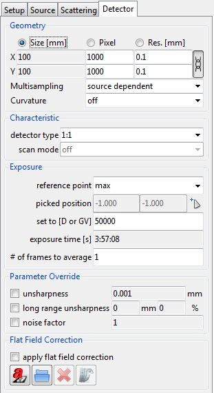
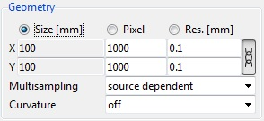
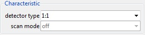
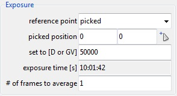
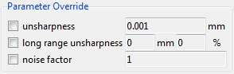
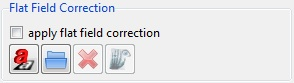

.. include:: _templates/icons.rst

.. _DetectorPanelSection:

Detector Panel
==============

The :guilabel:`Detector` tab of Parameter Panel is relevant for the settings of detector properties like geometry and type.

.. _guiparameterPsetupdetector:

    Parameter panel: Detector.

.. _GeometrySubsection:

Geometry
--------

 .. |modules-ImagViewerScale-closedSymbol| image:: pictures/modules-ImagViewerScale-closedSymbol.png
 .. |modules-ImageViewer-openSymbole| image:: pictures/modules-ImageViewer-openSymbole.png

.. _guiparameterPdetectorGeometry:

    Geometry settings.

In this part of the :guilabel:`Detector` tab, you can adjust the **Geometry** of the detector (:numref:`guiparameterPdetectorGeometry`). 
Choose which quantity you want to update automatically (**Size [mm]**, **Pixel**, **Resolution [mm]**) and set the values for **X** and **Y**. 
Next to the input fields is a button |modules-ImagViewerScale-closedSymbol|. When you click this button, the symbol changes, once into an open chain |modules-ImageViewer-openSymbole| and once into a closed chain |modules-ImagViewerScale-closedSymbol|. The closed symbol |modules-ImagViewerScale-closedSymbol| gives a  square pixel area. The open symbol |modules-ImageViewer-openSymbole| allows a rectangular pixel area, as X and Y can have different values.

**Multisampling** is used for anti-aliasing. 
The default setting is source dependent, which means, that the source's sampling pattern will also be used for the image resulting in reduced computation time. 
The other available patterns of the list are: :class:`5`, :class:`10`, :class:`20`, :class:`30` and :class:`1×1`, :class:`2×2`, :class:`3×3`, :class:`4×4`, :class:`5×5`. 
Thereby you can also enter your own values. A single integer denotes the number of samples randomly distributed and an entry of the form NxM denotes a regular grid.

**Curvature** is used to have a curved detector around its reference point along the selected axis (reference point of the detector should not be the same as its position, but e.g. the center axis of a cylindrical part). 
This can be useful if you want to test curved parts like a pipeline. Thereby you can choose between :class:`X` or :class:`Y` curvature.

.. _CharacteristicSubsection:

Characteristic
--------------

Detector type is used to select the type of detector you want to use in your simulation. You may choose between

* different types of film (:class:`film D4`, :class:`film D5`, :class:`film D5 (Ir 192)`, :class:`film D7`, :class:`film IX100`, :class:`film IX50`, :class:`film IX80`)
* two imaging plates (:class:`ST-VI Dynamix SK708`, :class:`UR-1 Dynamix SK 708`)
* a :class:`flat panel` detector
* an :class:`Air dose meter`
* an :class:`1:1` detector type
* :class:`10000:1 (4IC)`, :class:`10000:1 sharp noisy` or
* load an external file (:class:`External`)

.. note::

   To access the digital detector open the :ref:`DigRad <DigRadSection>` module (:guilabel:`Modules` → DigRad). The default setting for detector type is :class:`1:1`, which means a :class:`1:1` conversion of dose values into grey values.

.. note::

   For example it is possible to load (in External) saved detector files, which were done with the :ref:`DetectorCalc <DetectorCalcSection>` module (:guilabel:`Modules` → DetectorCalc).

**Scan mode** takes digitization of film into account. The drop-down menu is therefore only active when a film is selected for detector type. Then you can choose between a laser-based (:class:`Kodak LS85`) and a CCD (:class:`CCD 16bit`) based scanner or deactivate (:class:`off`) the option.

.. _guiparameterPdetectorCharacteristics:

    Characteristic settings.

.. _ExposureSubsection:

Exposure
--------

The following settings are available for **reference point**:

* :class:`off` sets the exposure time in seconds or as hh:mm:ss in the corresponding input field and the number of frames to average below.
* :class:`min` sets the exposure time automatically for minimum grey value. Set dose or grey value to achieve at the **reference point** (**set to [D or GV]**).
* :class:`max` sets the exposure time automatically for maximum grey value. Set dose or grey value to achieve at the **reference point** (**set to [D or GV]**).
* :class:`center` sets exposure time automatically for medium grey value. Set dose or grey value to achieve at the **reference point** (**set to [D or GV]**).
* :class:`picked` picks auto-exposure reference point either through manual input of the X and Y coordinates in the corresponding fields (**picked position**) or by selecting a position in :ref:`Image Viewer <ImageViewerSection>` (activate access with this button: |16x16_edit-pickposition| ).

**set to [D or GV]** sets dose or grey value to achieve at reference point if possible.

**# of frames to average** sets the number of frames to average.

.. _guiparameterPdetectorExposure:

    Exposure settings.

.. _ParameterOverrideSubsection:

Parameter Override
------------------

If the command is selected it is necessary to change the number of the parameters for override (:numref:`guiparameterPdetectorParamterover`):

* **unsharpness** sets the receptor unsharpness in mm.
* **long range unsharpness** sets a greater receptor unsharpness for imaging plates.
* **noise factor** sets :class:`0` → no noise factor or :class:`1` → noise factor according to characteristic (factor is not proportionate).

.. _guiparameterPdetectorParamterover:

    Parameter Override settings.

.. _FlatFieldCorrectionSubsection:

Flat Field Correction
---------------------

**Flat Field Correction** (:numref:`guiparameterPdetectorFlatfieldcor`) is part of the calibration procedure of digital detector arrays. 
It is used to remove artifacts from 2-D images that are caused by variations in the pixel-to-pixel sensitivity of the detector and/or by distortions in the optical path. 
It also removes the shading in the image due to the different path lengths of the cone beam. 
For this reason, the flat-field correction is available here in |artist| as well. 
The flat-field (“white”) image is generated by an simulation without any parts in the scene. 
If there isn't already a flat field image present, it will be automatically generated.

 .. |gui-parameterP-focal_spot2| image:: pictures/gui-parameterP-focal_spot2.jpg
 .. |gui-parameterP-focal_spot3| image:: pictures/gui-parameterP-focal_spot3.jpg
 .. |gui-parameterP-focal_spot4| image:: pictures/gui-parameterP-focal_spot4.jpg

.. _guiparameterPdetectorFlatfieldcor:

    Flat Field Correction settings.

|22x22_aRTist| |gui-parameterP-focal_spot2| |gui-parameterP-focal_spot3| |gui-parameterP-focal_spot4| Calculate, load, delete or show the flat field image.