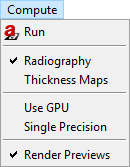

.. include:: _templates/icons.rst

.. _MenuBarSection:

Menu bar
--------

The Menu bar consists of different drop-down menus with common Windows commands and program specific functions. Some of the menu entries can also be found in the toolbar indicated by the same icon. If that is the case, the icon is next to the command/option in this manual.

.. _FileMenuSubsection:

File menu
^^^^^^^^^

The :guilabel:`File` drop-down menu comprises commands referring to the current project.

.. _guiFileMenu:
.. figure:: pictures/gui-menu-file.png
    :alt: aRTist file menu
    :width: 57.3%

    File menu.

* **New Project** opens a new |artist| scheme. This may also be done by pressing :kbd:`ctrl` + :kbd:`n`. The program will ask you if you want to save the changes on your current project.
* |16x16_document-open-folder| **Open** is used to search an existing project. Then select a project file in the dialog boxes that follow. Alternatively, press :kbd:`ctrl` + :kbd:`o`.
* |16x16_library| **Open Library**  is used to load something from the collection of example parts and projects. It can also be opened by pressing :kbd:`ctrl` + :kbd:`l`.
* |16x16_document-save| **Save** the current project to a single file. Alternatively, press :kbd:`ctrl` + :kbd:`s`.
* |16x16_document-save-as| **Save As** renames a project or changes the location of where you want to save it. Alternatively, press :kbd:`ctrl` + :kbd:`shift` + :kbd:`s`.
* **Reload External Files** serves to check and update external dependencies (incorporated data files) of the current project. There you can choose file versions from the project or the file system in the dialog box that follow.
* **Last Directories** shows a list of recently opened directories. By clicking on an entry, a file open dialog for this directory will pop up.
* **Open New Window** starts a new, additional instance of |artist|.
* **Restart** reboots the program. Before restarting, the program will ask you if you want to save any changes to your current project.
* |16x16_window-close| **Quit** terminates the program. Before quitting the program will ask you if you want to save any changes on your current project. Alternatively, press :kbd:`ctrl` + :kbd:`q`.

.. _EditMenuSubsection:

Edit menu
^^^^^^^^^

The :guilabel:`Edit` menu contains undo/redo functionalities with the project's history, whereas the usual commands (cut, copy, paste and delete) refer to parts in the assembly.

.. _guiEditMenu:
.. figure:: pictures/gui-menu-edit.png
    :alt: aRTist edit menu
    :width: 22.6%

    Edit menu.

* |16x16_edit-undo| **Undo** erases the last change done to the project reverting it to its previous state. Alternatively, press :kbd:`ctrl` + :kbd:`z`.
* |16x16_edit-redo| **Redo** reverses the Undo or advances the buffer to its former state. Alternatively, press :kbd:`ctrl` + :kbd:`y`. The opposite of Undo is Redo. The Undo and Redo commands restrict you to an incremental sequence of changes.
* **History** displays the chronology of your recent actions and lets you revert back to any previous state. Alternatively, press :kbd:`ctrl` + :kbd:`h` to open the history.
* |16x16_edit-cut| **Cut** removes parts from the assembly and keeps them in the clipboard. In the scene or in the *Assembly list* (in the *Parameter panel*), you can left-click to select any part(s) that you want to cut. Select multiple parts by keeping the :kbd:`ctrl` key pressed on the keyboard.
* |16x16_edit-copy| **Copy** can create a duplicate of the selected part(s). First, select the part(s) you want to copy by using the Ctrl key on the keyboard and click on them with the left mouse either in the scene or in the *Assembly List* (of *Parameter Panel*). The selected parts are kept in the clipboard.
* |16x16_edit-paste| **Paste** appends parts from the clipboard to the *Assembly List*.
* |16x16_edit-delete| **Delete** removes selected parts from the *Assembly List*.

.. _GeometryMenuSubsection:

Geometry menu
^^^^^^^^^^^^^

The :guilabel:`Geometry` menu includes all functions regarding the geometry application for parts from the assembly. |artist|'s functionality regarding "Geometry Manipulation" (→ *Union, Intersection, Difference, Arrange* and *Pick Destination*) for creating and arranging more complicated parts are described more in-depth in the separate chapter.

.. _guiGeometryMenu:
.. figure:: pictures/gui-menu-geometry.png
    :alt: aRTist geometry menu
    :width: 21%

    Geometry menu.

* |16x16_center-new| **Center New Parts** positions newly loaded parts (.stl or .ply files) at the origin of the global coordinate system, if activated. If deactivated, new parts will be placed at their native, original coordinates.
* **Isolate** deactivates all parts in the scene except the selected ones. Alternatively you can deactivate or activate a part with a click on the |16x16_object-visible-on| eye symbol at the *Parameter Panel* → *Setup* → *Assembly List*.
* **Activate/Deactivate** selected item(s) of the assembly. If you deactivate an item, it will be ignored during simulation and be nearly invisible in the scene. Please note that you have to select the respective item first. Otherwise you may use the |16x16_object-visible-on| eye symbol in the *Assembly List* of the *Parameter Panel* to achieve the same effect.
* **Set Material** changes the material of a selected part. As an alternative, you may click on the material name of a part in the *Assembly List* of the parameter panel to open a drop-down menu with the same options.
* |16x16_boolean-union| **Union,** |16x16_boolean-intersection| **Intersection** and |16x16_boolean-difference| **Difference** can be used to create complex parts in the scene. For these commands, parts have to be created (e.g. with the |16x16_icon-solid| *Solid* module) and placed in the scene, so that they overlap. Then, select parts by using the :kbd:`Ctrl` key on the keyboard and click on them with the left mouse. The first selected part can be recognized by its yellow corners. All subsequent parts will be marked with white corners. The so-called *Geometry Manipulation* commands are explained more detailed in another section.

	* |16x16_boolean-union| **Union** joins two or more parts. The order of selection is not important.
	* |16x16_boolean-intersection| **Intersection** creates a new part from the overlapping areas of at least two parts. Everything else will be removed. The order of your selection is not important.
	* |16x16_boolean-difference| **Difference** is used to create a new part from the difference of at least two other parts. By selecting this command the order of selection will be important for the result. The first selected part (yellow corner) is the minuend and all other selected parts (white corners) are subtracted from the first part.
* |16x16_icon-arrange| **Arrange** is used to put parts in order to the assembly. Select the parts which have to be arranged, and activate this command. In the opening dialog box four options: *none*, *-*, *center*, *+* are available for each of the three axes. The parts will be aligned with the first selected part.
* |16x16_edit-pickposition| **Pick Destination** moves item(s) from one point of the scene view to another. Click with the left mouse on the desired destination to relocate selected item(s).

.. _ComputeMenuSubsection:

Compute menu
^^^^^^^^^^^^^

The :guilabel:`Compute` menu includes the button to start a simulation and offers different options for the simulation.

.. _guiComputeMenu:

    Compute menu.

* |16x16_aRTist| **Run** starts the simulation for the current configuration. It triggers a full-featured simulation in contrast to the preview simulations automatically performed if enabled. Resulting images are presented in the ImageViewer and labelled |16x16_image-final| as final result.
* **Radiography** / **Thickness maps** control the simulation mode. Choose between these two options to either simulate a radiographic projection or just thickness maps for each penetrated material.
* **Use GPU** controls the usa of an OpenGL graphics processing unit. When it is enabled and a suitable GPU has been found, some image processing tasks will be transferred to the GPU. |artist|'s ray tracer runs independently of this at CPU only. If GPU usage will accelerate the simulation at all depends on the hardware configuration.
* **Single Precision** controls the data representation at simulation: single or double precision. While double precision offers higher numerical accuracy, single precision helps to reduce memory consumption and computing time.
* **Render Previews** enables/disables live rendering of preview images in ImageViewer. Preview images are labeled |16x16_image-preview| (not final) to set apart from final |16x16_image-final| results.

.. _ModulesMenuSubsection:

Modules menu
^^^^^^^^^^^^^

The :guilabel:`Modules` menu offers the selection of the available extension modules. Modules extent the program functionality with an additional graphical dialog. These module windows can be embedded by the user in the docking area of the main window or used as a separate window. Below you will find brief introductory information on some of the individual modules. For more information see :ref:`Modules <Modules>`.

.. _guiModulesMenu:
.. figure:: pictures/gui-menu-modules.png
    :alt: aRTist modules menu
    :width: 20.7%

    Modules menu.

* **Manage Modules...** controls the activation of the installed modules. New modules can be installed from |artist| package files (:code:`*.artp`).
* **CtScan** module facilitates the simulation of series of projections for virtual X-ray computerized tomography (CT) with circular trajectory. The module includes Feldkamp reconstruction and volume rendering. For more details see :ref:`CtScan <CtScanSection>` description.
* **DetectorCalc** module will add new detector models to aRTist. Based on scintillator material and thickness the detector properties are modelled and adjusted by a reference shot of the modelled detector. For more information see :ref:`DetectorCalc <DetectorCalcSection>` section.
* **DigRad** module will add new detector models to aRTist. It is intended to describe individual digital detectors by measured values according to detector characterization standards. For more information see :ref:`DigRad <DigRadSection>` section.
* |16x16_image-radiography| **ImageViewer** module shows the simulation result, the virtual projections. The different settings and functions of ImageViewer will be explained in section :ref:`ImageViewer <ImageViewerSection>`.
* **LogViewer** module displays internal messages by aRTist and its components.
* **McRay** module is the interface to the Monte Carlo code McRay, coming with aRTist. Usually McRay is controlled at the :ref:`Scattering <ScatteringPanelSection>`. This module provides additional options for experienced users.
* |16x16_icon-solid| **Solid** module presents a dialog to generate simple parts (virtual objects) of any sizes and add these to the scene.
* **TomoSynth** module provides another dialog to setup a simulation series. The Laminography tab is the easy interface to define a scanning movements of tube and detector, while the Advanced tab can be used to control variations for any part in the scene.

.. _ToolsMenuSubsection:

Tools menu
^^^^^^^^^^

The :guilabel:`Tools` menu provides several dialogs to control the program.

.. _guiToolsMenu:
.. figure:: pictures/gui-menu-tools.png
    :alt: aRTist tools menu
    :width: 32%

    Tools menu.

* **Show Console** opens the |artist| console, a dialog window with a TCL command shell. This is the command-line interface of aRTist. Status and debug information can be observed here including potential warnings and error messages at simulation runs. 
* **Show VTK Log** calls module LogViewer to displays internal messages by aRTist and its components.
* **Enable remote access** opens a TCP/IP port to control |artist| from another program, e.g. Python. 
* **Opening Angle** calculates the angular aperature of the cone beam enclosing the detector at the present setup. It will be displayed at the status bar.
* **Attenuation Data** opens a viewer of the energy-dependent attenuation coefficients used by the program.
* **Detector Properties** opens a viewer of the currently used detector model.
* **Image Viewer** provides the menu bar of the image viewer module (lacking a nice way to directly attach it to the module window).
* |16x16_edit-materials| **Materials** opens the materials editor.
* |16x16_xray-tube| **Spectrum...** opens the X-ray spectrum generator.
* |16x16_preferences-system| **Settings** opens the preferences dialog.

.. _ViewMenuSubsection:

View menu
^^^^^^^^^^^^^

The :guilabel:`View` menu provides commands ot control the various rendering and display parameters. 

.. _guiViewMenu:
.. figure:: pictures/gui-menu-view.png
    :alt: aRTist view menu
    :width: 35.9%

    View menu.

* |16x16_zoom-select| **Zoom to Selection** will render the selected parts over the full extent of the scene view. If no part is selected, the view is adjusted to show the entire setup.
* |16x16_default-view-top-right| **Default View** realign the scene view to look from the top right.
* |16x16_default-view-minus-x| **View along X**,
* |16x16_default-view-minus-y| **View along Y**,
* |16x16_default-view-minus-z| **View along Z** realign the scene view to look in the direction of the coordinate axes. Calling the function again rotates the view in the opposite direction. 
* |16x16_pick-focalpoint| **Pick Focal Point** will allow to pick an part and shift the view to the center of the picked part. From mow on the scene will rotate around the position of the picked part.
* |16x16_view-orthographic| **Orthographic Projection** toggles orthographic and perspective projection mode.
* |16x16_view-axes| **Toggle Axes** will control the visibility of local coordinate axes at the selected parts.
* |16x16_bounding-box| **Toggle Bounding Box** will control the visibility of the bonding box at the selected parts.
* **Toggle Edge Visibility** will control the visibility of triangle edges at the selected parts.
* |16x16_switch-wireframe| **Toggle Wireframe** toggles wireframe and solid rendering of the selected parts.
* **Multiple views** switches the division of the scene view to show three additional sub-views, each with a different viewing direction.
* **Views Follow Main Camera** toggles the synchronous movement of the sub-views.
* **Show Source Cone** toggles the display of a transparent cone representing the X-ray beam.
* **Show Orientation** toggles the display of a orientation marker at bottom lift of the scene view.
* **Stereo Rendering** toggles stereo rendering, e.g. by red/cyan anaglyph imaging. See related parameters under Settings. 
* **Level Of Detail Rendering** 
* **Fullscreen** toggle full-screen mode of main program window.
* **Toggle Toolbar Visibility** switches the toolbar on and off.
* |16x16_open-dock| **Toggle Dock Visibility** switches the docking area on and off.
* **Toggle Setup Visibility** switches the parameter panel on and off.

.. _HelpMenuSubsection:

Help menu
^^^^^^^^^

The :guilabel:`Help` menu provides information about the program itself, its installation and its license status.

.. _guiHelpMenu:

    Help menu.

* |16x16_system-help| **Show Inline Help** activates the inline help where available, e.g. on the Scattering tab or at the material editor.
* **User Guide** opens the documentation file (PDF).
* **Online Guide** opens the online handbook (https://bamresearch.github.io/aRTist-handbook).
* **Homepage** opens |artist|'s homepage (http://artist.bam.de).
* **License Information** opens a dialog window with the actual license status. Here you will also find information on license activation and applying for a demo license. See also :ref:`License activation <licenseactivation>`.
* |16x16_aRTist| **About aRTist** opens a dialog window with information about the software itself and its version, installed modules and included third-party software.
