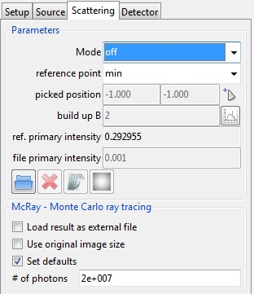
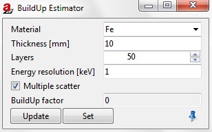
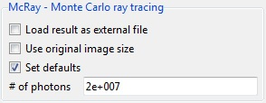

.. include:: _templates/icons.rst

.. _ScatteringPanelSection:

Scattering Panel
================

The Scattering tab of Parameter Panel is useful for different scattering settings (homogenous, McRay etc.) in the stimulated radiation.

The scattering is by default (:numref:`guiparameterPSetupScattering`) in the :class:`off` **Mode** and the **reference point** is **min**. In addition, **Set defaults** for the McRay are **marked** and number **# of photons** is :class:`2e+007`.

.. _guiparameterPSetupScattering:

    Parameter panel: Scattering.

.. _ParametersSubsection:

Parameters
----------

|gui-parameterP-focal_spot2| |gui-parameterP-focal_spot3| |gui-parameterP-focal_spot4| |gui-parameterPscattering_para4| : Load, delete, show or smooth scatter image.

Mode
^^^^

* :class:`off` does not take into account scattered radiation at all.

* :class:`build-up factor` is used to estimate a constant scatter. The build-up factor is the ratio of total to primary radiation at the reference position. Decreased contrast due to scattering is simulated. Set the build-up factor in the **build-up B** input field.  Build-up factor of :class:`2` means as much scatter radiation (S) as primary radiation (P) impinges on the detector at the reference position.

    .. |gui-parameterP-buildup1| image:: pictures/gui-parameterP-buildup1.jpg

    |gui-parameterP-buildup1| BuildUp Estimator estimates the BuildUp Factor for a specific part. You can dock the window in :numref:`guiparameterPbuildup` in the docking area.

    * Set **Material** and **Thickness** in mm, the number of **Layers** and the **Energy resolution** in keV
    * Enable/Disable **Multiple scatter**
    * Press :guilabel:`Update` (BuildUp factor will be estimated but not set) or Set

    **Layers**, **Energy resolution [keV]** and **Multiple scatter** are model parameters for the algorithmus function thereby. **Material** and **Thickness** are physical parameters for the geometric function.

    .. note::

        After a new simulation with the build-up factor, an additional image :class:`primary + scatter intensities` appears in the drop-down menu of the :ref:`Image Viewer <ImageViewerSection>`, showing the new build-up factor simulation step.

.. _guiparameterPbuildup:

    |gui-parameterP-buildup1| BuildUp Estimator settings.

* :class:`external file` is used for a user-supplied image, which is scaled and added. The corresponding primary radiation at the reference position has to be set in the box of **file primary intensity**.

* :class:`McRay` is used to determine the amount of scattering with Monte Carlo simulation. It calculates fully automatic the Monte Carlo of scatter contribution. 

    .. note::

        A larger number of photons results in a better estimate, but longer calculation times.

Reference Point
^^^^^^^^^^^^^^^

Select the reference point within the detector image. Available settings:

* :class:`off` is used to set a value under ref. primary intensity, instead of using a reference point.
* :class:`min` selects the image point of minimum grey value as the reference.
* :class:`max` selects the image point of maximum grey value as the reference.
* :class:`center` selects the image center as the reference point.
* :class:`Picked` is used

 .. |gui-parameterP-focal_spot2| image:: pictures/gui-parameterP-focal_spot2.jpg
 .. |gui-parameterP-focal_spot3| image:: pictures/gui-parameterP-focal_spot3.jpg
 .. |gui-parameterP-focal_spot4| image:: pictures/gui-parameterP-focal_spot4.jpg
 .. |gui-parameterPpickedPosition1| image:: pictures/gui-parameterP-scattering-picked_position1.jpg
 .. |gui-parameterPscattering_para4| image:: pictures/gui-parameterP-scattering_para4.jpg

 * |16x16_edit-pickposition| to pick a scatter image reference point in :ref:`Image Viewer <ImageViewer>` (click and hold) or
 * |gui-parameterPpickedPosition1| to put in the X and Y coordinates manually.

.. _McRayTracingSubsection:

McRay - Monte Carlo ray tracing
-------------------------------

Monte Carlo ray tracing (:numref:`guiparameterPscatteringMcray`) will contribute a image of scatter radiation based on the actual setup. This includes considerable extra computing effort. 
Typically, it takes seconds to minutes for one calculation. 
Worthwhile when inspecting castings (thick walls). 
Build-up factor is recommended when inspecting metal sheets and welds. More detailed settings for McRay can be done in the :ref:`McRay of Modules <McRaySection>`.

.. _guiparameterPscatteringMcray:

    Monte Carlo ray tracing.

.. note::

    When McRay is finished in the upper bar (in the drop-down menu) of the :ref:`Image Viewer <ImageViewer>` module not only :class:`Energy density` (J/m²) and :class:`primary intensities` can be seen but also :class:`scatter intensities` and :class:`primary + scatter intensities`.
