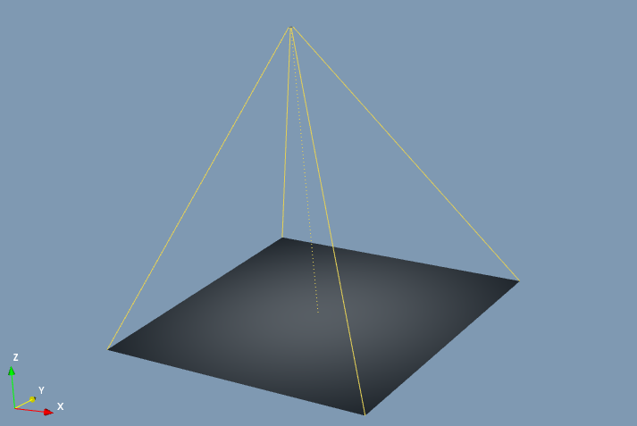

.. include:: _templates/icons.rst

Scene
--------
.. _SceneSection:

Virtual scene
=============

The 3D visualization area shows the virtual scene view, a 3D representation of the setup (:numref:`guiSceneAdocSceneview`). 
The default view only contains source and detector. In the assembly, virtual parts (geometric objects) can be appended in the scene view, e.g. via the |16x16_icon-solid| Solid module or by loading any STL or PLY files.  

.. _guiSceneAdocSceneview:

    Virtual scene, scene view.
    
The virtual scene can be freely rotated, scaled, and shifted in space in the following ways:

* Hold down the left mouse button over the empty space of the scene view and drag it. The scene will rotate.
* Hold down the right mouse button and drag or use the middle mouse button and turn it. The scene view will scale.
* Hold down the middle mouse button and drag. The scene view will move with the mouse.

A coordinate system pictogram is shown in the bottom left corner indicating the actual orientation of the scene view.

In the virtual scene items are all parts (geometrical objects), detector, and source. They are shown and manipulated together. 

For selecting an item in the scene view click on it with the left mouse. To select several items use the :kbd:`Ctrl` key on the keyboard and click on them with the left mouse. 
The first selected item can be recognized by its yellow corners. All subsequent items will be marked with white corners. 

.. note::

    The order of selection is important for all functions regarding the :guilabel:`Geometry` application for items in the assembly.

