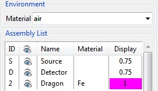
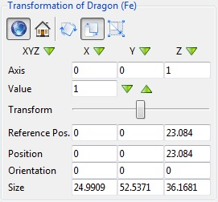

.. include:: _templates/icons.rst

.. _SetupPanelSection:

Setup Panel
-----------

The :guilabel:`Setup` of the Parameter Panel is mainly pertinent for positioning items in the assembly.

.. The default settings of the Setup for the environment is air, for the Transformation are |16x16_world-coordinate-system| world coordinate system and |16x16_transformation-move| translate mode. This settings can be seen in :numref:`guiSetupDefault`.

.. _guiSetupDefault:
.. figure:: pictures/gui-parameterP-SetupDefault.png
    :alt: Default settings from the setup
    :width: 41.3%

    Default settings from the Setup.

.. _SetupEnvironmentSubSection:

Environment
^^^^^^^^^^^

Open the drop-down menu and select an environmental material of your choice. 
This material applies everywhere at the space of the scene outside of any part. 

.. note::

   You can choose between any preset or self-definded material. :class:`air` is the default setting. 
   All available materials are provided in the |22x22_edit-materials| **Materials Editior** of |artist|. Additional you can add new materials (for details see :ref:`Materials Editor <MaterialEditiorSubSection>`).

.. _SetupAssemblyListSubSection:

Assembly list
^^^^^^^^^^^^^

The Assembly List consists of five columns (:numref:`guiEnvironmentAssembly`). 
You can select one ore more item(s) from the assembly either from the list or from the virtual scene. 
Use therefore the :kbd:`Ctrl` key on the keyboard and click on the item(s) with the left mouse in the virtual scene. 
It will be highlighted blue in the list and the first selected item marked with yellow corners in the virtual scene. 
All subsequent items in the scene will be marked with white corners.

.. _guiEnvironmentAssembly:

    Environment and Assembly List.

* **ID** represents an unique identifier for an entry.
* |16x16_object-visible-on| **Activates**/|16x16_object-visible-off| **Deactivates** an item with a click on the eye symbol. Alternatively, you may use the corresponding commands from the :ref:`Geometry menu <GeometryMenuSubsection>`.
* **Name** changes the name of the part (by double-click on the item name). It is not possible to change the names of the detector and the source.
* **Material** changes the material of a part (by double-click on the item material the list of available materials will be shown). It is not possible to change the materials for the detector and the source.
* **Display** shows the color and the opacity of each item. By double-click on the item display you can change/select the color of the item using the color list right of the color field and the opacity by moving the bar in the opacity field.

.. _SetupTransformationSubSection:

Transformation
^^^^^^^^^^^^^^

Under transformation you can find a number of options to manipulate and scale of each item of the Assembly List (:numref:`guiSetupTransformation`). Proceed in the following way:

 .. |gui-parameterP-SetupSelectAxis| image:: pictures/gui-parameterP-SetupSelectAxis.png
 .. |gui-parameterP-SetupSlideTransform| image:: pictures/gui-parameterP-SetupSlideTransform.png

1. Select an item.

2. Choose between the |16x16_world-coordinate-system| **world coordinate system** or the |16x16_object-coordinate-system| **local coordinate system**.

3.  Choose type of transformation: |16x16_transformation-rotate| **rotate**, |16x16_transformation-move| **translate** or |16x16_transformation-scale| **scale**.

4.  With |gui-parameterP-SetupSelectAxis| you can select one **Axis** or all three with a click on one of the green arrows. In the axis row you can see which axis is currently not selected (:class:`0` = axis) and which axsis is currently selected (:class:`1` = axis).

5.  |16x16_set-coordinate-arrow-down| |16x16_set-coordinate-arrow-up| set the step size with the green arrows or type in a **Value**. The unit matches the type of transformation: degree (for |16x16_transformation-rotate| **rotate**), mm (for |16x16_transformation-move| **translate**) or 10 % (for |16x16_transformation-scale| **scale**) giving the magnification.

6. With the slide control |gui-parameterP-SetupSlideTransform| rotate, translate or scale the selected item or do it directly in the scene with the left mouse button. You can monitor the movement/modification of **Reference position**, **Position**, **Orientation**, and **Size** over the display fields in the bottom of the **Transformation** page or put in values by yourself as an alternative to the previously explained approach.

.. _guiSetupTransformation:

    Transformation of an item.
