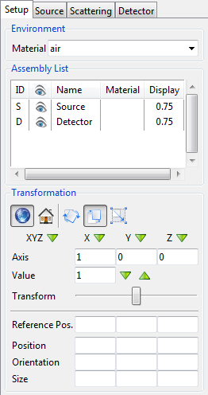

.. include:: _templates/icons.rst

.. _SetupPanelSection:

Setup Panel
-----------

The :guilabel:`Setup` of Parameter Panel is mainly pertinent for positioning items in the assembly.

.. The default settings of the Setup for the environment is air, for the Transformation are |16x16_world-coordinate-system| world coordinate system and |16x16_transformation-move| translate mode. This settings can be seen in :numref:`guiSetupDefault`.

.. _guiSetupDefault:

    Default settings from the Setup.

.. _SetupEnvironmentSubSection:

Environment
^^^^^^^^^^^

Open the drop-down menu and select an environmental material of your choice. 
This material applies everywhere at the space of the scene outside of any part. 

.. note::

   You can choose between the following materials: :class:`Al`, :class:`Be`, :class:`Cu`, :class:`Fe`, :class:`Mg`, :class:`Mo`, :class:`Ni`, :class:`Pb`, :class:`Pt`, :class:`Ti`, :class:`W`, :class:`Pe (HDPE)`, :class:`air`, :class:`water`, :class:`glass` or :class:`lead`, :class:`void`, :class:`Daunen`, :class:`wood (oak/dry)`, :class:`Ta`, :class:`Pe`. 
   These preset materials are provided with the comment: preset of |artist| in the |22x22_edit-materials| Materials editor.

.. _SetupAssemblyListSubSection:

Assembly list
^^^^^^^^^^^^^

The Assembly List consists of five columns (:numref:`guiEnvironmentAssembly`). 
You can select an item from the assembly either from the list or the virtual scene. 
Use therefore the :kbd:`Ctrl` key on the keyboard and click on them with the left mouse. 
It will be highlighted blue in the list and marked with yellow corners in the virtual scene. 
All subsequent items in the scene will be marked with white corners.

.. _guiEnvironmentAssembly:
.. figure:: pictures/gui-parameterP-EnvironmentAssembly.png
    :alt: Environment, Assembly List
    :width: 41.3%

    Environment, Assembly List.

* **ID** represents an unique identification for an entry.
* |16x16_object-visible-on| **Activates**/|16x16_object-visible-off| **Deactivates** an item with a click on the eye symbol. Alternatively, you may use the corresponding commands from the :ref:`Geometry menu <GeometryMenuSubsection>`.
* **Name** changes the name of the part (by double-click). It is not possible to change the name of the detector and source.
* **Material** changes the material of a part (by double-click). Here it is not possible to change the material for detector and source.
* **Display** shows the color and opacity of each item. Double-click on the number to change the color and opacity.

.. _SetupTransformationSubSection:

Transformation
^^^^^^^^^^^^^^

Under transformation you can find a number of options to manipulate and scale each item of the Assembly List (:numref:`guiSetupTransformation`). Proceed in the following way:

 .. |gui-parameterP-SetupSelectAxis| image:: pictures/gui-parameterP-SetupSelectAxis.png
 .. |gui-parameterP-SetupSlideTransform| image:: pictures/gui-parameterP-SetupSlideTransform.png

1. Select an item.

2. |16x16_world-coordinate-system| Choose between world coordinate system and |16x16_object-coordinate-system| local coordinate system.

3.  Choose type of transformation: |16x16_transformation-rotate| rotate, |16x16_transformation-move| translate or |16x16_transformation-scale| scale.

4.  |gui-parameterP-SetupSelectAxis| Select an **Axis** or all three with a click on one of the green arrows. :class:`0` = axis is currently not selected, :class:`1` = axis is currently selected.

5.  |16x16_set-coordinate-arrow-down| |16x16_set-coordinate-arrow-up| Set the step size with the green arrows or type in a **Value**. The unit matches the type of transformation: degree (for |16x16_transformation-rotate| rotate), mm (for |16x16_transformation-move| translate) or 10 % (for |16x16_transformation-scale| scale) magnification.

6.  |gui-parameterP-SetupSlideTransform| Rotate, translate or scale the item with the slide control or directly in the scene with the left mouse button. You can monitor the movement/modification of **Reference position**, **Position**, **Orientation** and **Size** over the display fields in the bottom of the Setup page and also put in values yourself as an alternative to the previously explained approach.

.. _guiSetupTransformation:
.. figure:: pictures/gui-parameterPsetup_transformation.jpg
    :alt: Transformation of an item
    :width: 41.3%

    Transformation of an item.
