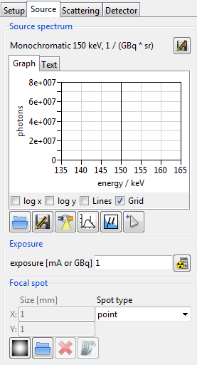
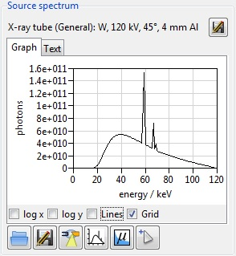
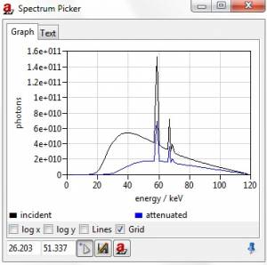
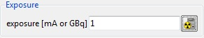
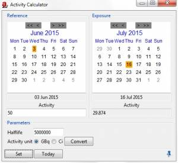
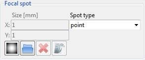
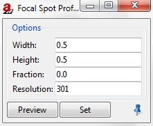

.. include:: _templates/icons.rst

.. _SourcePanelSection:

Source Panel
============

The :guilabel:`Source` tab of the Parameter Panel is used for defining the radiation source settings (:numref:`guiSourceDefault`).

.. The default setting (:numref:`guiSourceDefault`) of the source is a monochromatic point source with a voltage of 150kV. In addition, the graphical display is preselected as well as an **exposure** of **1mA or 1GBq**.

.. _guiSourceDefault:

    Default settings from the Source.

.. _SourceSpectrumSubSection:

Source Spectrum
---------------

The main area of this page shows the source spectrum (:numref:`guiSourceSpectrum1`).

.. _guiSourceSpectrum1:

    Source spectrum.

Top:
^^^^

* |16x16_document-save-as| **Save spectrum graph or data** as a :code:`.xrs`, :code:`.eps` or :code:`.pdf` file.
* It can be choosen between :guilabel:`Graph` or :guilabel:`Text` via tabs.

Bottom:
^^^^^^^

* Enable/Disable **log x**, **log y**, **Lines**, and **Grid** via checkboxes.
* |22x22_document-open-folder| **Load Spectrum** from the |artist| library. For Gamma sources it can be choosen between four different Gamma spectra: Co-60, Ir-192, Se-75, and Yb-169. Also X-ray spectra may be loaded from the |artist| library or from another directory if stored there . 

    .. note::

        If required, spectra from other Gamma sources can also be added . For this  an Gamma source spectrum :code:`.xrs` in the |artist| library should be opened with any text editor. Than a new Gamma source can be created by putting the required information in there and save it with another name.

    .. hint::

        **How to create new Gamma sources?**
        
        In |artist| Gamma sources are defined as follows:

            .. code-block:: text

                # Am-241 spectrum
                # Lund LBNL table
                # photons/(GBq sr)
                # halfLife 432.2y
                26.34     1.909859e+06
                33.20     1.002676e+05
                43.073    5.809155e+04
                59.35     2.856831e+07
                103.0     1.591549e+04
                335.0     3.978874e+02

        In various databases the decay data are given in the following following  form:

            .. code-block:: text

                Am - 241
                Energy [keV]     Intensity [%]
                26.34               2.40
                33.20               0.126
                43.42               0.073
                59.54               35.9
                103.0               0.02
                335.0               0.0005
        
        The Intensity [%]/100 gives the probability of one decay (i.e., one Bq) and must be converted into the number of photons /(GBq sr) in the following way:

            .. math::

                    \textsf{Photons/(GBq \,sr)} = \frac{\textsf{Intensity} \cdot 10^9}{100 \cdot 4\pi}
        
        

* |22x22_document-save-as| **Save current spectrum** as a :code:`.xrs` file.
* |22x22_xray-tube| **Calculate X-ray tube spectrum** opens the Spectrum calculator where detailed adjustments to the tube can be made. 

   .. note::
      Important details of the current tube settings are displayed directly above the Graph/Text tabs. A more in-depth explanation of the spectrum calculator can be found in the :ref:`Spectrum <SpectrumSection>` section of the tutorial.
      
* |22x22_plot-spectrum| **Show current spectrum** opens the current spectrum in a seperate window. By clicking and holding for a second or right-clicking more options (**Show original spectrum**, **Show reduced spectrum** or **Show preview spectrum**) are displayed.
* |22x22_show-attenuation| **Plot attenuation data** displays the attenuation coefficients for the current settings. 

   .. note::
      In the separate section of the tutorial :ref:`Attenuation Data <AttenuationDataSection>` more information about the attenuation coefficients can be found.  
* |22x22_edit-pickposition| **Show attenuated spectrum for picked position** opens the Spectrum Picker. The incident beam is shown in black, the attenuated beam in blue (:numref:`guiSpectrumPicker`). For more information about the Spectrum Picker see below the figure. 

   .. note::
       The window can be docked in the docking area.

.. _guiSpectrumPicker:

    Spectrum Picker. The spectrum shown here is attenuated by an aluminum cube.

* |16x16_edit-pickposition| **Pick image position to calculate attenuation for** is used in the Spectrum Picker to pick a spectrum reference position in :ref:`Image Viewer <ImageViewerSection>` (click with the left mouse button). In the Image viewer :code:`Pick spectrum reference position` will be shown in red. Alternatively, the X- and Y- coordinates can be typed manually. 
* |16x16_document-save-as| **Save current data** as a :code:`.xrs`, :code:`.eps` or :code:`.pdf` file.
* |16x16_aRTist| **Recalculate attenuation data** for picked position.

.. _ExporeSubsection:

Exposure
--------

To define the exposure value the tube current in mA, or the activity in GBq if a radionuclide is used, (:numref:`guiParameterPExposure`) has to be given here.
By opening the Activity calculator (|16x16_activity-calculator|) a actual activity from a reference activity in the past can be determined.

.. _guiParameterPExposure:

    Exposure by radionuclide.

|22x22_activity-calculator| Activity Calculator
^^^^^^^^^^^^^^^^^^^^^^^^^^^^^^^^^^^^^^^^^^^^^^^

 .. |gui-parameterP-activityCcalc1| image:: pictures/gui-parameterP-activity_calc1.jpg

* with |gui-parameterP-activityCcalc1| the reference and exposure dates are set - « »: to change the year, < >: to change the month. To enquire the present-day activity, simply  the :guilabel:`Today` button in the lower part of the window can be pressed.
* By typing in the **Activity** in [GBq] or [Ci] and the **Halflife** in [s] all required parameters are set. With :guilabel:`Convert` the respective alternative unit is converted.
* By pressing :guilabel:`Set` the changes are applied.
  
.. _guiparameterPActivityCalc:

    Activity Calculator.

.. _FocalSpotSubsection:

Focal spot
----------

The number and the arrangement of the focal spot samples can be selected from the list or by entering values (:numref:`guiparameterPFocalSpot`). 
A single integer denotes the number of samples randomly distributed by the Poisson sampling algorithm (weighted by focal spot image if this has been set). 
An entry of the form NxM denotes a regular grid to sample the focal spot size.  

 .. note::
      To assign a 5 point source is insufficient to check for possible geometrical unsharpness.

**X, Y**: Size of focal spot along X and Y in [mm]. 

 
.. attention::

   This is the overall size, or extent, of the focal spot. If a profile image is used, the effective spot size may be smaller.

.. _guiparameterPFocalSpot:

    Focal spot settings. Here a point scource is selected.

|22x22_smooth| **Create a spot profile image** opens the Focal Spot Profile dialog box.

    Set the Focal Spot Profile (:numref:`guiparameterPFocalSpot5`):

      * effective spot **Width** in mm, :abbr:`FWHM (Full Width at Half Maximum)` of horizontal profile
      * effective spot **Height** in mm, :abbr:`FWHM (Full Width at Half Maximum)` of vertical profile
      * Lorentz **Fraction** of pseudo Voigt profile. The frachtion ranges from :class:`0.0` (pure Gaussian profile) to :class:`1.0` (pure Lorentzian profile). The numbers in between are mixtures of Gaussian and Lorentzian profiles.
      * pixel dimension of spot profile image (**Resolution**)

 .. |gui-parameterP-focal_spot2| image:: pictures/gui-parameterP-focal_spot2.jpg
 .. |gui-parameterP-focal_spot3| image:: pictures/gui-parameterP-focal_spot3.jpg
 .. |gui-parameterP-focal_spot4| image:: pictures/gui-parameterP-focal_spot4.jpg

.. _guiparameterPFocalSpot5:

    Focal Spot Profile settings. Here a pure Gaussian profile is choosen. 

|gui-parameterP-focal_spot2| **Load spot profile image from file**: Supported files: :code:`.tif`, :code:`.tiff`, :code:`.raw`, :code:`.bin`, :code:`.fld`, :code:`.png`, :code:`.bd`, :code:`.dd`, and :code:`.bmp`.

|gui-parameterP-focal_spot3| **Delete spot profile image**

|gui-parameterP-focal_spot4| **Show spot profile image**: The options are shown by holding down the left mouse button. These are *Show profile plot image* and *Show grid of source points*. 

.. note::

    **Focal Spot**
    
    A planar focal spot is simulated by averaging projections from several point sources. 
    This could be a regular grid of point sources (e.g. **Spot type**: :class:`5×5`) or an algorithmic distribution good for sampling, (e.g. **Spot type**: :class:`25`). In |artist| Poisson sampling is used. 
    The point sources are distributed over a rectangular area (defined by **Size [mm]** :class:`X`/:class:`Y`) and by default contribute in the same way (same spectra and weighting).
    
    Non-uniform spot profiles can be realized by using a profile image. With a spot profile image, the **Size [mm]** :class:`X`/:class:`Y` parameters are defining the image extension. 
    In this case, the focal spot size depends on the image size and the image content as well. 
    
    The number of source points (defined by **Spot type**) is generally the same, with or without spot profile image. 
    But some point sources may end up with a weight of zero and are neglected. The gray value distribution of the image is used to adjust the point sources. 
    
    For a regular grid, just the weight of the point sources is adjusted to follow the gray value distribution of the spot profile image. 
    
    For unstructured point sources (**Spot type**: :class:`N`; just one number) the weight and the position of the point sources will be adjusted to follow the shape of the spot profile image.
    To play with the focal spot parameters of |artist| there is a special project file, :code:`SourceSampling.aRTist`, in ExampleProjects (**Menu bar**: :guilabel:`File` → |16x16_library| **Open Library…**). 
    By defining a detector close to the source, and with a size equal to the focus it will directly image the source point distribution.