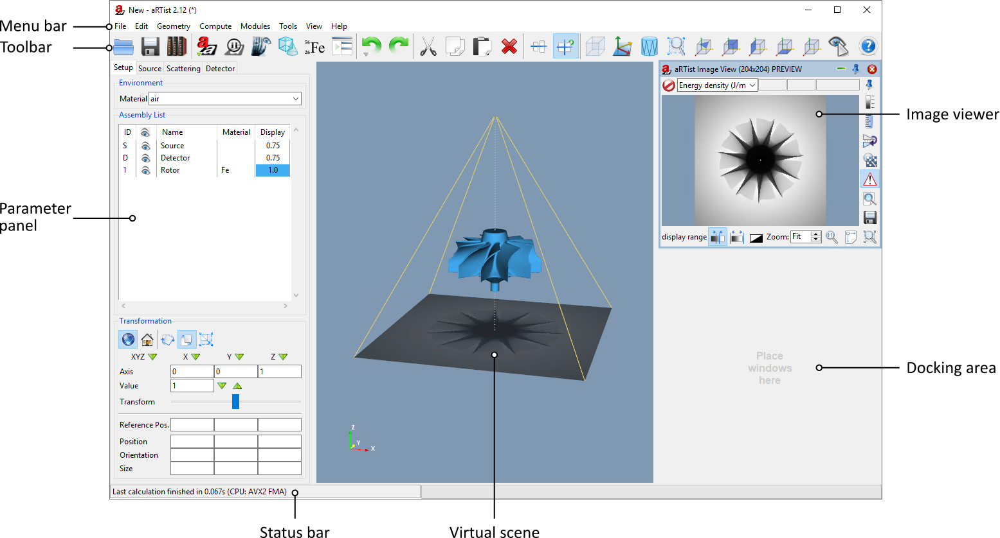

.. include:: _templates/icons.rst

User interface
==============

When |artist| is started, the main window (:numref:`guiMainWindow`) opens with the following areas:

* **Menu bar**, used to access detailed settings and commands.
* **Toolbar**, used to access the most commonly used functions and viewer settings.
* **Parameter panel**, used to control the current model parameters for the scene, X-ray source and detector.
* **Virtual scene**, a 3D scene view of the radiographic setup.
* **Docking area**, integrates additional program windows (modules). By default, the **Image Viewer** showing the simulated radiograph is placed here.
* **Status bar**, displays status information.

The three main areas (parameter panel, virtual scene, docking area) can be scaled by clicking and dragging the edges of the respective areas.

.. _guiMainWindow:

    aRTist main window.

.. toctree::
   :maxdepth: 2
   :caption: User interface elements:

   gui-menu-bar
   gui-parameter
   gui-scene

