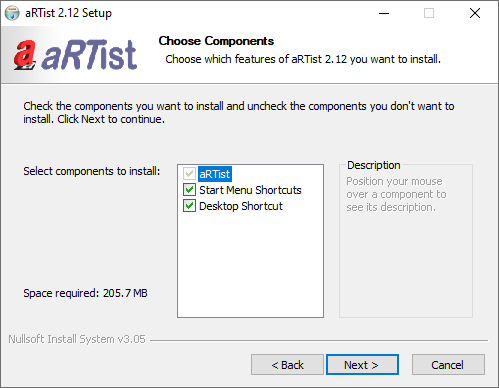
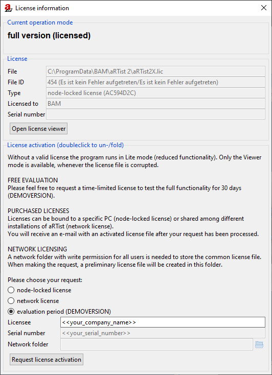

.. include:: _templates/icons.rst

Installation
============

System requirements
-------------------

The |artist| program comes as a Microsoft Windows application. The system requirements narrow down to the required platform: Microsoft Windows 7 or higher. The program is provided as 64-bit application.

It is possible to use |artist| on low prize notebook hardware. But it is recommended to run it on computers with multi core processor(s) and accelerated graphics processing unit (GPU) running OpenGL 2.1 or higher to have the necessary calculation speed for treating ambitious simulation tasks efficiently.

Licenses
--------

The |artist| program is equipped with software protection mechanisms and needs license activation for full functionality. Without activation, the program runs in Lite mode of reduced functionality. In case of licensing errors, e.g. broken license file, the program might still be usable to arrange and review virtual scenes, but it is not possible to make any simulations (viewer mode).

.. note:: 
    
    Demo licenses can be provided on request for an **evaluation period** of 30 days (DEMOVERSION). For this see :ref:`activationrequest`.

An |artist| license is shipped as serial number, which can be used to activate an |artist| installation. License activation is a two-steps process: sending an activation request via email and installing the activated license file received in response, see :ref:`licenseactivation`.

.. note:: 
    
    Licenses can be bound to a specific computer **(node-locked license)** or shared among different installations **(network license).**

The |artist| licenses can be used either node-locked or shared within a network. A node-locked license is assigned to one specific computer. With network licensing the |artist| program can be installed on several computers with access to the same license file. In this case |artist| can be alternately used on different computers (floating license). To run several |artist| installations at the same time it is possible to assign more than one license to the shared license file.

Installation instructions
-------------------------

The radiographic simulator |artist| comes with an installation routine :file:`aRTistSetup-X.X.X-64bit.exe` (where X.X.X is the version number). For installation the setup routine must be downloaded and executeted. A dialog will appear (:numref:`installationWelcomeScreen`) guiding through the installation process.

.. note:: 
    
    If |artist| is already installed, the installation routine will prompt to uninstall the current version, if, necessary before proceeding with the installation process. Consequently, installations with the same version number (X.X) will be replaced, while installations with different version numbers can coexist on the same computer.

During the installation process, options can be choose such as generating a Windows Start Menu entry and a Windows Desktop icon for convenient program execution (:numref:`installationOptions`). After the installation, |artist| is ready to use. Without an active and valid license, aRTist only runs with the limited functionality of the Lite/Viewer mode.

In the next section information on requesting an evaluation or permanent license can be found.

.. _installationWelcomeScreen:
.. figure:: pictures/artist-2.12-setup1.png
    :alt: Installer welcome screen
    :width: 71.3%

    Installer welcome screen.

.. _installationOptions:

    Installation options dialog.

.. _licenseactivation:

License activation
------------------

|artist| needs to be installed before proceeding with the license activation. The activation is a two-step process: first, a dedicated activation request has to be sent to the supplier of the software and secondly, the activated license file provided in response has to be installed.

The actual license status can be displayed under :guilabel:`License information` from the :guilabel:`Help` menu (:numref:`licenseInformationDialog`).

.. _activationrequest:

Activation request
^^^^^^^^^^^^^^^^^^

The activation request requires information about the actual |artist| installation. The necessary information can be collected at the license information dialog of |artist| (:guilabel:`Help` menu → :guilabel:`License information`) at section "License activation". There are options to apply for node-locked or network licensing and to request an evaluation period.

.. note:: 
    
    To request a network license, a shared network folder has to be prepared in advance. It is required to store the common license file in this folder.

.. note:: 
    
    All users of the network license need to have write permission for the license file.

The button :guilabel:`Generate activation request` must be pressed to display the activation request (it will also be copied to the computer's clipboard). This request has to be emailed to `aRTist@bam.de <mailto:aRTist@bam.de>`_.

In response to an activation request, an activated license file will be emailed back within the next working days.

.. _licenseInformationDialog:

    License information dialog.

License file installation
^^^^^^^^^^^^^^^^^^^^^^^^^

The final step in activating a license is to install the license file provided in response to the activation request. The license file must be opend in |artist| to start the dialog for installing a license file. This can be found in the license information dialog. During installation, the temporary license file will be overwritten by the activated one.

.. note:: 
    
    The license activation can also be done by Drag'n'Drop the license file over the |artist| window/icon to install it.

A license file for network licensing also only needs to be installed once. One, first computer with an |artist| installation is used to finally install the license file (the license file must be copied to the shared network folder). Opening a network license file in |artist| will show a dialog **"Use (not install) this network license?"** which needs to be answered with :guilabel:`No` to initiate the installation. A subsequent dialog will ask for the location of the common license file. It is important to enter the path of the activation request, as the license file was activated for exactly this path. To use this license at other computers in the network, the location of the license file has to be configured. A procedure similar to the license file installation can be used, see :ref:`configurenetworklicensing`.

.. _configurenetworklicensing:

Configure network licensing
^^^^^^^^^^^^^^^^^^^^^^^^^^^

Network licensing is realized by providing one common license file at a shared network folder. Any computer in the network can be used for |artist| if the user has access to this common license file. To use the network license with |artist|, the location of the license file has to be configured in the program.

The procedure to configure the network license file in |artist| is, similar to installing a node-locked license file, to open it in |artist|. Here it is important to open the original file at the network folder, not any local copy. The subsequent dialog **"Use (not install) this network license?"** needs to be answered with :guilabel:`Yes`.

.. note:: 
    
    The license activation can also be done by Drag'n'Drop the license file from the network folder over the |artist| window/icon to install it. The subsequent dialog **"Use (not install) this network license?"** needs to be answered with :guilabel:`Yes`.
