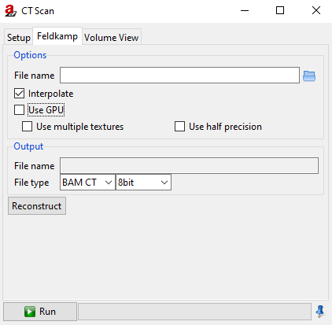

.. include:: _templates/icons.rst

.. _CtScanSection:

CtScan
------

.. 3.3	CtScan (from existing tutorial)
.. 3.3.1	Centre of Rotation
.. 3.3.2	Additional Settings
.. 3.3.3	FDK Reconstruction

With the CtScan module, a computerized tomography (CT) scan can be simulated. The module is accomplished by Feldkamp reconstruction and volume visualization. 
The simulated projections can be processed in the same way as experimental CT projections by external reconstruction programs. 
It is recommended to use the *TIFF* file format for easy data exchange in this case.

The CtScan module consists of three separate pages that can be navigated using the tabs at the top of the window (:numref:`modules-CtScan1`). 
At bottom of module window, you can find a Run button to start or to stop the simulation and a progress bar. 
The first two pages offer settings for the scan and for reconstruction (aRTist uses the Feldkamp algorithm for reconstruction). 
The finished tomogram can be viewed in the scene with the help of the first (Setup) or third (Volume View) tab by clicking on the Show button. 
In :ref:`ImageViewer <ImageViewerSection>` the sectional image can be seen with the Slice View in the third (Volume View) tab. 
All three pages will be explained in detail below.

.. _modules-CtScan1:
.. figure:: pictures/modules-CTScan1.png
    :alt: CtScan1
    :width: 71.3%
    
    CtScan: General settings.

.. _SetupSubsection:

Setup
^^^^^

**Scan Parameters**

* **Total Angle [°]**
* **Number of Steps** and
* **Angle Step Size [°]**
  
**Output**

Choose **Directory** and **File Type** and put in a **File Name**. The **File Type** can be chosen between BAM CT or TIFFs and 16 bit or float. 
If fields are left blank they will be filled in automatically. If you wish to start reconstruction directly after the scan is finished check the corresponding box, **Run Feldkamp**. 
You may set the parameters for Feldkamp on the second page. Press the Run button on either one of the three pages when finished with the settings. 
If you choose not to check the **Run Feldkamp** box before starting the simulation you may initiate reconstruction manually (see: :ref:`Feldkamp <FeldkampSubsection>`). 
Click on the Show button when the simulation is finished to see the tomogram in the scene. 
For an improved view deactivate the solid or minimize the opacity (double-click on the number of the object to change the opacity: **Parameter Panel** → **Setup Panel** → **Display**).

**Advanced**

By marking **Only selected objects** you can include chosen objects of your assembly in the simulation. 
That means the selected objects rotate and the others do not. 
To do this, you should select the corresponding components in the :ref:`Parameter Panel <ParameterPanel>` beforehand. Select a single object by clicking on it. 
Select two or more by holding down the Ctrl key and clicking on the other components to be included in the simulation. 
The components are selected when they are highlighted in blue.

* **Direction** is used to choose between clockwise or counterclockwise direction.
* **Scattering** is used to choose between off or McRay scatter-attitude.
* **Interval [°]** sets the interval for using the same scatter image (to save some time by not recalculating for each projection).
 
.. _FeldkampSubsection:

Feldkamp
^^^^^^^^

Set the parameters for reconstruction on the second page (:numref:`modules-cttfeldk`). 
Check the **Run Feldkamp** box on the first page to start reconstruction automatically after the necessary data has been acquired. 
Otherwise, you may start reconstruction manually by pressing the **Reconstruct** button in the lower half of the Feldkamp page.

* **File name**: You may load previously acquired data with a click on the file symbol or use the recently acquired data.

Enable/disable:

* **Interpolation**
* Use of GPU
        * **Use multiple textures** 
        * **Use half precision**

Output options:

* **File type**: 
        * BAM CT, VTK, RAW
        * 8bit, 16bit, 32bit, float

.. _modules-cttfeldk:

    CtScan: Parameters for reconstruction.

Volume View
^^^^^^^^^^^
With the tab Volume View (:numref:`modules-cttvv`) it is possible to show sectional image of the finished tomogram in :ref:`ImageViewer <ImageViewerSection>` directly after reconstruction. 
Alternatively, you may load previously acquired data. Supported file types are: *.bd*, *.raw*, *.bin*, *.vtk*.
Press the **Show** button on this page or the first page to start the calculation. This will take a few seconds. 
Then you can view the 3D-Scan of the part in the scene. Deactivate the part or minimize the opacity for an improved view of the 3D-Scan.
With the option **Slice View** → **Show plane** a sectional image of the part for the respectivly axis (**X**, **Y** or **Z**) will appear in :ref:`ImageViewer <ImageViewerSection>`. 
If **Show slice** is activated, borders of the object can be seen in the plane. Choose an axis and move the plane with the slider to see a sectional image of the part.

Settings for Volume View:

* **Minimum**
* **Maximum**
* **Level**
* **Contrast**
* Activate/Deactivate **Use 3D texture**
* **Gradient**/ **GradientROI** → choose between **All**, **Min/Max** or **Level/Contrast**

In **Positioning**, the scene is affected. It is possible to **Position** the voxel packet. With **Spacing**, the size of the scene can be influenced (in X, Y, Z).

.. _modules-cttvv:
.. figure:: pictures/modules-cttvv.png
    :alt: Feldkamp
    :width: 71.3%

    CtScan: Parameter for voluming rendering.