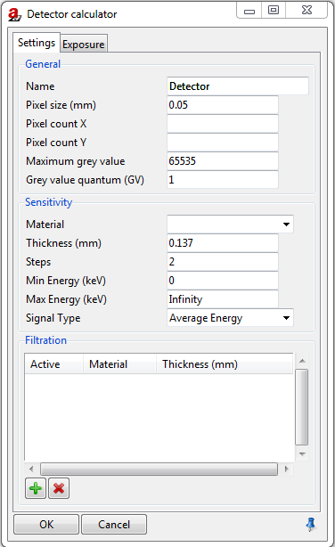

.. include:: _templates/icons.rst

.. _DetectorCalcSection:

DetectorCalc
============

The **DetectorCalc** module can be used to generate detector models for digital detectors (:numref:`detectorcalcSettingsgeneral`). 

.. note::
    
    In addition to the more general DetectorCalc module there is a simplified detector model calculator: :ref:`DigRad <DigRadSection>`.

.. _detectorcalcSettingsgeneral:

    DetectorCalc module.

.. _DetectorSettingsSubSection:

Settings
--------

.. _DetectorCalcGeneralSettingsSubsubSection:

General Settings
^^^^^^^^^^^^^^^^

Set the general settings for your new detector:

* **Name** to select the name of the detector.
* **Pixel size (mm)** to set the pixel size of the detector.
* **Pixel count X** to choose the number of pixel in X direction (optional). If the pixel count is set, the choosen number will be set if this detector is selected.
* **Pixel count Y** to choose the number of pixel in Y direction (optional). If the pixel count is set, the choosen number will be set if this detector is selected.
* **Maximum grey value** to set the maximum grey value (for a 16 bit detector the maximum grey value is given bei 2 power 16 = 65635 starting with a minimal grey value of 0)
* **Grey value quantum (GV)** gives the smalles unit: 1 == integer; 0.1 == one decimal digit. 

.. _DetectorCalcGeneralSensitivitySubsubSection:

Sensitivity
^^^^^^^^^^^

Set the sensitivity for your new detector:

* **Material** to set the detector material from the list of already defined materials (pull down menue). You can add any material to the list with the materials editor |16x16_edit-materials| **Materials** in the tools menue which also can be access via the **Toolbar**.
* **Thickness (mm)** to set the thickness of the selected detector material.
* **Steps** to set the number of steps for the layer model.

  .. note::

    The amount of Steps are relevant for the layer model. The more steps you set, the more accurate the simulation will be. 
    Accordingly, the execution time will increase. Typically two steps are enough for sufficient accuracy.

* **Min Energy (keV)** to set the minimal energy to be count for. The default value is 0 keV.
* **Max Energy (keV)** to set the maximal energy to be count for. The default value is Infinity.
* **Signal Type** to set the signal type. The following options are available via the pull down menue: Average Energy, Photon Count, and Energy Contribution. 
  
.. _DetectorCalcGeneralFiltrationSubsubSection:

Filtration
^^^^^^^^^^

It is possible to add a filtration over the new detector.

|16x16_list-add| Click on the green button to add a filter (default filter is Al with 1.0 mm thickness).

|16x16_edit-delete| Click on the red button to delete a selected filter.

If you want to change the settings of your filtration, click on the corresponding **Material** or **Thickness**. For the Material column you can choose a material of the editor list 
(:guilabel:`Tools` → |16x16_edit-materials| **Materials**). For **Thickness** just enter your desired value (in mm).

The column **Active** enables to activate (:class:`Yes`) or deactivate (:class:`No`) the selected filter. Therefore use the left mouse button to choose :class:`Yes` or :class:`No`.

.. _DetectorCalcExposureSubSection:

Exposure - Reference shot
-------------------------

For creating a new detector it is necessary to set reference values. With those, the new detector will be calibrated (with available detector settings) and considered for calculations (:numref:`detectorcalc-exposure`).

Set the reference values for your new detector:

* **Spectrum** to select the reference spectrum. A precalculated or measured spectrum can be loaded by |16x16_document-open-folder| :guilabel:`Load`. 
* **Current (mA)** to set the reference current, e.g., from an experiment.
* **Exposure time (s)** to set the reference exposure time, e.g., from an experiment. 
* **Number of frames** to set the number of frames, e.g., from an experiment.
* **Source detector distance (mm)** to set the source to detector distance, e.g., from an experiment.
* **Basic spatial resolution (mm)** to set the basic spatial resolution (SRb) of the detector, measured according to ASTM-E2002 - 2022 *Standard Practice for Determining Image Unsharpness and Basic Spatial Resolution in Radiography and Radioscopy* or DIN EN ISO 19232-5:2018 *Non-destructive testing — Image quality of radiographs — Part 5: Determination of the image unsharpness and basic spatial resolution value using duplex wire-type image quality indicators*.

.. note::

    The basic spatial resolution (SRb) of an X-ray detector is usually larger than the pixel size. Two times the SRb gives the inner unsharpness of the detector. 

* **Long range unsharpness (mm)** to set the long range detector unsharpness applying only for imaging plates and flat panel detectors.
* **Unsharpness ratio (%)** to set the internal scatter radiation ISR (%) describing the scatter radiation within the detector. The percentage can be determined on an edge profile (see also :ref:`DigRad <DigRadSection>` for more details). 
* **Grey value** to set the reference grey value, e.g., from an experiment.
* **SNR unnormalized** to set the reference unnormalilzed signal to noise ratio, e.g., from an experiment.

.. _detectorcalc-exposure:
.. figure:: pictures/modules-artist-detectorcalc-exposure.png
    :alt: Detector calculator, Exposure
    :width: 60.3%

    Detector calculator, Exposure.

Press :guilabel:`Run` to apply these settings and save them as an :code:`.aRTdet` file or :guilabel:`Default` to reset them.  
Afterwards the new detector can be loaded |16x16_document-open-folder| :guilabel:`Load` and applied at **Parameter Panel** → **Detector** → **Characteristic** → **detector type** → **Extern**. 

.. note::
    
    Another possibility is that the new detector with the file extension :code:`.aRTdet` can also be drop-in to the |artist| scene.
