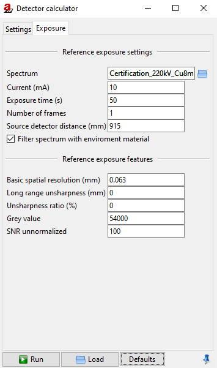

.. include:: _templates/icons.rst

.. _DetectorCalcSection:

DetectorCalc
============

The **DetectorCalc** module opens the Detector calculator (:numref:`detectorcalcSettingsgeneral`). It is useful for the detector's flat panel settings and calculating the captured photons. 

.. hint::
    
    In addition to the more general DetectorCalc there is a simplified detector calculator: :ref:`DigRad <DigRadSection>`.

.. _detectorcalcSettingsgeneral:
.. figure:: pictures/modules-artist-detectorcalc-settings.png
    :alt: Detector calculator, Settings
    :width: 60.3%

    Detector calculator, Settings.

.. _DetectorSettingsSubSection:

Settings
--------

.. _DetectorCalcGeneralSettingsSubsubSection:

General Settings
^^^^^^^^^^^^^^^^

Set the general settings for your new detector:

* **Name**
* **Pixel size (mm)**
* **Pixel count X**
* **Pixel count Y**
* **Maximum grey value**
* **Grey value quantum (GV)**

.. _DetectorCalcGeneralSensitivitySubsubSection:

Sensitivity
^^^^^^^^^^^

Set the sensitivity for your new detector:

* **Material**
* **Thickness (mm)**
* **Steps**

  .. note::

    The amount of Steps are relevant for the layer model. The more steps you set, the more accurate the simulation will be. 
    Thereby the execution time will increase. Typically two steps will be enough.

* **Min Energy (keV)**
* **Max Energy (keV)**
* **Signal Type**
  
.. _DetectorCalcGeneralFiltrationSubsubSection:

Filtration
^^^^^^^^^^

It is possible to add a filtration over the new detector.

|16x16_list-add| Click on the green button to add a filter (default filter is Al with 1.0 mm thickness).

|16x16_edit-delete| Click on the red button to delete a selected filter.

If you want to change the settings of your filtration, click on the corresponding **Material** or **Thickness**. For the Material column you can choose a material of the editor list 
(:guilabel:`Tools` → |16x16_edit-materials| **Materials**). For **Thickness** just enter your desired value (in mm).

The column **Active** enables to activate (:class:`Yes`) or deactivate (:class:`No`) the selected filter. Therefore use the left mouse button to choose :class:`Yes` or :class:`No`.

.. _DetectorCalcExposureSubSection:

Exposure - Reference shot
-------------------------

For creating a new detector it is necessary to set reference values. With those, the new detector will be calibrated (with available detector settings) and considered for calculations.

Set the reference values for your new detector:

* **Spectrum**
* **Current (mA)**
* **Exposure time (s)**
* **Number of frames**
* **Distance (mm)**
* **Long range unsharpness (mm)**
* **Unsharpness ratio (%)**
* **Grey value**
* **SNR unnormalized**

.. _detectorcalc-exposure:

    Detector calculator, Exposure.

Press :guilabel:`Run` to apply these settings and save them as an :code:`.aRTdet` file or :guilabel:`Default` to reset them.  
Afterwards the new detector can be loaded |16x16_document-open-folder| :guilabel:`Load` and applied at **Parameter Panel** → **Detector** → **Characteristic** → **detector type** → **Extern**. 

.. note::
    
    Another possibility is that the new detector with the file extension :code:`.aRTdet` can also be drop-in to the |artist| scene.
