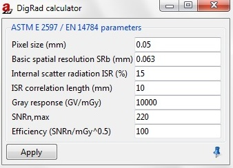

.. include:: _templates/icons.rst

.. _DigRadSection:

DigRad
------

.. 3.5	DigRad (incl. menu description)

The DigRad module refers to the type of detector used in the simulation. 
For example if you want to use a digital detector, open this module and set the parameters (:numref:`DigRadcalculator`). 
Press **Apply** when finished.

* **Pixel size (mm)**
* **Basic spatial resolution SRb (mm)**
* **Internal scatter radiation ISR (%)**
* **ISR correlation length (mm)**
* **Gray response (GV/mGy)**
* **SNRn,max**
* **Efficiency (SNRn/mGy^0.5)**

.. _DigRadcalculator:

    DigRad calculator.