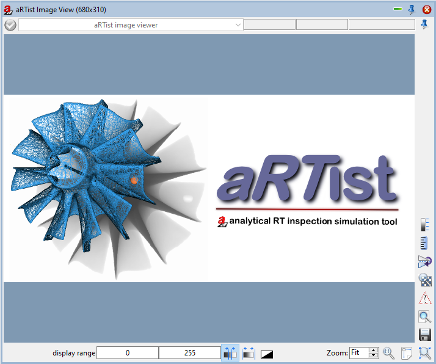
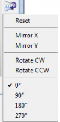
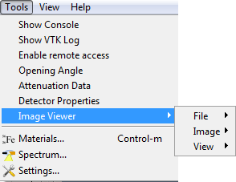
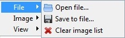
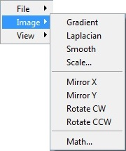
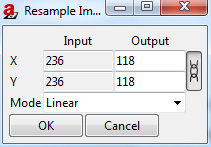
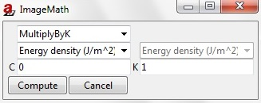
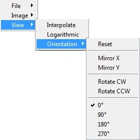

.. include:: _templates/icons.rst

.. _ImageViewerSection:

|32x32_image-radiography| Image Viewer 
======================================

The |16x16_image-radiography| **Image Viewer** module is the only module that is in the docking area by default (:numref:`ImageViewerPic1`). 
It displays the preview image and the finished simulation. You may choose between two options as
mentionend before: radiography and thickness maps (see: :ref:`Compute menu <ComputeMenuSubsection>`). 
The different settings and functions of Image Viewer will be explained in this chapter.

.. _ImageViewerPic1:

    Image Viewer picture after start.

.. _UpperBarSubSection:

Upper bar
---------

|16x16_image-status-undefined| : A grayed out check mark means that no images have been loaded into Image Viewer before.

|16x16_image-preview| : A crossed out red circle means that you are currently viewing a preview of the simulation. The preview has a lower resolution and is calculated with different parameters for faster results.

|16x16_image-final| : Run |16x16_aRTist| the simulation and a green tick will appear indicating that the simulation was successful.

The drop-down menu to the right of the icon offers different images of the simulation steps (:class:`energy density J/m²` or :class:`primary intensities`). 
The available options depend on the current settings.

The three grey fields next to the drop down menu display the mouse position (first grey field: X-axis, second grey field: Y-axis) 
and the energy density [in J/m²] or primary intensities in grey value or thickness [in mm] (third grey field) at that position. Those figures are also displayed in the status bar (see: :numref:`guiMainWindow`).

.. _LowerBarSubSection:

Lower bar
---------

**display range** indicates min. and max. grey value/thickness of the current image. If needed, you may change those values with your keyboard. Press :kbd:`Enter` when finished.

|16x16_optimize-contrast| Optimize display range (dependent on current image).

|16x16_reset-contrast| Reset display to default range (Maximum and minimum output depends on the detector).

|16x16_image-invert| Display inverted to a negative of the image and back.

 .. |ImageViewer-Zoomfit| image:: pictures/modules-ImageViewer-Zoomfit.png

|ImageViewer-Zoomfit| **Zoom** in and out with the up-down control of the spin box. Alternatively, you may use the mouse wheel or the right mouse button. Default: Fit (zoom fits window).

|16x16_zoom-original| Show in actual size shows a 1:1 depiction of the current image.

|16x16_zoom-fit-best| Zoom to fit window resets zoom to fit window after zooming in or out.

|16x16_zoom-select| Zoom to selection enlarges to a selected part of the image. Select the desired part with the left mouse button.

.. _BarOnTheRightSubsection:

Bar on the right
----------------

|16x16_document-save| Save the current image.

|16x16_document-preview| Show in external viewer opens the current image in an external viewer.

|16x16_latitude-warning| Display exposure latitude warning (de)activates warning for over- or underexposure. Overexposed areas will be marked red, underexposed areas will be marked blue.

|16x16_zoom-pixel-by-pixel| Pixel for pixel mode changes between actual pixel size and screen pixel size. This option is only active when Zoom = Fit.

|16x16_object-flip-turn| Change image orientation opens a menu with different options to mirror or rotate the image.

* **Reset** is used for resetting the settings in the image orientation.

* **Mirror X/Mirror Y** is used to reflect the image orientation on X-axis or Y-axis.

* **Rotate CW/Rotate CCW** is used to spin the image clockwise or counter-clockwise.

* **0°** / **90°** / **180°** / **270°**  is used to orientate the image (between four different angles).

   .. seealso::
    
       The same menu like in :numref:`ImageViewRot` can be found in the :guilabel:`Tools` menu under  **Image Viewer** → **View** → **Orientation**. Please note that the changes made with commands from either one of those menus do not have lasting effects, for example, when saving the image. If you want to permanently edit an image use the commands from the following menu: :guilabel:`Tools` →  **Image Viewer** → **Image**.
    
.. _ImageViewRot:

    Image View: Change image orientation.

|16x16_lineal| Show ruler displays a ruler on the bottom of the image. It measures the image width in millimeters by default. If the ruler is turned on, you can also measure in pixels. To do this press the icon for pixel mode |16x16_zoom-pixel-by-pixel|.

|16x16_legend| Show legend opens a legend with grey or thickness values. Minimum and maximum values are determined by the display range. Height, width and position of the legend are adjustable.

.. _ImageViewerToolsMenuSubsection:

Tools Menu: Image Viewer
------------------------

In the following every command of the  Image Viewer submenu from the Tools Menu (:numref:`ImageViewToolsNeu`) will be explained.

.. _ImageViewToolsNeu:

    Tools Menu,  Image Viewer Menu.

This submenu offers specific settings for :ref:`Image Viewer <ImageViewerSection>` and consists of different additional submenus:

* File
* Image
* View

.. _FileSubsubSection:

File
^^^^
It consists of three additional submenus: Under File you can find commands to open a new image file, save the current simulation 
(you may also use the Save button |16x16_document-save| in  Image Viewer) or clear the image list (:numref:`image_viewer1`).

.. _image_viewer1:

    Image Viewer, File Menu.

.. _ImageSubsubSection:

Image
^^^^^

Under Image you can find different filters and options to mirror or rotate the current image (:numref:`image_viewer2`). 

.. note::

    Please note that changes made with commands from this submenu are permanent (for example when saving the image).
    For non-permanent modifications use commands from the View submenu.

.. _image_viewer2:

    Image Viewer, Image Menu.

* **Gradient**, **Laplacian** and **Smooth** are used to choose between corresponding filters

    .. |modules-ImagViewerScale-closedSymbol| image:: pictures/modules-ImagViewerScale-closedSymbol.png
    .. |modules-ImageViewer-openSymbole| image:: pictures/modules-ImageViewer-openSymbole.png

* **Scale** is used to fill in the output values for X and Y (:numref:`ImageView-toolsscale`). Next to the output fields is a button |modules-ImagViewerScale-closedSymbol|. When you click this button, the symbol changes, once into an open chain |modules-ImageViewer-openSymbole| and once into a closed chain |modules-ImagViewerScale-closedSymbol|. The closed symbol |modules-ImagViewerScale-closedSymbol| gives a square image. The open symbol |modules-ImageViewer-openSymbole| allows rectangular pixels, as X and Y can have different values.

.. _ImageView-toolsscale:

    Image Viewer, Image, Scale.

* **Mirror X/Y** reflects the current image on X-axis or Y-axis.

* **Rotate CW/CCW** spins the current image in 90 degree steps clockwise or counter-clockwise.

* **Math** opens the ImageMath window (:numref:`imagemath1`). It offers several arithmetic operations and point operations that can be applied the current image.

    The first drop-down menu of the ImageMath offers the following arithmetic operations. In order for them to work the input field for **C** or **K** has to be filled in. Except for the first two functions, :class:`MultiplyByK` and :class:`AddConstant`, the actual number is not important. Press :guilabel:`Compute` to run the operation and :guilabel:`Cancel` to reverse it:

.. _imagemath1:

    Image Viewer, Image, Math.

* :class:`MultiplyByK` is used for pointwise multiplication of each pixel with K.
* :class:`AddConstant` is used for pointwise addition of each pixel and C.
* :class:`Exp` is point operator based on the exponential function and changes the dynamic range of the image.
* :class:`Log` is point operator based on the log function and changes the dynamic range of the image.
* :class:`Invert` inverts the current picture.
* :class:`AbsoluteValue` takes the absolute value of each pixel.
* :class:`Square` squares the value of each pixel.
* :class:`SquareRoot` takes the square root of each pixel.
* :class:`Sin` calculates the sine of each pixel.
* :class:`Cos` calculates the cosine of each pixel.
* :class:`ATAN` calculates the arctangent of each pixel.

The following operations calculate a new image out of two images therefore the third drop-down menu is enabled. 

.. hint::
    
    **C** and **K** may be left empty.

* :class:`Add` sums every corresponding pixel value of the two images.
* :class:`Subtract` deducts every corresponding pixel value of the second image from the first image.
* :class:`Multiply` multiplies every corresponding pixel value of the two images.
* :class:`Divide` divides every pixel value of the first image by corresponding pixel value of the second image.
* :class:`Min` shows minimum grey values of the two images.
* :class:`Max` shows maximum grey values of the two images.

.. _ViewSubsubSection:

View
^^^^

Under View you can find the same four mirror and rotate commands explained under Image and additional options (:numref:`image_viewer3`). 
Please note that the changes will not be visible when you save the image or open it in an external viewer as opposed to the commands found in the Image submenu.

.. _image_viewer3:

    Image Viewer, View, Orientation Menu.

**Interpolate** activates/deactivates interpolation. |artist| uses linear interpolation.

**Logarithmic** is point operator based on the log function and changes the dynamic range of the image.

**Orientation** is used for the following commands, which also access with this button |16x16_object-flip-turn| in the  Image Viewer (see: :ref:`Bar on the right <BarOnTheRightSubsection>`).