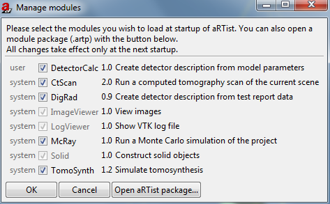

.. include:: _templates/icons.rst

.. _manageModules:

Manage Modules
==============

Manage Modules (:numref:`modulesManage`) allows you to select that should be loaded when |artist| is started. The following modules can be activated or deactivated: 

* :ref:`DetectorCalc <DetectorCalcSection>`, 
* :ref:`CtScan <CtScanSection>`, 
* :ref:`DigRad <DigRadSection>`, 
* :ref:`McRay <McRaySection>` and 
* :ref:`TomoSynth <TomoSynthSection>`

Modules like :ref:`ImageViewer <ImageViewerSection>`, LogViewer and :ref:`Solid <SolidSection>` are obgligatory and cannot be disabled (:numref:`modulesManage`). 

The changes will only take effect after a restart of aRTist.

.. _modulesManage:	
			

    
    Manage modules.

