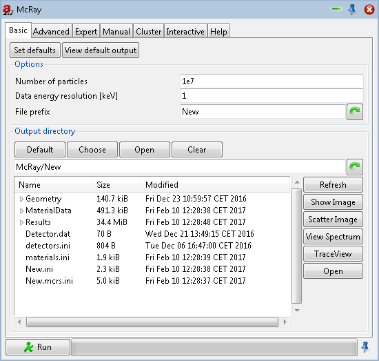
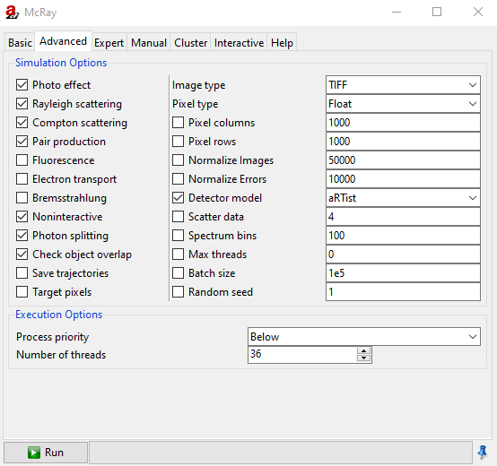

.. include:: _templates/icons.rst

.. _McRaySection:

McRay
=====

**McRay** is a Monte Carlo ray tracing implementation for photon and electron transport. 

For photon transport **McRay** solves the stationary Bolzmann equation. It describes not only the attenuation of photons as the exponential attenuations law, giving the part of the photon that do no interact with die object, but also counts for contributions of Compton and Rayleigh scattering as well as for pair production. Additionally internal sources as X-ray fluorescence (emission of photons as a result of the photo absorption), electron-positron annihilation (emission of two photons with exactely 511 keV in opposite direction as a result of pair production), and Bresmstrahlung production can be considered. 

Additional the **McRay** module can trace electrons which is for most of the application of |artist| not necessary and consumes a very large amount of computing resources. 

This module forms a graphical interface for **McRay** in order to configure and run simulations using it from within |artist|. 
If you activate the inline help icon |16x16_system-help| an additional tab :guilabel:`Help` will appear (see: :ref:`Help menu <HelpMenuSubsection>`).

.. note::
    
    In this user guide, the **McRay** module topics :guilabel:`Expert`, :guilabel:`Manual`, :guilabel:`Cluster`, and :guilabel:`Interactive` are not being explained. The topics :guilabel:`Expert` requires detailed knowledge about the underlaying physics and the Monte Carlo method. The topic  :guilabel:`Manual` require detaild knowledge aubout the implementation of the ray tracer. The topic :guilabel:`Cluster` war created to run **McRay** on a computer cluster under linux for parallel computing. The actual implementation runs also on multi processor multi core Windows systems. The topic :guilabel:`Interactive` summarizes the simulation and the calculation process, i.e., is just informative. 

A :guilabel:`Run` or alternately a :guilabel:`Stop` button and a progress bar are located at bottom of module window. To start the calculation press the :guilabel:`Run` button. After this the :guilabel:`Run` button turns to the :guilabel:`Stop` button to stop the running calculation. 

.. _McRayBasicSubSection:

:guilabel:`Basic`
-----------------

This page contains everything necessary to run a Monte Carlo simulation with the default settings (:numref:`mcrayy`). 
At the top there are two buttons, :guilabel:`Set defaults` to reset all settings to the default one, and :guilabel:`View default output` to load the images normally resulting from a successful simulation.

.. _mcrayy:

    McRay: Basic.

.. _McRayBasicOptionsSubsubSection:

Options
^^^^^^^

* **Number of particles** is used to specify the desired number of particles (photons / electrons) to be started for the simulation.
* **Data energy resolution [keV]** is used to set the energy resolution for the simulation.

    .. hint::
    
        Internally most material data (attenuation-coefficients, differential scatter cross-sections, etc.) is kept in lookup structures for fast access. 
        The default value of 1 keV does not normally need to be changed, but for low-energy calculations, for instance if fluorescence is included, a smaller value of, e.g., 0.1 keV may be advisable.

* **File prefix** is used as the base name for the output files, it defaults to the name of the current |aRTist| project.

.. _McRayBasicOutputSubsubSection:

Output directory
^^^^^^^^^^^^^^^^

Here you may change and view the **Output directory**, which will hold the configuration files, data files, and all output files (images, spectra, etc.). 
The four buttons at the top allow you to :guilabel:`Choose` the directory via a graphical dialog, :guilabel:`Open` it in an external file browser, or :guilabel:`Clear` to delete all files in the output directory and in all subdirectories. 
With the :guilabel:`Default` button it is possible to reset the settings to the default values. The default value for the output directory is #McRay/<File prefix>. After the calculation has been finished an additional subdirectory named Results is created, where all simulation results are stored.

.. note::
    You may also change the directory by typing into the text field below the buttons.

The remaining space is filled by the file list and associated buttons. A double click in the list will open this file with its associated application (standard file explorer functionality), 
just like pressing the :guilabel:`Open` button. To view the content of the subdirectories press the **+** in front of the subdirectory name. :guilabel:`Show Image` will load the currently selected file in the :ref:`ImageViewer <ImageViewerSection>`. :guilabel:`Scatter Image` will load this image as scatter image for the scattering mode *External file* of the general |aRTist| workflow (see parameter panel **Scattering**). :guilabel:`TraceView` will open the selected file with the TraceView module. The TraceView module is intended to visualize trajectories saved by McRay if *Safe trajectories* is selected in the :ref:`Advanced <McRayAdvancedSubSection>` tab (see below) in the 3D scene view. 
:guilabel:`View Spectrum` will open the selected file with the spectrum viewer of |aRTist|.

.. _McRayAdvancedSubSection:

:guilabel:`Advanced`
--------------------

.. _McRayAdvancedSimulationOptionsSubsubSection:

Simulation Options
^^^^^^^^^^^^^^^^^^

The options on the left hand side are mostly concerned with physical effects and geometry handling. The right hand side allows configuration of the output to produce (:numref:`mcrayy1`).
If the command is selected it is necessary to change the number right to the selected option. If the command is not selected the default setting will be set.

.. _mcrayy1:

    McRay: Advanced.

Left hand side of Simlulation Options:
~~~~~~~~~~~~~~~~~~~~~~~~~~~~~~~~~~~~~~

* **Photo effect** considers photoabsorption when selected. Should almost always be selected.

    .. note::
    
        The photoabsorption results in the emission of an electron when electromagnetic radiation is absorbed in the material. The emitted the photoelectron obtains a kinetic energy given by the difference between the photon’s energy and the binding energy of that particular electron. The photoelectron produces Bremsstrahlung radiation with energies smaller or equal to the kinetic energy of the electron. Additionally, recombination processes within the electron shell yield to X-ray fluorescence.

* **Rayleigh scattering** considers Rayleigh scattering when selected.

    .. note::
        
        The coherent or Rayleigh scattering is an elastic process and involves no energy loss of the X-ray photon but continues to travel through the material along an altered path upon being scattered by an atom. It is only a photon process that does not produce electrons. 

* **Compton scattering** considers Compton scattering when selected.

    .. note:: 
    
        Compton scattering occurs when the incident X-ray photon is deflected from its original path by an interaction with an outer shell electron. 
        The electron is ejected from its orbital position and the X-ray photon loses energy because of the interaction but continues to travel through the material along an altered path. 
        Energy and momentum are conserved in this process. The energy shift depends on the angle of scattering and not on the nature of the scattering medium if considering scattering at a free electron. In reality, the scattering occurs at a bound electron that has to be considered in the scattering cross section, i.e., it depends on the scattering medium.
        As for the photoabsoption Bremsstrahlung radiation with energies smaller or equal to the kinetic energy of the electron is produced as secondary effect.

* **Pair production** considers pair production when selected, i.e., the production of an electron-positron pair.

    .. note::

        If the photon energy exceeds double the electron mass of rest, i.e., if its energy is larger than 1.022 MeV, the photon is converted in the electrical field of the nucleus into an electron and a positron. This process is called pair production. Photons with lower energy are not able to produce an electron positron pair. The photon energy that exceeds the needed minimal energy for producing an electron positron pair appears as kinetic energy of the pair. The produced pair loses its kinetic energy within a very short time of about 10 power -12 s. The remaining resting electron positron pair has a lifetime of about 10 power -9 s before annihilation. As result of annihilation two gamma photons are emitted in opposite direction because of momentum conservation both with energy of exactly 511 keV. 
        

* **Fluorescence** considers X-ray flourescence when selected. Photons, and electrons if enabled, can excite or eject bound electrons of the material's electron shell. During the recombination in the electron shell X-ray fluorescence photons, fluorescence electrons, and Auger electrons may be emitted.

    .. note::
    
        X-ray fluorescence is the emission of characteristic or fluorescent X-rays from a material that has been excited by being exposed with high-energy X-rays or gamma rays, ionization of their component atoms may take place. Ionization consists of the ejection of one or more electrons from the atom, and may occur if the atom is exposed to radiation with an energy greater than its ionization energy. Each element has electronic orbitals of characteristic energy. Following removal of an inner electron by an high-energy photon provided by a primary radiation source, an electron from an outer shell drops into its place. Each of the possible transitions yields a X-ray fluorescence photon with a characteristic energy equal to the difference in energy of the initial and final orbital. 
        

* **Electron transport** considers electron transport when selected. When fluorescence or bremsstrahlung radiation is enabled, secondary particles will be created.

    .. note::

        The transport of electrons and other charged particles is fundamentally different from that of uncharced particles, such as neutrons and photons. The transport of electrons is dominated by the long-range Coulomb force, resulting in large numbers of individual interactions. Elastig and inelastic interactions of electrons with matter are considered: Elastic scattering, ionisation, excitation, and radiative energy loss (Bremsstrahlung radiation) are considerd. In the |artist| Monte Carlo implementetion of the electron transport the model of individual collitions (MIC) is used. The energy-loss fluctuations are  taken into account according to the Landau theory.

* **Bremsstahlung** (photons) are created during electron interactions when elected and requires electron transport.

    .. note::
        Bremsstrahlung radiation is an electromagnetic radiation produced by the deceleration of a charged particle when deflected by another charged particle, 
        typically an electron by an atomic nucleus. The moving particle loses kinetic energy, which is converted into one photon or more, thus satisfying the law of conservation of energy. 
        The term is also used to refer to the process of producing the radiation. Bremsstrahlung has a continuous spectrum, which becomes more intense and whose peak intensity shifts toward 
        higher energies as the change of the energy of the decelerated particles increases.

* **Noninteractive** starts/stops calculation without further user interaction.
* **Photonsplitting** applies a variance reduction scheme. Photonsplitting takes into account the possible interaction processes when a photon is penetrating a medium.
* **Check object overlap** notes the overlapping of parts when elected.
* **Save trajectories** writes trajectory segments to disk (slow depending on the number of photon to be considered).
* **Target pixels** aims photons toward each pixel (mostly for visualization purpose).

right hand side of Simlulation Options:
~~~~~~~~~~~~~~~~~~~~~~~~~~~~~~~~~~~~~~~

* **Image type** is used to choose between different image types: TIFF, ISee, RAW, PGM or TXT. The default setting is TIFF.
* **Pixel type** is used to choose between different pixel types: UInt 16, Float, Double. Usually Float is used.
* **Pixel columns** enters the number of pixel in columns.
* **Pixel rows** enters the number of pixel in rows.
* **Normalize Errors** normalizes a relative error of 1 to this value (relative statistically error).
* **Detector model** is used to choose between different detector models: aRTist, Photons, Leptons, Electrons, Positrons or All. The default detector model is aRTist.
* **Scatter data** registers data for this many scatter events separately.
* **Spectrum bins** sets the number of spectrum bins. The maximum energy divide by the number of bins gives the spectrum resolution in keV for each energy.
* **Max threads** sets the maximum number of threads.
* **Batch size** sets the batch size of trajectories.
* **Random seed** sets the random seed. The random seed is a number used to initilize a pseudo random number generator. A pseudorandom number generator's number sequence is completely determined by the seed: thus, if a pseudorandom number generator is reinitialized with the same seed, it will produce the same sequence of numbers. If the seed is not set a random seed is used, i.e., it will not produce the same sequence of random number, which is recommended. 

.. _McRayAdvancedExecutionOptionsSubsubSection:

Execution Options
^^^^^^^^^^^^^^^^^

**Process priority** is used to adjust the process priority of the background process carrying out the actual simulation with this parameter. 
You can choose between :class:`Idle`, :class:`Below`, :class:`Normal`, :class:`Above` and :class:`High`. 

.. hint::
    
    As calculations can potentially take a long time, a reduced priority is generally advisable (default setting: :class:`Below`).

Set the **Number of threads** to be executed for the Monte Carlo simulation. Default: **0**, utilizing one thread per logical processor.
