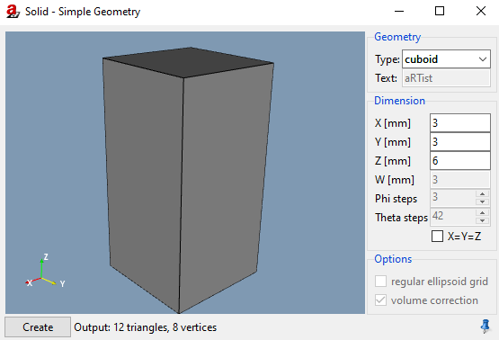
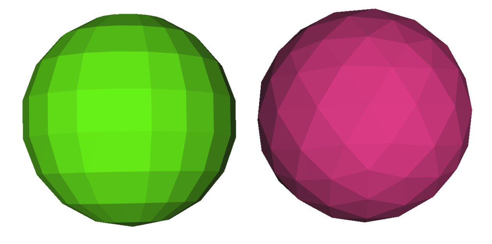

.. include:: _templates/icons.rst

.. _SolidSection:

|32x32_icon-solid| Solid
========================

The |16x16_icon-solid| **Solid** module can be used to generate triangulated surfaces of simple geometric solids like ellipsoids, cuboids, etc. and also 3D letters with customizable text (:numref:`modules-solid1`). 
The created solids are loaded into the scene and contribute to the assembly of parts. 

.. _modules-solid1:

    
    Solid.

Geometry
--------

Under **Geometry** you can select the **Type**. The following types are available for selection:

* :class:`cuboid`
* :class:`ellipsoid`
* :class:`cylinder`
* :class:`tube`
* :class:`cone`
* :class:`text` (to define a text marker that can be radiographed) 
* :class:`wedge`
* :class:`step wedge`

Dimensions
----------

The size of the solid can be defined by the **X**, **Y**, and **Z** extent of its bounding box. By activating the checkbox **X=Y** (**=Z**) you can force equal values for **X [mm]**, **Y [mm]**, and **Z [mm]**. 

The **W** defines the wall thickness of a tube, or the final thickness (in Z dimension) of a wedge (**Z** sets the initial thickness).
The **Phi steps** and **Theta steps** control the accuracy of the faceting of the ellipsoid, cylinder and cone.

Options
-------

For an ellipsoid, you can additionally decide whether to use facetting in a **regular ellipsoid grid** using a latitude/longitude tesselation or a geodesic tesselation of equal-sized triangles (see :numref:`modules-solid2`).

.. _modules-solid2:

    
    Latitude/longitude tesselation (left) and geodesic tesselation of equal-sized triangles (right).

For ellipsoid, cylinder, and cone, you can activate the **volume correction**, where the facetted solid will be scaled up to meet the exact volume of the ideal solid. 

.. note::

    The default material for new parts is :class:`Fe` and can be adjusted at :guilabel:`Menu Bar` → **Tools** → **Settings...** → **Advanced** → **Geometry**. But **text** is always created with material :class:`Pb`.

.. tip::

    After the solid is created, it can also be saved in a file (STL or PLY). To do this, select the part of your solid in the :class:`Assambly List` (e.g., by clicking at it in the scene) alone. Than use the general dialog :guilabel:`File` → |16x16_document-save-as| **Save as ...** to save, selecting :class:`File type` **Selected Parts**. 
