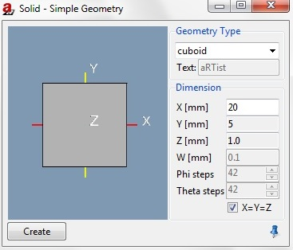

.. include:: _templates/icons.rst

.. _SolidSection:
|32x32_icon-solid| Solid
========================

.. 3.2	Solid (from existing tutorial)

.. _GeometryTypeSubsection:
Geometry Type
-------------

The Solid module allows you to create simple parts of different sizes to construct your assembly as desired (:numref:`modules-solid1`). 
It offers different geometric shapes to choose from:

* cuboid
* ellipsoid
* cylinder
* tube
* cone
* text
* wedge
* step wedge

.. _DimensionsSubsection:
Dimensions
----------

Select the part of your choice from the drop-down menu and set the Dimensions in mm and the Phi/Theta steps if applicable. You may predetermine equal values for 
X, Y and Z by checking the box at the bottom of the module. If you choose “text” the input field at the top of the module is enabled. When finished press the Create button.

The default material for new parts is Fe. A list with available materials can be accessed from

* the :guilabel:`Menu Bar` → **Geometry**  → **Set Material** or
* the Assembly List of the :ref:`Parameter Panel <ParameterPanel>`

.. _modules-solid1:

    
    Solid.