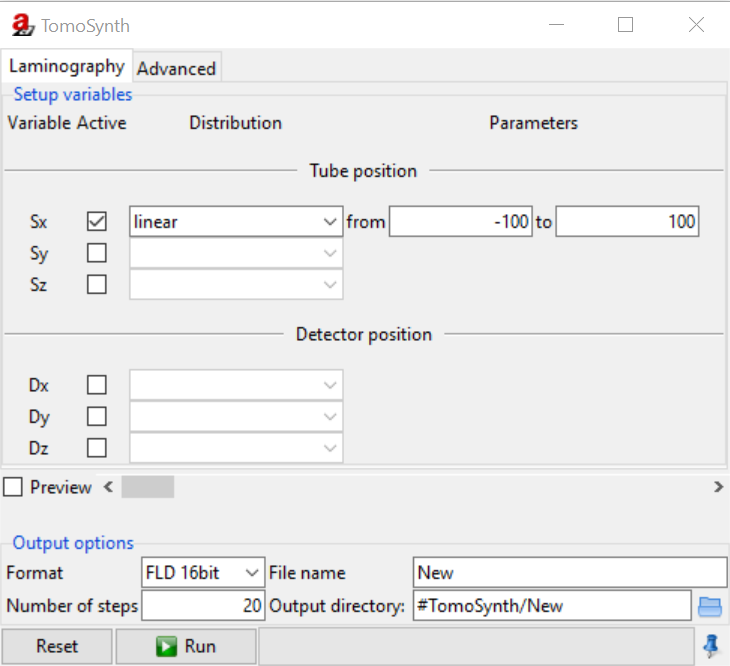
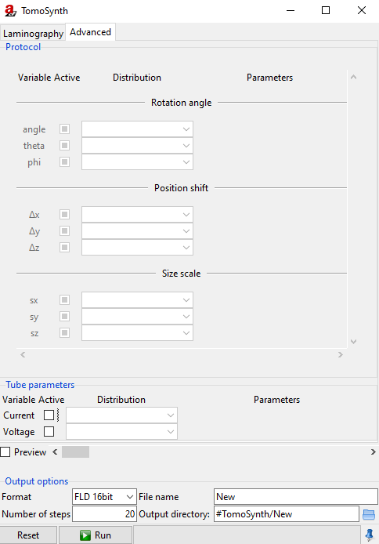

.. include:: _templates/icons.rst

.. _TomoSynthSection:

TomoSynth
=========

The **TomoSynth** module (:numref:`tomosynth1a`) allows you to configure repeated projections at stepwise parameter variations. Geometrical transformations can be applied individually to any element of the scene. The module was developed to simulate arbitrary scanning trajectories.  
The :guilabel:`Laminography` tab offers settings for tube and detector position only. It provides a simple interface to facillitate laminographic scans. 
The :guilabel:`Advanced` tab offers settings for the actual selected part. Individual variations can be applied by sequentially selecting the respective parts. 

.. _LaminographySubsection:

:guilabel:`Laminography`
------------------------

.. _tomosynth1a:

    TomoSynth: Laminography.

Setup variables
^^^^^^^^^^^^^^^
Tube (**S**) and detector (**D**) can be moved on the three axes **X**, **Y** and **Z**. Set the parameters in the following order:

**Variable Active** is used to select the desired axis/axes via checkbox(es).

**Distribution** is used to choose a distribution out of the available options. A drop-down menu is activated when the corresponding variable is selected. 
Deterministic and random distributions are available (see below). 

**Parameters** are used to fill in the values of the activated parameters. The values for the activated parameters are depending on the distribution choosen.

 .. |modules-Tomosynth-tomosynth_PreviewSlider| image:: pictures/modules-tomosynth_PreviewSlider.jpg

**Preview** |modules-Tomosynth-tomosynth_PreviewSlider| is used to see a preview in :ref:`ImageViewer <ImageViewerSection>` of the tube's and/or detector's movement for the current settings when moving the slider (if checkbox is activated). 
Beneath the settings for tube and detector, you can find a slide control next to the preview checkbox.

    .. note::
        A deterministic distribution is a mathematical formula, which describes how to compute the value for a given image number step for a total of Nsteps images. Here, step varies from 0 to Nsteps-1. 
        A random distribution assigns a pseudo random number with a given probability density to the associated variable.
        The pseudo random numbers are generated by hashing sequence numbers with a fixed random seed and are therefore completely reproducible.

    .. hint::

        Please note that the sign of the radius (circle, arc, disc) defines the orientation of the rotation, where positive radius values indicate a right-handed rotation.

Deterministic distributions:
~~~~~~~~~~~~~~~~~~~~~~~~~~~~

.. _here: https://www.tcl.tk/man/tcl8.6/TclCmd/expr.html#M22

* :class:`linear` is used to linearly increase/decrease the parameter you selected.
* :class:`logarithmic` is used to logarithmically increase/decrease the parameter you selected.
* :class:`constant` sets a variable to a constant value. Most useful to define the axis of rotation for rotating objects.
* :class:`circle_x` revolves in X-direction.
* :class:`circle_y` revolves in Y-direction.
* :class:`arc_x` is used to calculate arc in X-direction.
* :class:`arc_y` is used to calculate arc in Y-direction.
* :class:`disc_x` is used to disc in X-direction.
* :class:`disc_y` is used to disc in Y-direction.
* :class:`formula_rnd` is used to define a formula with a random variable.
* :class:`formula` is used to enter an arbitrary mathematical formula to define a deterministic distribution. The expression is evaluated using the rules of expr of the Tcl scripting language. For a detailed reference, please consult the online documentation for Tcl here_. 

Random distribution:
~~~~~~~~~~~~~~~~~~~~

* :class:`uniform` assigns a uniform probability distribution function. A uniform distribution is a continuous random variable in which all values between a minimum value and a maximum value have the same probability.
* :class:`gaussian` assigns a Gaussian probability distribution function. The Gaussian distribution or normal distribution is a type of continuous probability distribution for a real-valued random variable. The parameter μ is the mean or expectation of the distribution, while the parameter σ is its standard deviation. 
* :class:`lognormal` assigns a log-normal probability distribution function. In probability theory, a log-normal distribution is a continuous probability distribution of a random variable whose logarithm is normally distributed. Thus, if the random variable X is log-normally distributed, then Y = ln(X) has a normal distribution.

Output options
^^^^^^^^^^^^^^

* choose a **Format** from the following options: :class:`RAW`, :class:`TIFF`, :class:`TIFF 16bit` and :class:`FLD 16bit`
* put in a **File name**
* put in the **Number of steps**
* choose the **Output directory**

Alternatively, you may use the default settings.

When finished press the :guilabel:`Run` button to start the simulation or :guilabel:`Reset` if you wish to discard the changes you have made.

.. _AdvancedSubsection:

:guilabel:`Advanced`
--------------------

The settings in this tab are mainly directed towards experts (:numref:`tomosynth2a`).

.. _tomosynth2a:

    TomoSynth: Advanced.

Protocol
^^^^^^^^
It is possible to change the settings for each part of the scene.

**Variable Active** selects desired axis/axes via checkbox(es).

* Rotation Angle sets the rotation **angle**, the polar angle **theta** and the azimuthal angle **phi**.

* Position Shift sets the position shift in the three axes: **Δx**, **Δy** and **Δz**.

* Size Scale sets the size scale in the three axes: **Sx**, **Sy** and **Sz**.

**Distribution** is used to choose a distribution from the available options. A drop-down menu is activated when the corresponding variable is selected. 
Please note that the sign of the radius (circle, arc, disc) defines the orientation of the rotation, where positive radius values indicate a right handed rotation.

**Parameters** are used to fill in necessary parameters.

Tube parameters
^^^^^^^^^^^^^^^
Current drop-down menu is activated when **Current** is selected. Choose a distribution from the available options (:class:`linear`, :class:`logarithmic`, :class:`constant`, :class:`circle_x`, :class:`circle_y`, :class:`arc_x`, :class:`arc_y`, :class:`uniform`, :class:`gaussian`, :class:`lognormal`, :class:`disc_x`, :class:`disc_y`, :class:`formula_rnd` or :class:`formula`).

Voltage drop-down menu is activated when **Voltage** is selected. Choose a distribution from the available options (:class:`linear`, :class:`logarithmic`, :class:`constant`, :class:`circle_x`, :class:`circle_y`, :class:`arc_x`, :class:`arc_y`, :class:`uniform`, :class:`gaussian`, :class:`lognormal`, :class:`disc_x`, :class:`disc_y`, :class:`formula_rnd` or :class:`formula`).

**Preview** |modules-Tomosynth-tomosynth_PreviewSlider| is used to see a preview in :ref:`ImageViewer <ImageViewerSection>`. Beneath the settings for tube and detector you can find a slide control next to the preview checkbox. 
Activate the checkbox and move the slider to see a preview of the tube's and/or detector's movement for the current settings.

Output options
^^^^^^^^^^^^^^
* choose a **Format** from the following options: :class:`RAW`, :class:`TIFF`, :class:`TIFF 16bit` and :class:`FLD 16 bit`
* put in a **File name**
* put in the **Number of steps**
* choose **Output directory**