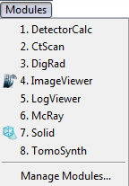

.. include:: _templates/icons.rst

.. _Modules:

:guilabel:`Modules`
===================

:guilabel:`Modules` are independent parts of the |aRTist| software that provide additional functuality and their own program windows. These windows can run separately or be integrated into the docking area of the main window. You can use the |16x16_window-dock| **Pin** to put a module in a separate window or attach it to the *Docking Area*.

Several modules are included with |aRTist|. The :guilabel:`Modules` drop-down menu (:numref:`neu_module`) can be used to access the modules.

.. _neu_module:	

    
    Modules Menu.

.. note::
    
    Additional or updated modules can also be provided individually using |aRTist| package files (:code:`.artp`) for subsequent installation.  

.. toctree::
   :maxdepth: 2
   :caption: Modules elements:
   
   modules-ctscan
   modules-detectorcalc
   modules-digrad
   modules-imageviewer
   modules-mcray
   modules-solid
   modules-tomosynth
   modules-manage
