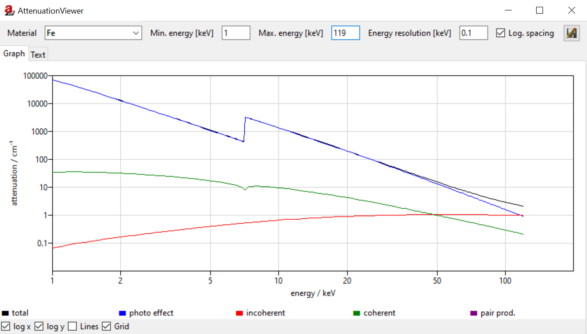

.. include:: _templates/icons.rst

.. _AttenuationDataSection:

Attenuation Data
================

The **AttenuationViewer** shows the attenuation-coefficient as a function of the radiation's energy (:numref:`tools-attenuation1`). It consists of different graphs:

* photo effect (blue graph)
* incoherent scattering (red graph)
* coherent scattering (green graph)
* pair production (violet graph)
* total (black graph)

|16x16_document-save-as|: The displayed data can be saved in tabulated, or graphical form.

.. _tools-attenuation1:

    AttenuationViewer.