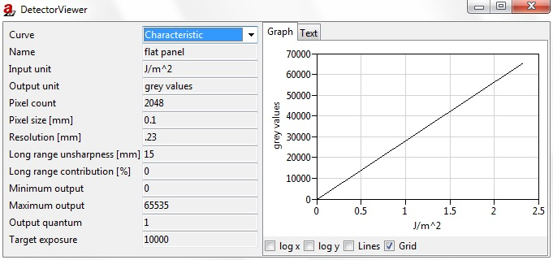

.. include:: _templates/icons.rst

.. _Tools-detectorProperties:

Detector Properties
===================

The **DetectorViewer** contains plots of the properties of the current detector (:numref:`DetectorViewer`):

* :class:`Characteristic` is used for grey values, film densities or air dose mGy as a function of energy density J/m²
* :class:`Noise` is used for :abbr:`SNR (Signal-to-Noise Ratio)` as a function of energy density
* :class:`Sensitivity` deposits energy as a function of energy

.. note::
    
    The type of graph(s) available is dependent on the detector.

On the left-hand side of DetectorViewer (:numref:`DetectorViewer`) details of the current detector are displayed.

.. _DetectorViewer:

    DetectorViewer.