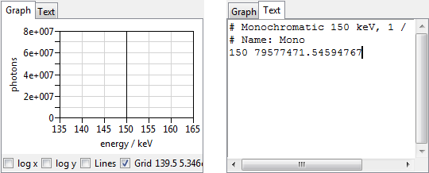

.. include:: _templates/icons.rst

.. _Graphs:

Graphs
======

Throughout the program you will come across several graphs like the one in the left of :numref:`tools-graph_nebeneinander`. Those graph displays are all designed the same in that you can choose visualization options:

* log x
* log y
* Lines
* Grid

.. note::
    There is also the option to zoom in by selecting a part of the graph with the left mouse button. To go back to full view simply press the right mouse button. 
    
The graph can also be displayed as a :guilabel:`text` via tabs (:numref:`tools-graph_nebeneinander`, right).

.. _tools-graph_nebeneinander:

    Graph display: diagram (left), text (right).