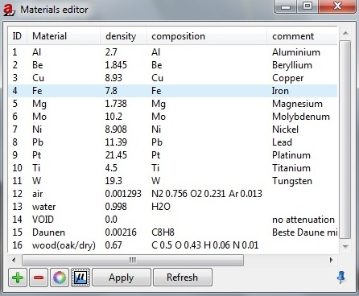

.. include:: _templates/icons.rst

.. _Tools-materials:

|32x32_edit-materials| Materials
================================

The |22x22_edit-materials| **Materials** editor lists all materials that are available within |artist| including density and composition (:numref:`tools-materialseditor1`). You may dock the editor with |16x16_window-undock| in the docking area.
It provides the following possibilities to edit materials:

* Edit selected material. Click on an entry you wish to edit, for example density or composition. Press :kbd:`enter` when finished.
* |16x16_list-add| is used to append a new material definition.
* |16x16_list-remove| Delete is used to erase currently selected material.
* |16x16_choose-color| Edit display is used to revise material display parameters for currently selected material.
* |16x16_show-attenuation| Attenuation plots attenuation data for currently selected material
* :guilabel:`Apply` is used to update material database with table contents.
* :guilabel:`Refresh` is used to reload table contents from material database.

.. note::
    
    Densities are given in g/cm³. The composition must be of the form: H2O 0.96 NaCl 0.04. The fractional numbers are mass ratios.

.. _tools-materialseditor1:

    Materials editor.