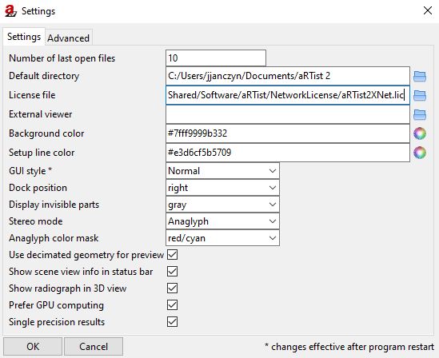
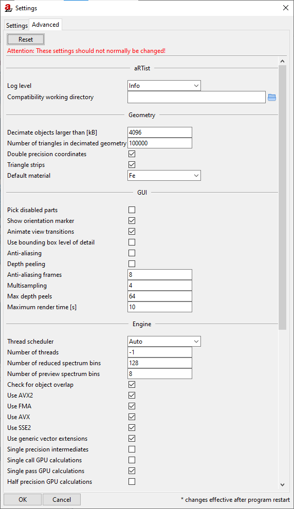
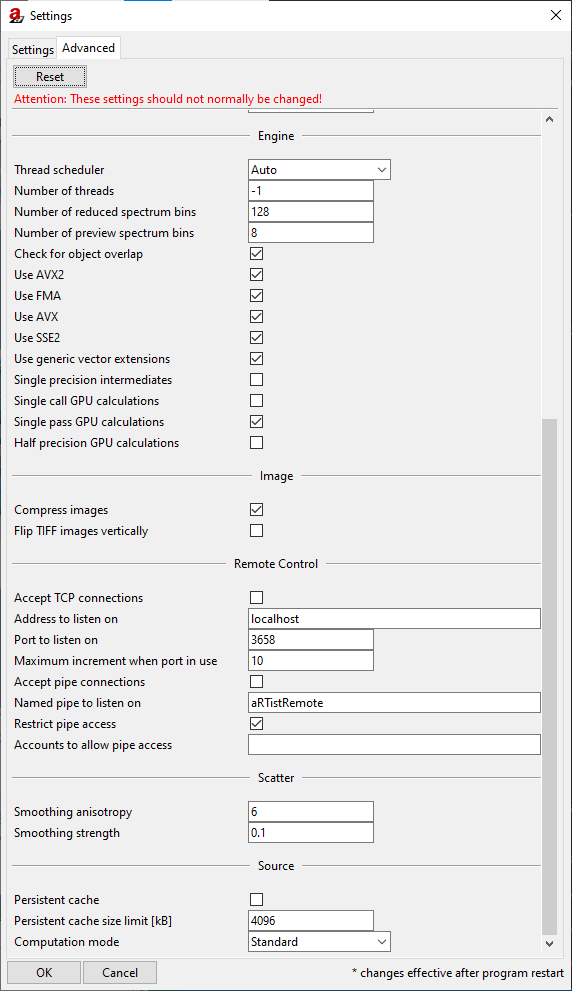

.. include:: _templates/icons.rst

.. _Tools-Settings:

|32x32_preferences-system| Settings
===================================

:guilabel:`Settings`
--------------------

The :guilabel:`Settings` dialog box offers several options to adjust the user interface (:numref:`tools_settings2`).

Press :guilabel:`OK` for saving or :guilabel:`Cancel` for quitting these settings. 
The changes are effective after program restart.

.. _tools_settings2:

    Settings.

:guilabel:`Advanced`
--------------------

Advanced settings should normally not be changed (:numref:`tools-advancedsettings1`, :numref:`tools-advancedsettings2`)

Press :guilabel:`OK` for saving or :guilabel:`Cancel` for quitting these settings. It is possible to :guilabel:`Reset` the settings on default. The changes are effective after program restart.

.. _tools-advancedsettings1:

    Settings, Advanced I.

.. _tools-advancedsettings2:

    Settings, Advanced II.