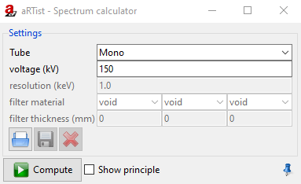
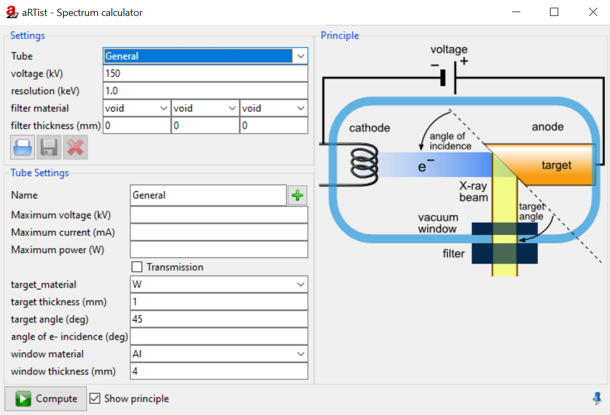
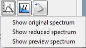

.. include:: _templates/icons.rst

.. _SpectrumSection:

|32x32_xray-tube| Spectrum
==========================

The **Spectrum calculator** offers specific settings for the source (:numref:`tools-spectru`). 
When you open the spectrum calculator, the following window appears:

.. _tools-spectruMono:

    Spectrum calculator, start window.

To see the advanced settings from :numref:`tools-spectru`, select :class:`General` under **Tube**. 
More settings appear, which can be seen in :numref:`tools-spectru` on the left-hand side below. 
The schematic drawing on the right side of :numref:`tools-spectru` only appears if the check mark under **Show principle** is activated.

.. hint::
    It can also be opened from the Parameter Panel → :guilabel:`Source` → |16x16_xray-tube|. 
    You may dock with |16x16_window-undock| the Spectrum calculator in the docking area.

.. _SpectrumSettingSubSection:

Settings
--------
On the upper left side of :numref:`tools-spectru` you will find the **Settings**. 
You can select the **Tube** between :class:`Mono` and :class:`General` and set the **voltage (kV)** and **resolution (keV)**. 
You can also set the **filter material** and **thickness (mm)**. The following **target material** and **window material** can be selected:
:class:`Al`, :class:`Be`, :class:`Cu`, :class:`Fe`, :class:`Mg`, :class:`Mo`, :class:`Ni`, :class:`Pb`, :class:`Pt`, :class:`Ti`, :class:`W`, :class:`air`, :class:`water` or :class:`VOID`)

    .. |gray-savebutton| image:: pictures/gray-savebutton.png
    .. |gui-parameterP-focal_spot3| image:: pictures/gui-parameterP-focal_spot3.jpg

* |16x16_document-open| Load tube definitions, File type: :code:`.dict`.
* |gray-savebutton| Save tube definition (hold or right-click for options)
* |gui-parameterP-focal_spot3| delete tube definition from database.

.. note::
    
    To use no filter, :class:`VOID` must be selected.

.. _SpectrumTubeSettingsSubSection:

Tube Settings
-------------

Under **Tube Settings** (:numref:`tools-spectru`) you can set maximum values for the tube and adjust the **target_material**, **target thickness (mm)** and **target angle**, the **angle of e- incidence (deg)** and the **window material** and **window thickness (mm)**. 
Mark the **Show principle** checkbox in the bottom row and a schematic drawing appears which shows the principle of the simulated tube. 
Press the :guilabel:`Compute` button in the lower part of the window to apply changes when finished.

.. _tools-spectru:

    Spectrum calculator.

.. hint::
    
    If the tube voltage is set over :class:`128 kV`, a window will appear with the note: 
    
    “This spectrum contains 146 entries, the currently recommended value is 128. Reduce?” 
    
    You can choose between :guilabel:`Yes` or :guilabel:`No`.
    
    By selecting :guilabel:`Yes`, you can see a reduced spectrum at the Parameter Panel → :guilabel:`Source` → **Source spectrum**. Keep holding the left-click on the mouse or right-click the symbol |16x16_plot-spectrum|. There you can open **Show reduced spectrum**, **Show reduced spectrum** or **Show prewiew spectrum** to see the different spectrums (:numref:`tools-spec`). 
    
    By selecting :guilabel:`No`, the spectrum is not reduced and will stay as the original spectrum. 
    If needed, it is possible to change the number of reduced spectrums bin at :guilabel:`Tools` → |16x16_preferences-system| **Settings** → :guilabel:`Advanved`.

.. _tools-spec:

    Spectrum selection.

