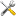
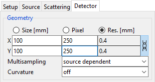
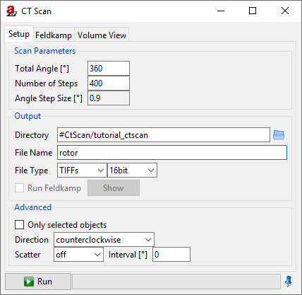
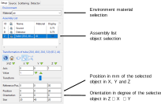
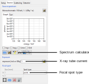

.. Handy substitutions
.. |artist| replace:: *aRT*\ ist

.. |icon-world| image:: pictures/icons/22x22_world-coordinate-system.png
    :width: 22

.. ############################################################################

CtScan Module
================
.. _CtScanModule:

The *CtScan* module is a modular extension of |artist| which provides the tools (compare :numref:`CtScanModuleOverview`) to simulate a typical circular CT scan. By default the *CtScan* module is deployed with the |artist| installation and can be accessed via the :guilabel:`Modules` tab.

.. _CtScanModuleOverview:
.. figure:: pictures/CtScanModule_Overview.svg
	:width: 95%

	Process of a dimensional measurement with CT. Process steps, which are highlighted in red, can be simulated with the |artist| *CtScan* module. :cite:p:`Binder2021`

.. note:: The pagination of the listed modules in the :guilabel:`Modules` depend on the installed modules.

For the following tutorial it is advised to be comfortable with the basic elements of |artist|. Therefore, in section ##2.3 description of the setup panel and the axis definition used within |artist| can be found. In section ##2.4 are the basics of the source panel described, which will be used to define a x-ray source. Section ##2.6 covers the basics of the detector panel, which is also necessary for a CT scan setup. The basic elements of the CtScan module itself, are descried in section ##3.3.

In the following chapters of this description, first a simple CT scan is described, which shows the basics of the module. After that, a typical setup of the module is shown, which can be transferred to a custom CT scan setup. In the section ##7.3 two examples are provided, which shows the difference between a ideal simulation and an experimental model in |artist|. In the last section of this tutorial, the borders of the current models - while using the *CtScan* module are discussed.

.. ############################################################################

A Simple CT Scan
----------------
.. _CtScanModuleASimpleCTScan:

Download the example file :download:`tutorial_simple_ctscan.aRTist <files/tutorial_simple_ctscan.aRTist>` |nbsp| (4.5 MB) and open it with |artist|.

In the *Parameter Panel* on the left-hand side, open the :guilabel:`Detector` tab. In the :guilabel:`Geometry` group, select :guilabel:`Res. [mm]` to fixate the pixel resolution and enable editing for the actual physical size and the number of pixels along the detector x- and y-axis. For :guilabel:`Pixel`, enter :code:`250` for both :guilabel:`X` and :guilabel:`Y` (:numref:`detectorSettingsPixels`).

.. note:: For a fast demonstration the detector resolution will be reduced to 250×250 |nbsp| px.

.. _detectorSettingsPixels:

    Detector geometry settings with a reduced resolution of 250×250 |nbsp| px.

Next open the *CtScan* module from the menu bar: :guilabel:`Modules` → :guilabel:`CtScan` (:numref:`ctScanWindow`).

.. _ctScanWindow:

    The *CtScan* module window.

To simulate a full rotation, set the :guilabel:`Total Angle [°]` to :code:`360` degree.

The angular steps define the number of projections simulated. A good estimation to suffice the Nyquist-Shannon theorem for the Feldkamp reconstruction is to choose :math:`P` projections based on the sampling points :math:`S` along the object. :cite:p:`Kharfi2013`

.. math::

  P \ge S \cdot \frac{\pi}{2}

The sampling points along the object are defined by the detector width. In this case 250 |nbsp| px.

.. math::

  P \ge 250 \cdot \frac{\pi}{2} \approx 392.69

Including a small buffer, :math:`P` is set as :guilabel:`Number of Steps` to :code:`400`. The :guilabel:`Angle Step Size [°]` will be automatically calculated and display :code:`0.9`.

Next choose an output :guilabel:`directory` for the projection files and enter a :guilabel:`File Name` for the projection files. In this demonstration, the name :code:`rotor` is chosen.

.. tip::

	The :code:`#` directory is a placeholder for the *Default Directory*, which can be set in the settings: From the menu bar, select :guilabel:`Tools` → |icon-settings| :guilabel:`Settings`.

As export :guilabel:`File Type`, either as a stack of :guilabel:`TIFF` images or the :guilabel:`BAM CT` format can be chosen.

.. note::

	* **TIFFs:** Each projection image will be saved as a single :code:`.tif` file. A projection number will be added to the file name. If this format is chosen, *aRT*\ ist's reconstruction software will not be able to reconstruct the CT scan, since the geometrical settings are not saved separately.

	* **BAM CT:** Is a format where all projections are stored in a single :code:`.dd` file. It has a header of variable size, followed by the raw data of the projection images. *aRT*\ ist's Feldkamp reconstruction software is able to reconstruct scans from this file format, since the geometric settings are stored in the :code:`.dd` file. A detailed documentation of the :code:`.dd` file format can be found under `BAM CT File Format <bamct_file_format.html>`_.

For this simple *CtScan*, set the :guilabel:`File Type` output to :guilabel:`TIFFs` (as shown for example in :numref:`ctScanWindow`). With a click on the |icon-run| :guilabel:`Run` button the scan simulation will start. During the scan, the circular rotation of *Rotor* around its own rotation centre can be observed in the virtual scene. The simulated projections will be saved as enumerated :code:`.tif` files on the file system.

.. ############################################################################

CtScan Setup
------------
.. _CtScanModuleCtScanSetup:

In the previous section :ref:`A Simple CT Scan <CtScanModuleASimpleCTScan>`: the basic functionality of the *CtScan* module has been demonstrated. Therefore, a template |artist| project has been provided, which already included definitions of the basic components of a CT system. Generally for a CT scan simulation, there are several parameters to be considered as displayed in :numref:`CtScanModuleComponents`.

.. _CtScanModuleComponents:
.. figure:: pictures/CtScanModule_Components.svg
	:width: 95%

	Overview of the basic components and settings of the *CtScan* module (scattering excluded) :cite:p:`Binder2021`

For that reason, the following sections will cover the necessary setups to define a CT scan model with |artist| from scratch, which later on can be exercised in the :ref:`Examples <CtModuleExamples>` section.

.. ############################################################################

Assembly Setup
~~~~~~~~~~~~~~
.. _CtScanModuleAssemblySetup:

In this first section, the assembly setup will be covered. It includes the geometrical setup for the three main components (x-ray source, detector, measurement object) and defines the surrounding environment.

.. _CtScanModuleAssemblyList:

	Exemplary overview of the setup panel with the environment material definition, the assembly list and the transformation parameters of the selected tube.

In many scenarios, the environmental material, which is part of the simulated attenuation, can be used with the standard material *air*. By default *air* is defined as a simplified composition of nitrogen, oxygen and argon. The definition of air or any other material can be defined in the :guilabel:`Materials...` editor, which can be found in the :guilabel:`Tools` menu of |artist|. The resulting attenuation coefficients can be viewed with the :guilabel:`AttenuationViewer` and are based on the ENDF/B-VIII.0 database :cite:p:`Brown2018`.

.. note::

  If a material is added or modified, the material can either be defined by it's structural formula or by a mass fraction. If the material is defined by a mass fraction, the relative mass fractions will always be normalized to 1.

The assembly list contains by default the *Source* and the *Detector*. Both elements don't have a material assigned in the assembly list. The material dependend properties for the *Source* and the *Detector* will be covered in the :ref:`Source Setup <CtScanModuleSourceSetup>` and the :ref:`Detector Setup <CtScanModuleDetectorSetup>` section. Any surface model (.stl, .ply, .obj or .vtk) can be imported into the assembly list with the :guilabel:`Open...` dialogue in the :guilabel:`File` menu. Additionally, simple geometries like tubes, ellipsoids or cuboids can be generated by |artist| with the :guilabel:`Solid` module.

In computed tomography, the ratio :math:`M` of the distance between the x-ray source and the object rotation axis (abbr.: :math:`SOD`) and the distance between the source and the detector (abbr.: :math:`SDD`) is an important geometrical parameter.

.. math::

  M = \frac{SOD}{SDD}

This ratio, also called *magnification*, is used in the reconstruction process to scale the acquired projections in order to reconstruct the actual size of the measured volume. Therefore, the relative position between the x-ray source and the detector in |artist| has to be adjusted. By default, the source and the detector are placed along the global z-Axis with a distance of 100 mm and the centrepoint of the detector plane as origin of the global coordinate system. Each object in the assembly list can be adjusted to by it's position, orientation and size inside the scene. Therefore, each object has to be selected from the assembly list (compare :numref:`CtScanModuleAssemblyList`.) and can be adjusted in the transformation section either using the |icon-world| |nbsp| **world coordinate system** or by a |icon-local| |nbsp| **local coordinate system**, which is based on a minimum bounding box that will be fitted automatically if an object is imported into the scene. By default |artist| will define the x-ray direction based on the line direction between the source centrepoint and the detector centrepoint.

.. note::

	If *McRay* scattering is enabled, the default position of the x-ray source in positive direction of the global z-axis shall not be changed, since the internal definition of the *McRay* module depends on this axis definition.

.. note::

	 To avoid ambiguities, every orientation transformation will be applied first along the selected z-axis, then the x-axis and last the y-axis. This sequence will be applied for every change in the transformation tab of the selected object.

For more information on the available coordinate systems in |artist| follow to :ref:`The Virtual Scene <theVirtualSceneChapter>` section. More details about transforming an object inside the scene please have a look at the :ref:`Position, Orientation & Size <PositionOrientationSizeChapter>` chapter.

.. ############################################################################

Source Setup
~~~~~~~~~~~~
.. _CtScanModuleSourceSetup:

In industrial CT systems the operator is usually in control of the x-ray tube parameters, like the acceleration voltage and the tube current, which are important to adjust the system on an individual measurement object. In |artist| both settings can be found in the *Source* tab, even though the acceleration voltage is included into the spectrum definition, which can be generated by the *spectrum calculator*.

.. _CtScanModuleSourceTab:

	Overview of the source tab in |artist| highlighted with the essential menus to define a x-ray tube.

|artist| supports two different ways to define the spectrum of a x-ray tube. Both can be found in the *spectrum calculator* menu located at the *Source* tab. Within this extra window, either a simple monochromatic tube (Tube: *Mono*) or a general model (Tube: *General*) can be chosen. The general spectrum calculator supports x-ray tubes with a reflection or a transmission target and is based on the work of Deresch et al. :cite:p:`Deresch2016`. The calculated spectrum is displayed in the *Soure* tab as a function of the acceleration voltage and the number of photons.

.. note::

  * The target thickness of the spectrum calculator will only be used if a transmission target is defined.

  * The settings :guilabel:`Maximum Voltage`, :guilabel:`Maximum Current` and :guilabel:`Maximum Power` are not mandatory for the calculation.

  * If more than 128 sampling points are defined by the acceleration voltage and the resolution, |artist| will prompt to reduce the calculated spectrum to 128 datapoints, which is sufficient for most use cases.

.. ############################################################################

Detector Setup
~~~~~~~~~~~~~~
.. _CtScanModuleDetectorSetup:

.. ############################################################################

Examples
--------
.. _CtModuleExamples:

.. ############################################################################

Ideal Model
~~~~~~~~~~~
.. _CtScanModuleIdealModel:

.. ############################################################################

Experimental Model
~~~~~~~~~~~~~~~~~~
.. _CtScanModuleExperimentalModel:

.. ############################################################################

Summary
-------
.. _CtScanModuleSummary:

.. ############################################################################

References
----------
.. _CtScanModuleReferences:
.. bibliography::

.. ############################################################################

Test
----

Admonition example (based on the style of a note):

.. admonition:: Example

  This is an example

Internal site reference to headline:
Reference to `CtScan Module`_

Internal site reference to chapter:
Reference to `CtScan Module Chapter <tutorial_ctscan_module.html>`_.

Cross site reference:
Reference to :ref:`description <worldLocalCoordinateSystem>`:
