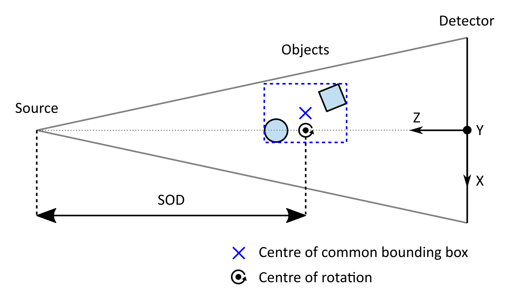
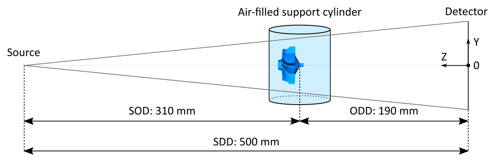
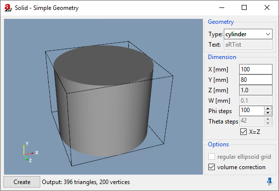
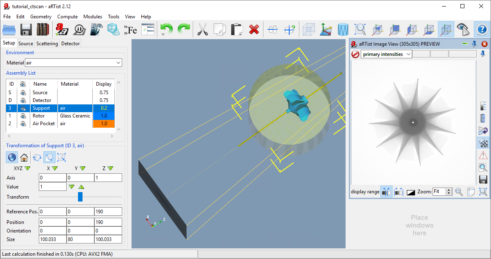
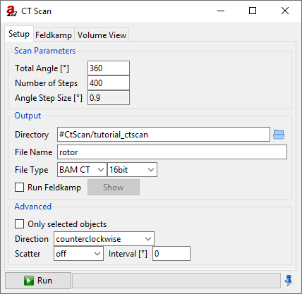
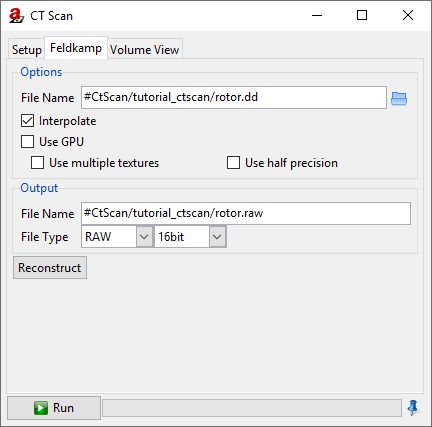
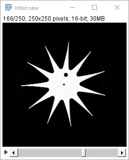

.. include:: _templates/icons.rst

CtScan Module
=============

In this tutorial, the *CtScan* module will be explained. It allows to simulate simple CT scans.  There will be another tutorial about more advanced geometries and trajectories, using the *TomoSynth* module.

.. note:: We continue with the project from the last tutorial. You can download it here if you need the current state:

     :download:`tutorial_multiple_components.aRTist <files/tutorial_multiple_components.aRTist>` |nbsp| (4.6 MB)

.. warning:: The *CtScan* module always uses an axis of rotation that points in **Y direction** of the world coordinate system. Also, it will always place the center of rotation on the **principal ray** connecting the source and the detector centre.

	The reconstruction software that comes with |artist| assumes a straight axis of rotation in the centre of the detector. You can simulate projections with a tilted detector, but |artist|'s reconstruction software will not be able to reconstruct such a scan correctly.

A Simple CT Scan
----------------

To make this demonstration quicker, we will decrease the number of detector pixels to 250×250.

.. note:: In the *Parameter Panel* on the left-hand side, open the :guilabel:`Detector` tab. In the :guilabel:`Geometry` group, select :guilabel:`Res. [mm]` to make the pixel size a degree of freedom while we keep the overall physical size and set a fixed number of pixels. For :guilabel:`Pixel`, enter :code:`250` for both :guilabel:`X` and :guilabel:`Y` (:numref:`detectorSettingsPixels`).

.. _detectorSettingsPixels:
.. figure:: pictures/tutorial-ctscan-detector-settings.png
    :width: 50%

    We decrease the number of detector pixels to 250×250.

.. note:: Open the *CtScan* module from the menu bar: :guilabel:`Modules` → :guilabel:`CtScan` (:numref:`ctScanWindow`).

.. _ctScanWindow:
.. figure:: pictures/tutorial-ctscan-window.png
    :width: 55%

    The *CtScan* module window.

Let's simulate one full rotation (360°):

.. note:: For :guilabel:`Total Angle [°]`, enter :code:`360`.

The number of angular steps should be chosen with respect to the matrix size. Our detector has a width of 250 |nbsp| px. To stay on the safe side, let's choose 250⋅π/2 |nbsp| ≈ |nbsp| **400** |nbsp| steps.

.. note:: For the :guilabel:`Number of Steps`, enter :code:`400`. The :guilabel:`Angle Step Size [°]` should automatically be calculated and display :code:`0.9`.

You can choose a different output :guilabel:`directory` for the projection files. If you leave the :code:`#` directory as it is, everything will be saved in your *Default Directory*. You can set this in your settings: from the menu bar, choose :guilabel:`Tools` → |16x16_preferences-system| :guilabel:`Settings` to see your *Default Directory*.

.. note:: Enter a :guilabel:`File Name` for your projection files. In this demonstration, we will name it :code:`rotor`.

For the :guilabel:`File Type`, you can choose between a stack of :guilabel:`TIFF` images and the :guilabel:`BAM CT` format.

* **TIFFs:** each projection image will be saved as a single TIFF file. A projection number will be added to the file name. If you choose this format, |artist|'s reconstruction software will not be able to reconstruct the CT scan.
* **BAM CT** is a format where all projections are stored in a single :code:`.dd` file. It has a header of variable size, followed by the raw data of the projection images. |artist|'s Feldkamp reconstruction software is able to reconstruct scans from this file format. You can find a documentation in this handbook under `BAM CT File Format <bamct_file_format.html>`_.

.. note:: Go ahead and simulate a TIFF stack by choosing the appropriate settings (as shown for example in :numref:`ctScanWindow`). Click the |16x16_compute-run| :guilabel:`Run` button to start the scan. The CT simulation should start and you should be able to observe the *Rotor's* rotation around its own centre in the virtual scene. The *Air Pocket* should follow this rotation as well.

Centre of Rotation
------------------

The warning box at the beginning already explained that the *CtScan* module always chooses an axis of rotation that points in the *Y* direction of the coordinate system. The centre of rotation will be placed on the principal ray that connects the source and the detector centre. In |artist|'s standard coordinate system, this is the *Z* axis of the world coordinate system. The point on this axis (and therefore the actual :abbr:`SOD (source-object distance)`) will be determined by the **common bounding box** that encloses **all parts** that participate in the CT rotation. The centre coordinate of this common bounding box, projected along the *X* axis onto the principal ray (if it is not already there) determines the centre of rotation (:numref:`ctScanCentreOfRotation`).

.. _ctScanCentreOfRotation:

    **View from above:** if multiple objects are in the scene, the *CtScan* module projects the centre of the common bounding box of all objects (blue cross) onto the principal ray axis to find the centre of rotation.

In our current scene, the centre of the *Rotor* is the centre of rotation because its bounding box encloses both the *Rotor* and the *Air Pocket*. An easy way to shift the centre of rotation but keep the current position of all parts is to create a new "support object" that forces a different common bounding box.

At the moment, our scan's :abbr:`SOD (source-object distance)` is 300 |nbsp| mm. We will shift the rotation axis to an :abbr:`SOD (source-object distance)` of 310 |nbsp| mm without moving the *Rotor*, therefore simulating an off-axis rotation. To do this, we will create a big cylinder made of air (:numref:`ctScanSupportCylinder`) that will be centred at an :abbr:`SOD (source-object distance)` of 310 |nbsp| mm and that will completely contain the *Rotor* and the *Air Pocket*. This leads to a common bounding box of all three objects that is the same as the cylinder's own bounding box.

.. _ctScanSupportCylinder:

    **View from the side:** we use a "support object" to shift the centre of rotation away from the *Rotor* towards the detector.

.. note:: Open the |32x32_icon-solid| **Solid module** and create a cylinder with a diameter (:guilabel:`X` and :guilabel:`Z`) of :code:`100` |nbsp| mm and a height (:guilabel:`Y`) of :code:`80` |nbsp| mm. We use :code:`100` :guilabel:`Phi steps` to make it relatively smooth. (:numref:`ctScanSupportCylinderSolid`)

.. _ctScanSupportCylinderSolid:

    We use the *Solid* module to create the support cylinder.

Once the cylinder is created, we set its material to air. This way, it will not differ from the environment material anymore. You don't actually need to change its material: it would already be enough to turn off its |16x16_object-visible-on| **visibility**. The support cylinder will then be ignored during the attenuation simulation, but still fulfil its purpose as the object that shifts the axis of rotation for the *CtScan* module.

.. note:: 
	1. Rename the cylinder object to :code:`Support` (or any other name you like).
	2. Set its material to :code:`air`.
	3. Decrease its **opacity** in the colour dialog to make it more transparent.
	4. Move it **upwards** in the *Assembly List* to a position above the *Rotor* to give it the lowest priority.
	5. Set its :guilabel:`Z` position to :code:`190` |nbsp| mm (our new :abbr:`ODD (object-detector distance)`).

When you view the scene from above, you should see something similar to :numref:`ctScanSupportCylinderScene`.

.. _ctScanSupportCylinderScene:

    We placed the support cylinder at an :abbr:`ODD (object-detector distance)` of 190 |nbsp| mm.

Let's simulate this new CT scan using the BAM CT format:

.. note:: In the *CtScan* module window, change the file type to :guilabel:`BAM CT` and keep :guilabel:`16bit` as the data type (:numref:`ctScanWindowBAMCT`). Click |16x16_compute-run| :guilabel:`Run` to start the simulation.

.. _ctScanWindowBAMCT:

    We simulate the off-axis scan using the BAM CT format.

Advanced Settings
-----------------

If :guilabel:`Only selected objects` is checked, then only the parts you selected from the *Assembly List* will perform the CT rotation. (Remember that you can select multiple parts by keeping :kbd:`Ctrl` pressed.) Any other parts that are not selected will remain fixed at their current position during the CT scan.

You can choose the :guilabel:`Direction` of rotation for your CT scan. :guilabel:`Counterclockwise` will result in a mathematically positive rotation around the *Y* axis. Consequently, :guilabel:`clockwise` will be a rotation in mathematically negative direction.

You can run a scan with photon :guilabel:`Scatter` simulation activated. For the scatter simulation, |artist| will use a particle transport Monte-Carlo simulation tool called *McRay*. It will use the settings from the *Scatter* tab in the *Parameter Panel* of the main window. The :guilabel:`Interval` lets you set how often a new scatter image shall be calculated, which is a useful option if you want to speed up computation time. The simulation of scatter radiation will be the topic of another tutorial.

FDK Reconstructions
-------------------

|artist| comes with a CT reconstruction software (simply called "Feldkamp") that can read the BAM CT format. If you activate :guilabel:`Run Feldkamp`, the reconstruction will automatically start right after the CT simulation. It will use the settings from the *Feldkamp* tab and automatically give it the name of the projection volume.

.. note:: Switch to the :guilabel:`Feldkamp` tab of the *CtScan* module window (:numref:`ctScanWindowFeldkamp`).

.. _ctScanWindowFeldkamp:

    The *Feldkamp* tab of the *CtScan* module lets us reconstruct a CT scan.

The :guilabel:`File Name` is the input file with your projection data. It is already set to the BAM CT projection file that we created during the last simulation. You can also select any other :code:`.dd` file here. 

Activating :guilabel:`Interpolate` will lead to a linear interpolation between pixel grey values where necessary. :guilabel:`Use GPU` activates the OpenGL implementation of the reconstruction software, which uses the graphics card to speed up computations. Activating :guilabel:`multiple textures` can speed up the computation as well: in this mode, the graphics card will try to work on multiple projections in parallel. Instead of single precision, you can turn on calculations with :guilabel:`half precision` floating point numbers on the graphics card, but it is not recommended.

You can name an output file and data type: you can choose between RAW, VTK and BAM CT formats. If you select BAM CT, the module will also create a :code:`.vgi` file that easily lets you read the volume into VGSTUDIO. The matrix size (X and Y direction) of your output volume will be the number of detector columns. The number of detector rows will give the number of slices (Z height). If you need to know the voxel size, you can calculate it from your detector's pixel size and the magnification M |nbsp| = |nbsp| SDD/SOD:

	voxel size = pixel size / M.

.. note:: Click :guilabel:`Reconstruct` to run the reconstruction algorithm. Take a look at your reconstructed volume in a software you like, e.g. *ImageJ*, or try |artist|'s **Volume Viewer** (the third tab of the *CtScan* window: it is not yet explained here, but easy to use, especially with BAM CT files).

.. _ctScanReconstructionImageJ:

    A slice of the reconstructed *Rotor* with the *Air Pocket* visible, viewed in ImageJ.

Summary
-------

In this tutorial, the *CtScan* module was used to simulate a CT scan of the *Rotor* with an off-centre rotation.

* You know about the limitations of the *CtScan* module: it assumes an **axis of rotation in Y direction** and a centre of rotation that is located on the principal ray.
* You have learned how to set up and simulate a **simple CT scan.**
* You have used a technique to **shift the centre of rotation** away from the common bounding box centre (by creating a larger common bounding box with a support object).
* You have created **CT reconstructions** with the built-in *Feldkamp* software that supports the BAM CT format.

| The scene that we created up to this point is available for download:
| :download:`tutorial_ctscan.aRTist <files/tutorial_ctscan.aRTist>` (4.6 MB)