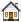
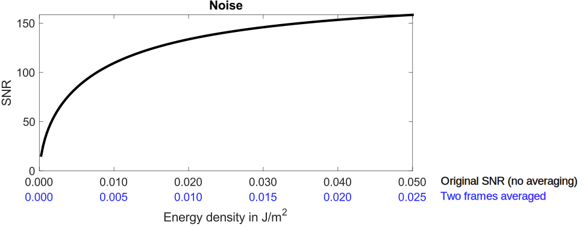
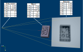

.. include:: _templates/icons.rst

.. |icon-run| image:: pictures/icons/16x16_compute-run.png
    :width: 16
.. |icon-settings| image:: pictures/icons/16x16_preferences-system.png
    :width: 16
.. |icon-world| image:: pictures/icons/22x22_world-coordinate-system.png
    :width: 22

.. ############################################################################

CtScan Module
================
.. _CtScanModule:

The *CtScan* module is a modular extension of |artist| which provides the tools (compare :numref:`CtScanModuleOverview`) to simulate a typical circular CT scan. By default the *CtScan* module is deployed with the |artist| installation and can be accessed via the :guilabel:`Modules` tab.

.. _CtScanModuleOverview:
.. figure:: pictures/CtScanModule_Overview.svg
	:width: 95%

	Process of a dimensional measurement with CT. Process steps, which are highlighted in red, can be simulated with the |artist| *CtScan* module. :cite:p:`Binder2021`

.. note:: The pagination of the listed modules in the :guilabel:`Modules` depend on the installed modules.

For the following tutorial it is advised to be comfortable with the basic elements of |artist|. Therefore, in section :ref:`Setup Panel <SetupPanelSection>` a description of the setup panel and the axis definition used within |artist| can be found. In the section :ref:`Source Panel <SourcePanelSection>` are the basics of the source GUI described, which will be used to define a x-ray source. The :ref:`Detector Panel <SetupPanelSection>` section covers the basics of the detector GUI, which is also necessary for a CT scan setup. The basic elements of the CtScan module itself, are descried in the :ref:`Module CtScan <CtScanSection>`.

In the following chapters of this description, first a simple CT scan is described, which shows the basics of the module. After that, a typical setup of the module is shown, which can be transferred to a custom CT scan setup. In the :ref:`Examples <CtModuleExamples>` section two examples are provided, which shows the difference between a ideal simulation and an experimental model in |artist|. In the last section of this tutorial, the borders of the current models - while using the *CtScan* module are discussed.

.. ############################################################################

A Simple CT Scan
----------------
.. _CtScanModuleASimpleCTScan:

Download the example file :download:`tutorial_simple_ctscan.aRTist <files/tutorial_simple_ctscan.aRTist>` |nbsp| (4.5 MB) and open it with |artist|.

In the *Parameter Panel* on the left-hand side, open the :guilabel:`Detector` tab. In the :guilabel:`Geometry` group, select :guilabel:`Res. [mm]` to fixate the pixel resolution and enable editing for the actual physical size and the number of pixels along the detector x- and y-axis. For :guilabel:`Pixel`, enter :code:`250` for both :guilabel:`X` and :guilabel:`Y` (:numref:`detectorSettingsPixels`).

.. note:: For a fast demonstration the detector resolution will be reduced to 250×250 |nbsp| px.

.. _detectorSettingsPixels:
.. figure:: pictures/tutorial-ctscan-detector-settings.png
    :width: 50%

    Detector geometry settings with a reduced resolution of 250×250 |nbsp| px.

Next open the *CtScan* module from the menu bar: :guilabel:`Modules` → :guilabel:`CtScan` (:numref:`ctScanWindow`).

.. _ctScanWindow:
.. figure:: pictures/tutorial-ctscan-window.png
    :width: 55%

    The *CtScan* module window.

To simulate a full rotation, set the :guilabel:`Total Angle [°]` to :code:`360` degree.

The angular steps define the number of projections simulated. A good estimation to suffice the Nyquist-Shannon theorem for the Feldkamp reconstruction is to choose :math:`P` projections based on the sampling points :math:`S` along the object. :cite:p:`Kharfi2013`

.. math::

  P \ge S \cdot \frac{\pi}{2}

The sampling points along the object are defined by the detector width. In this case 250 |nbsp| px.

.. math::

  P \ge 250 \cdot \frac{\pi}{2} \approx 392.69

Including a small buffer, :math:`P` is set as :guilabel:`Number of Steps` to :code:`400`. The :guilabel:`Angle Step Size [°]` will be automatically calculated and display :code:`0.9`.

Next choose an output :guilabel:`directory` for the projection files and enter a :guilabel:`File Name` for the projection files. In this demonstration, the name :code:`rotor` is chosen.

.. tip::

	The :code:`#` directory is a placeholder for the *Default Directory*, which can be set in the settings: From the menu bar, select :guilabel:`Tools` → |icon-settings| :guilabel:`Settings`.

As export :guilabel:`File Type`, either as a stack of :guilabel:`TIFF` images or the :guilabel:`BAM CT` format can be chosen.

.. note::

	* **TIFFs:** Each projection image will be saved as a single :code:`.tif` file. A projection number will be added to the file name. If this format is chosen, *aRT*\ ist's reconstruction software will not be able to reconstruct the CT scan, since the geometrical settings are not saved separately.

	* **BAM CT:** Is a format where all projections are stored in a single :code:`.dd` file. It has a header of variable size, followed by the raw data of the projection images. *aRT*\ ist's Feldkamp reconstruction software is able to reconstruct scans from this file format, since the geometric settings are stored in the :code:`.dd` file. A detailed documentation of the :code:`.dd` file format can be found under `BAM CT File Format <bamct_file_format.html>`_.

For this simple *CtScan*, set the :guilabel:`File Type` output to :guilabel:`TIFFs` (as shown for example in :numref:`ctScanWindow`). With a click on the |icon-run| :guilabel:`Run` button the scan simulation will start. During the scan, the circular rotation of *Rotor* around its own rotation centre can be observed in the virtual scene. The simulated projections will be saved as enumerated :code:`.tif` files on the file system.

.. ############################################################################

CtScan Setup
------------
.. _CtScanModuleCtScanSetup:

In the previous section :ref:`A Simple CT Scan <CtScanModuleASimpleCTScan>` the basic functionality of the *CtScan* module has been demonstrated. Therefore, a template |artist| project has been provided, which already included definitions of the basic components of a CT system. Generally for a CT scan simulation, there are several parameters to be considered as displayed in :numref:`CtScanModuleComponents`.

.. _CtScanModuleComponents:
.. figure:: pictures/CtScanModule_Components.svg
	:width: 95%

	Overview of the basic components and settings of the *CtScan* module (scattering excluded) :cite:p:`Binder2021`

For that reason, the following sections will cover the necessary setups to define a CT scan model with |artist| from scratch, which later on can be exercised in the :ref:`Examples <CtModuleExamples>` section.

.. ############################################################################

Assembly Setup
~~~~~~~~~~~~~~
.. _CtScanModuleAssemblySetup:

In this first section, the assembly setup will be covered. It includes the geometrical setup for the three main components (x-ray source, detector, measurement object) and defines the surrounding environment.

.. _CtScanModuleAssemblyList:
.. figure:: pictures/CtScanModule_AssemblyList.svg
	:width: 65%

	Exemplary overview of the setup panel with the environment material definition, the assembly list and the transformation parameters of the selected tube.

In many scenarios, the environmental material, which is part of the simulated attenuation, can be used with the standard material *air*. By default *air* is defined as a simplified composition of nitrogen, oxygen and argon. The definition of air or any other material can be defined in the :guilabel:`Materials...` editor, which can be found in the :guilabel:`Tools` menu of |artist|. The resulting attenuation coefficients can be viewed with the :guilabel:`AttenuationViewer` and are based on the ENDF/B-VIII.0 database :cite:p:`Brown2018`.

.. note::

  If a material is added or modified, the material can either be defined by it's structural formula or by a mass fraction. If the material is defined by a mass fraction, the relative mass fractions will always be normalized to 1.

The assembly list contains by default the *Source* and the *Detector*. Both elements don't have a material assigned in the assembly list. The material dependend properties for the *Source* and the *Detector* will be covered in the :ref:`Source Setup <CtScanModuleSourceSetup>` and the :ref:`Detector Setup <CtScanModuleDetectorSetup>` section. Any surface model (.stl, .ply, .obj or .vtk) can be imported into the assembly list with the :guilabel:`Open...` dialogue in the :guilabel:`File` menu. Additionally, simple geometries like tubes, ellipsoids or cuboids can be generated by |artist| with the :guilabel:`Solid` module.

In computed tomography, the ratio :math:`M` of the distance between the x-ray source and the object rotation axis (abbr.: :math:`SOD`) and the distance between the source and the detector (abbr.: :math:`SDD`) is an important geometrical parameter.

.. math::

  M = \frac{SOD}{SDD}

This ratio, also called *magnification*, is used in the reconstruction process to scale the acquired projections in order to reconstruct the actual size of the measured volume. Therefore, the relative position between the x-ray source and the detector in |artist| has to be adjusted. By default, the source and the detector are placed along the global z-Axis with a distance of 100 mm and the centrepoint of the detector plane as origin of the global coordinate system. Each object in the assembly list can be adjusted by it's position, orientation and size inside the scene. Therefore, each object has to be selected from the assembly list (compare :numref:`CtScanModuleAssemblyList`.) and can be adjusted in the transformation section either using the |icon-world| |nbsp| **world coordinate system** or the |icon-local| |nbsp| **local coordinate system**, which is based on a minimum bounding box that will be fitted automatically if an object is imported into the scene. By default |artist| will define the x-ray direction based on the line direction between the source centrepoint and the detector centrepoint.

.. note::

 * If *McRay* scattering is enabled, the default position of the x-ray source in positive direction of the global z-axis shall not be changed, since the internal definition of the *McRay* module depends on this axis definition.

 * To avoid ambiguities, every orientation transformation will be applied first along the selected z-axis, then the x-axis and last the y-axis. This sequence will be applied for every change in the transformation tab of the selected object.

For more information on the available coordinate systems in |artist| follow to :ref:`The Virtual Scene <theVirtualSceneChapter>` section. More details about transforming an object inside the scene please have a look at the :ref:`Position, Orientation & Size <PositionOrientationSizeChapter>` chapter.

.. ############################################################################

Source Setup
~~~~~~~~~~~~
.. _CtScanModuleSourceSetup:

In industrial CT systems the operator is usually in control of the x-ray tube parameters, like the acceleration voltage and the tube current, which are important to adjust the system on an individual measurement object. In |artist| both settings can be found in the *Source* tab, even though the acceleration voltage is included into the spectrum definition, which can be generated by the *spectrum calculator*.

.. _CtScanModuleSourceTab:

	Overview of the source tab in |artist| highlighted with the essential menus to define a x-ray tube.

|artist| supports two different ways to define the spectrum of a x-ray tube. Both can be found in the *spectrum calculator* menu located at the *Source* tab. Within this extra window, either a simple monochromatic tube (Tube: *Mono*) or a general model (Tube: *General*) can be chosen. The general spectrum calculator supports x-ray tubes with a reflection or a transmission target and is based on the work of Deresch et al. :cite:p:`Deresch2016`. The calculated spectrum is displayed in the *Soure* tab as a function of the acceleration voltage and the number of photons.

.. note::

  * The target thickness of the spectrum calculator will only be used if a transmission target is defined.

  * The settings :guilabel:`Maximum Voltage`, :guilabel:`Maximum Current` and :guilabel:`Maximum Power` are not mandatory for the calculation.

  * If more than 128 sampling points are defined by the acceleration voltage and the resolution, |artist| will prompt to reduce the calculated spectrum to 128 datapoints, which is sufficient for most use cases.

The tube current can be set in the in the :guilabel:`Exposure` menu and adjusts the intensity of the defined x-ray source.

|artist| supports three general types of focal spot definitions, which can be adjusted in the :guilabel:`Focal spot` menu. By default every focal spot is defined as a single point inside the focal spot plane. If the :guilabel:`Spot type` :code:`point` is chosen, the focal spot plane size will be ignored and replaced with a single point at the defined position in the assembly list. Alternatively, either a regular grid of :math:`m \times n` focal spot points or a random distributed number of :math:`m` focal spot points can be used.

.. note::

 * The :guilabel:`Spot type` entries in |artist| are examples. Every regular grid combination of :math:`m \times n` spots or :math:`m` random distributed spots can be used.

 * Every additional defined focal spot point will increase the necessary computational time for a single projection, since every spot is connected to every pixel of the defined detector.

 * If a single point :math:`m > 1` is chosen, the focal spots will be randomly distributed with a Poisson disc pattern, to centralize the focal spots to the centre of the focal spot plane and avoid overlapping.

Hence every focal spot is defined a single point, the shape of a focal spot plane can be adjusted with a focal spot weight. This weight can either be loaded as an image, which will be converted to a normalized weight ranging from :math:`\left[0,1\right]` or it can be generated with an additional focal spot image generator. The integrated generator for the focal spot weights is described in the chapter :ref:`Spot Intensity Profile <TutorialXraySourceSpotIntensityProfile>` of the x-ray source tutorial.

.. _CtScanModuleFocalSpotMechanic:
.. figure:: pictures/CtScanModule_FocalSpotMechanic.svg
	:width: 100%

	Image projection (A and C) of an 1:1 detector in |artist| with a distance of 5 |nbsp| mm between source and detector (1000x1000 |nbsp| px). Figure (A) is a raw projection defined by a 5x5 focal spot grid. (C) is the weighted result of the raw projection (A) and the gaussian focal spot weight (B). :cite:p:`Binder2021`

:numref:`CtScanModuleFocalSpotMechanic` shows exemplary the mechanics behind the spot distribution and the spot intensity profile. Please note, that the displayed blurriness of the projections (A) and (C) are a result of the 5 |nbsp| mm distance between the source and detector. Alternative, a pinhole setup as shown in :numref:`spot4x4imageViewer` can be used to further visualize the distribution of the focal spot.

.. ############################################################################

Detector Setup
~~~~~~~~~~~~~~
.. _CtScanModuleDetectorSetup:

The last mandatory setup to simulate a full CT scan with |artist| is the detector setup. |artist| supports out of the box a variety of different detector types. However, in this tutorial the two most versatile detector types :guilabel:`1:1` and :guilabel:`flatpanel` will be described. An overview of the available detector settings is given in :numref:`CtScanModuleDetectorPanel`.

.. _CtScanModuleDetectorPanel:
.. figure:: pictures/CtScanModule_DetectorPanel.svg
	:width: 75%

	Overview of the common setup options of the detector panel in |artist|.

The settings in :numref:`CtScanModuleDetectorPanel` are set by default if a new :code:`.artist` project is created. In the :guilabel:`Geometry` tab, the size and the resolution of the detector can be adjusted. By default a detector with the actual size of :math:`100x100 \mathrm{mm}` is created and placed at the origin of the scene. This default detector consists of :math:`1000x1000 \mathrm{px}` which results in a resolution/pixelpitch of :math:`0.1 \mathrm{mm}`.

.. note::

  * By selecting either :guilabel:`Size [mm]`, :guilabel:`Pixel` or :guilabel:`Res. [mm]` in the geometry tab, the selected column will be fixed and automatically calculated if one of the other columns is changed.

  * By default the pixels are considered as squares. To disable this boundary, the :guilabel:`square pixel` button next to the resolution column has to be disjointed.

In the geometry section the multi-sampling behavior can be adjusted, which is by default set to :code:`source dependent`. There are three options available for multi-sampling:

* :code:`source dependent`: The pattern of the focal :guilabel:`Spot type` is mirrored on every pixel of the detector. The point of detection is the central point of each subpixel.

* :code:`nxm`: Every pixel is separated into a regular :math:`m \times n` grid. The point of detection is the central point of each subpixel.

* :code:`n`: Every pixel is separated into :math:`n` subpixel based on a Poisson disc pattern. The point of detection is in the center of the Poisson discs.

A quick visualization of the different detector mutli-sampling and focal spot type combinations can be seen in the following :numref:`CtScanModuleDetectorMultisampling`.

.. _CtScanModuleDetectorMultisampling:
.. figure:: pictures/CtScanModule_DetectorMultisamplingGrid.svg
	:width: 80%

	Overview of the multi-sampling behavior for different source-detector combinations.

.. note::

  Sub figures C and B in :numref:`CtScanModuleDetectorMultisampling` show, that if multi-sampling is used without the :code:`source dependent` option, the computational effort will increase exponentially, which results in a longer computational time for each projection.

In the :guilabel:`detector type` field at the :guilabel:`Characteristics` section a specific detector can be selected. By default the :code:`1:1` detector is selected. The 1:1 detector stands for a direct transformation of grey values (:math:`\mathrm{GV}`) to radiant exposure :math:`\left( \mathrm{\frac{J}{m^2}} \right)`. By selecting :guilabel:`Tools` :math:`\rightarrow` :guilabel:`Detector Properties` from the main menu, an overview of the selected detector type characteristic is provided as seen in :numref:`CtScanModule1on1DectorViewer`.

.. _CtScanModule1on1DectorViewer:
.. figure:: pictures/CtScanMoudle_1-1DetectorViewer.png
	:width: 80%

	Detector viewer settings of the 1:1 detector.

The displayed :guilabel:`Characteristic` curve visualizes the direct relation between the displayed grey values and detected energy density.

.. note::

	The displayed pixel size of the detector viewer is the defined pixel size of the :code:`.artdet` detector file. Any changes in the :guilabel:`Detector` tab will overwrite the data from the file.

In |artist| at least a :code:`Characteristic` curve is needed to describe the response behavior of a detector, which is the case of the code:`1:1` detector. Further elaborated detector models consists of at least an additional :code:`Noise` curve and optional a :code:`Sensitivity` curve, which can be specified by an :code:`Attenuation` and :code:`Deposit` curve. The additional curves of an |artist| detector model will be discussed later in the section :ref:`Experimental Model <CtScanModuleExperimentalModel>`.

On a new project, the :guilabel:`Exposure` settings are set as acoording to :numref:`CtScanModuleDetectorPanel`. With the :guilabel:`reference point` option, a custom reference behavior can be enabled, which is useful in combination with the :code:`1:1` detector and therefore enabled by default. If the :guilabel:`reference point` option is enabled, a reference point according to the selected settings will be chosen and the :guilabel:`Exposure time [s]` automatically adjusted until the reference point reaches the threshold defined in :guilabel:`set to [D or GV]`. There are four ways to choose such a reference point:

* :code:`max`: The reference point is determined by the pixel with maximum grey value (0 ... 65535 for UINT16) of the rendered projection.
* :code:`min`: The reference point is determined by the pixel with minimum grey value  (0 ... 65535 for UINT16) of the rendered projection.
* :code:`center`: The reference point is the central pixel of the detector.
* :code:`picked`: The reference point is the pixel, which either can be set via coordinates or manually selected with the auto selection tool inside the :guilabel:`Image Viewer`.

Alternatively, with the :guilabel:`reference point` set to :code:`off` no reference point is used at all. In case of the :code:`1:1` detector a reference point is useful, since the defined energy densities are way higher than usual industrial CTs operate with. Consequently, without an adjusted :code:`exposure time` to compensate this, the resulting projections would appear to have very low contrast. Therefore, the default settings for the :guilabel:`Exposure` use a reference point, which is determined by the first pixel within the projection image that reaches a grey value of :code:`50000`. The exposure time, that results of the simulation setup (assembly, source, detector) so far, is automatically calculated and in this case 433 weeks 6 hours 49 minutes and 2 seconds.

.. note::

  * If a reference point is selected the :code:`exposure time` will automatically be adjusted every time a relevant parameter changes, like the distance between source and detector or the definition of the source or the detector. The :code:`exposure time` is only approximated and will be calculated correctly if the simulation is actually run.

  * Due to scattering or small deviations of the Monte Carlo simulation, the calculated :code:`exposure time` will also vary for empty projections.

  * The reference point may be influenced by the measurement object. For example if the :code:`center` reference point is chosen, the resulting grey value of the detector center depends also on any absorption caused by a measurement object in-between the source and the detector. Consequently, the resulting exposure times may change drastically, due to different penetration lengths

The last option in the :guilabel:`Exposure` section is the averaging option, which is also a common option in many CT systems. In a real system this usually means, that the same projection is repeated at the same rotation angle by a specified :guilabel:`# of frames to average`. Averaging projections results in an stable mean grey value for individual pixels and in a reduction of overall noise which is demonstrated in :numref:`CtScanModuleNoisyAveraging`.

.. _CtScanModuleNoisyAveraging:
.. figure:: pictures/CtScanModule_NoisyAveraging.svg
	:width: 100%

	Exemplary noisy projection without averaging (left) and with #3 frames averaged (right).

In order to reduce the computational effort and therefore reduce the computation time per projection, |artist| does not simply calculate a series of images and averages them, but changes temporarily the energy density proportional to :guilabel:`# of frames to average` of the corresponding signal to noise ratio (abbr.: SNR, see :numref:`CtScanModuleAveragingExample`). In that way, the overall noise level will be reduced with only a single simulated projection per angle iteration.

.. _CtScanModuleAveragingExample:

	Example of the temporary adjustment of the energy density axis to the original SNR curve for an averaging of two frames (detector type: ST-VI Dynamix SK 7083).

.. note::

	If the calculated energy densities exceed the temporary density axis, the SNR curve will be extrapolated based on the linear slope of the last two values of the curve. However, this may result in a faster saturation if averaging is enabled.

With the parameter override section, a manual override of the detector parameters can be enabled. By default |artist| uses the parameters of the characteristics for unsharpness or noise, which are defined either by selecting a provided detector type or by loading a custom detector file. The unsharpness model in |artist| follows the guideline as described in the ASTM E2597/E2597M-14 standard. :cite:p:`ASTME2597`
Any detector unsharpness contribution is applied as a 2D Gaussian convolution. The :code:`Unsharpness [mm]` and the :code:`Long range unsharpness [mm]` are the standard deviations of the two 2D Gaussian functions, which contribute to the overall unsharpness model of the detector. Additionally, the :code:`Long range unsharpness contribution [%]` is a linear scaling factor according to the ASTM E2597/E2597M-14 standard. :cite:p:`ASTME2597`
Furthermore, using the :code:`noise factor` in the override mode, will allows to manually scale the standard deviation of the SNR (compare :cite:p:`DIN147841`).

The last section allows to use a :guilabel:`Flat Field Correction` in |artist|. In actual CT systems, this usually requires a set of dark and bright images which are used for a gain and offset correction of each projection. In |artist| only a single free beam image is used to normalize a projection. For that purpose, the internal flat field generator can be used, which will use the current szene settings in order to get a free beam image. Alternatively, an external image can be loaded, too. If :guilabel:`apply flat field correction` is enabled, each projection :math:`P_i` of :math:`n` projections of a scan with will be corrected with the flat field image :math:`F` and scaled according to the mean of the flat field image :math:`\overline{F}` to acquire the normalized projection :math:`N_i`.

.. math::

  N_i = \frac{P_i}{F} \cdot \overline{F} \qquad \mathrm{for} \quad i = 1, 2,  \dots n

.. note::

	If :guilabel:`apply flat field correction` is enabled, |artist| will automatically set all objects temporarily invisible and acquire a free beam image of the current szene and settings if the simulation is run. Then the acquired flat field image will be stored in the :code:`.artist` project file. If the simulation is run and a flat field image is already present, changing the settings will not generate a new flat field image. Therefore, it is good practice to delete the stored flat field image, if any relevant settings change.

.. ############################################################################

Examples
--------
.. _CtModuleExamples:

After getting familiar with the settings of the *CtScan* module and the general procedure to setup the assembly, the source and the detector the following chapter will provide two additional examples. In the follow up section :ref:`Ideal model <CtScanModuleIdealModel>` an aluminium measurand will be simulated with ideal settings (point source, no unsharpness, no noise) and compared to the original :code:`.stl` volume. The second example given in the section :ref:`Experimental model <CtScanModuleExperimentalModel>` will adjust some of the settings to an exemplary CT system. This will include a custom source and detector definition. Both examples will be explained step by step and will be compared against the orignal volume. For the nominal to actual surface comparison, the external software *VG Studio MAX (v. 3.5)* is used.

.. ############################################################################

Ideal Model
~~~~~~~~~~~
.. _CtScanModuleIdealModel:

For both examples, the :download:`FMT_StackCube.stl <files/FMT_StackCube.stl>` |nbsp| (1.8 MB) is used as a non-trivial measurement object with different dimensional features. At first download the :code:`FMT_StackCube.stl` file and start a new |artist| project. Next load the :code:`FMT_StackCube.stl` into the szene either via :guilabel:`File` :math:`\rightarrow` :guilabel:`Open...` or by draging and droping the file right into the szene. Now start with the assembly setup by changeing the position and orientation of the :guilabel:`Source`, the :guilabel:`Detector` and the :guilabel:`FMT_StackCube` according to the values given in :numref:`CtScanModuleExampleSimulationSetup`.

.. _CtScanModuleExampleSimulationSetup:

	Geometric setup of the example simulation.

By default new objects are assigned :guilabel:`Fe` as material. Since the stack cube is made of aluminium, change the default material to :guilabel:`Al` in the :guilabel:`AssemblyList`. The environmental material :guilabel:`air` keeps unchanged.

For an ideal source, the tube type :guilabel:`Mono` has to be selected in the :guilabel:`Spectrum calculator`. The accleration voltage of this exemplary tube is given by :code:`170 kV`. Compute the spectrum an make sure, that the graph of the source spectrum represents a monochromatic spectrum at 170 kV. As exposure, a high current at :code:`1000 mA` is chosen. Since in an ideal simulation, the focal spot is a single point, the :guilabel:`Spot type` :code:`point` is chosen. In that way there is only one single point source to emitt x-radiation.

For the detector assembly, the :guilabel:`1:1` detector is chosen, which has no noise, no unsharpness and uses a linear characteristic between the energy density and the displayed grey value (compare :numref:`CtScanModule1on1DectorViewer`). Change the default geometry of the detector to a squared size of :code:`102.4 mm` with :code:`1024 px` and a resolution of :code:`0.1 mm`. Keep the :guilabel:`Multisampling` as :code:`source dependent` and the :guilabel:`Curvature` as :code:`off`. In the :guilabel:`Exposure` tab, the standard settings are kept, which will guarantee that the projections gain enough contrast for the reconstruction, even though the detector characteristics demand a high exposure time. Since, the :guilabel:`1:1` detector is without a noise curve, averaging can be disabled, which is the for a new project. Further parameter overrides are not necessary to define a near ideal detector.

Even though there is noise or non-linearity of the detector pixels, a flat field correction will at least account for the cone beam characteristic and level out the grey values for each projection. Therefore, enable the flat field correction with the checkbox :guilabel:`apply flat field correction`.

At this stage, it is useful to run the simulation (:guilabel:`Compute` :math:`\rightarrow` :guilabel:`Run`) which will trigger the automated flat field acquisition routine. Furthermore, the preview of the current projection in the :guilabel:`ImageViewer` will be replaced by a correctly rendered projection.

Now the CT setup is done and only the settings in the :guilabel:`CTScan` (:guilabel:`Modules` :math:`\rightarrow` :guilabel:`CtScan`) module have to be adjusted. The simulation shall take :code:`1800` projections at a total angle of :code:`360 °`. Next chose a suitable output :guilabel:`Directory` and a :guilabel:`File Name`. Be sure to use the :code:`BAM CT` :guilabel:`File Type` with a depth of :code:`16 bit`. Finally enable the Feldkamp reconstruction (:guilabel:`Run Feldkamp`) and click on the :guilabel:`Run` button to start the simulation.

The object will now rotate around the global y-axis and the reconstruction will trigger automatically after all projections are acquired. If everything is finished the progress bar will disappear and the projection stack (:code:`.dd`), the reconstructed volume (:code:`.bd`) and the open volume project file (:code:`.vgi`) can be used for further analysis.

As comparison, the complete |artist| project file for this ideal simulation is available for download: :download:`Example_CtScanModule_Ideal.aRTist <files/Example_CtScanModule_Ideal.aRTist>` |nbsp| (2.8 MB).

.. ############################################################################

Experimental Model
~~~~~~~~~~~~~~~~~~
.. _CtScanModuleExperimentalModel:

In the previous section, an ideal model has been setup with |artist| which does neither account for noise nor unsharpness. Furthermore, the source and the detector were idealized in their characteristical behaviour (point source and 1:1 detector). In this example, a more realistic model will be created with custom source and detector setups. Generally, every time a new |artist| project is created, it is advised to follow the same setup procedure as described before:

#. Load all objects into the scene
#. Assign the correct object materials and the environmental material
#. Setup the geometrical parameters within the assembly list
#. Setup the source and define a focal spot
#. Setup the detector settings
#. Create a flat field image
#. Finalize the *CtScan* module parameters and run the simulation

For the experimental model the source and the detector setup has to change. The geometrical settings will be same as in the ideal example. Hence, the previous model :download:`Example_CtScanModule_Ideal.aRTist <files/Example_CtScanModule_Ideal.aRTist>` |nbsp| (2.8 MB) will be used as basis, which skips step 1 to 3.

The spectrum of an industrial CT is usually polychromatic. Thus a general generator of the :guilabel:`Spectrum calculator` has to be used. Open the :guilabel:`Spectrum calculator` and select als :guilabel:`Tube` :code:`General`. Enter the :guilabel:`Tube settings` according to :numref:`CtScanModuleSpectrumExperimental`. The provided parameters represent a tungsten reflection tube with a maximum acceleration voltage of :code:`150 kV` and :code:`1.2 mA`. For this simulated measurement, the maximum acceleartion voltage will be used, which is defined in :guilabel:`voltage (kV)` setting. Additionally, an iron pre filter with a width of :code:`0.5 mm` is also defined in the spectrum calculator in order to reduce beam hardening artefacts. Compute the spectrum and verify in the spectrum graph, that a polychromatic spectrum is assigned.

.. _CtScanModuleSpectrumExperimental:
.. figure:: pictures/CtScanModule_SpectrumExperimental.svg
	:width: 40%

	Exemplary settings of the spectrum calculator for the experimental model.

.. note::

	The :guilabel:`target angle (deg)` and the :guilabel:`angle of e- incidence (deg)` are in this specific case both :code:`45°`. Depending on the actual construction of the target, both angles do not necessarily combine to :code:`90°`.

For the :guilabel:`exposure [mA or GBq]` a total of :code:`1 mA` ist used by the tube, which is a far more realistc value than the :code:`1000 mA` that were used in the ideal example. Industrial CTs usually have an extended focal spot area in order to spread the thermal load and avert material burn-ins. In this specific setting, the size and the shape of the focal spot area is known. First the :guilabel:`Spot type` is changed from :code:`point` to :code:`3x3`. This results in a 3x3 regular grid of 9 x-ray sources. The general shape of the focal spot intensity is known be a 2D Gaussian. This can be integrated with the focal spot profile generator at default settings. If the focal spot weight is set, the size has to be adjusted and is set in this case to be :code:`0.01 mm` in x- and y-direction.

After finishing the source setup, the detector setup is next. The :code:`1:1` detector which has been used before does not support any noise which is usually present in every real detector. Therefore, a different :guilabel:`detector type` has to be used. There are several options in |artist| to generate a custom detector. Either a detector can be generated with the *DigRad* (based on the ASTM E2597 :cite:p:`ASTME2597`) or the *DetectorCalc* (based on a layer model) module. Furthermore, a custom :code:`.artdet` file (see :ref:`Detector Definition <DetectorDefinitionSection>`) can be generated and read into |artist|. In this case, the provided :code:`flat panel` is used as :guilabel:`detector type` and adjusted to the simulation. Upon loading the :code:`flat panel` the default settings of the :code:`.artdet` file are loaded into the :guilabel:`Detector` tab. Hence, the size has to be reduced to the setting of the ideal example, which includes a squared size of :code:`102.4 mm`, :code:`1024 px` and a resolution of :code:`0.1 mm`. Since the source is already represented by 9 independent sources, the :guilabel:`Multisampling` option is kept at :code:`source dependent`. In the exposure tab, set the :guilabel:`reference point` :code:`off`. Now the exposure time is not adjusted for every projection but kept on a constant value, in this case :code:`1 s`. Since the SNR curve of the :code:`flat panel` detector is quite noisy, an average of :code:`2` frames is applied.

Even with averaging enabled, the :code:`flat panel` model is still quite noisy. To further reduce the noise contribution, override the :guilabel:`noise factor` to :code:`0.2`. The unsharpness settings of the detector are kept untouched. Now that all relevant settings are done, finish the detector setup with a new flat field image. Otherwise the old flat field image of the ideal example will be used, which will mislead the simulation.

Last but not least, change the output :guilabel:`File Name` and the :guilabel:`Directory` in the *CtScan* module. All other settings in the *CtScan* module can be kept the same as in the ideal example. If every chang is applied correctly, run the simulation. Due to the 9-fold of the computational effort (9 sources), the calculation time per projection will increase according to the available ressources of the calculating system. Again, if the simulation and the reconstruction is finished, the projection stack (:code:`.dd`), the reconstructed volume (:code:`.bd`) and the open volume project file (:code:`.vgi`) can be found in the output folder.

The full example of the experimental model is provided as download: :download:`Example_CtScanModule_Experimental.aRTist <files/Example_CtScanModule_Experimental.aRTist>` |nbsp| (2.0 MB)

Even though |artist| can simulate projections and reconstruct the volume, any further analysis of the volumes has to be done outside |artist|. Therefore the open volume project files (:code:`.vgi`) can be imported into a volume analysis software like *VG Studio MAX*. Within *VG Studio MAX* both volumes have been treated equally. Which means that first a surface was determined (classic surface determination with self healing start contour enabled) and then the resulting volume was fitted against the ideal :code:`FMT_StackCube.stl` surface (feature based registration). The resulting deviation distributions are summerized in :numref:`CtScanModuleComparisonIdealExperimental`.

.. _CtScanModuleComparisonIdealExperimental:

	Nominal to actual comparison between the surfaces of the reconstructed volumes and the nominal surface of the FMT_StackCube.stl.

.. ############################################################################

Summary
-------
.. _CtScanModuleSummary:

In this chapter, a basic procdure to setup a *CtScan* in |artist| has been provided. Additionally, some of |artist| hidden mechanics, like the handling of averaged images or the source dependent mulit sampling has been explained. Moreover three examples with increasing complexy have been provided that show how to setup a *CtScan* from scratch or update an existing model with new parameters.
