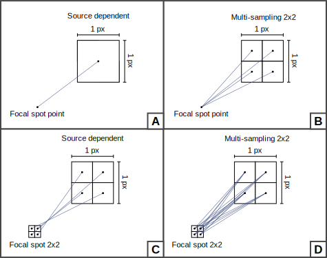
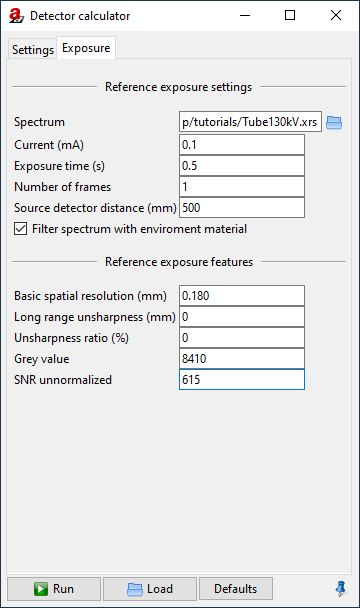

.. include:: _templates/icons.rst

.. _detectorTutorialChapter:

Detector
========

This tutorial explains the basics of |artist|'s virtual detector and how to use the *DetectorCalc* module to calculate characteristics for scintillator-based flat panel detectors.

We do not continue with the project file from the last tutorial, but will start with a fresh new |artist| scene.

.. note:: If you still have the previous project loaded in |artist|, choose :guilabel:`File` → :guilabel:`New Project` from the menu to create a new, empty project.

An Example Scene
----------------

In this tutorial, we will reproduce an example projection image taken with a real CT scanner. It is a flat-field corrected image of a PMMA step cylinder (:numref:`PMMAcylinderOriginalProjection`). To follow the steps we are going to take, you can download a package that contains the projection image (in TIFF format) and the STL file for the surface model of the cylinder that we will use in |artist|:

:download:`detector_tutorial_additional_data.zip <files/detector_tutorial_additional_data.zip>` |nbsp| (5.8 MB)

.. _PMMAcylinderOriginalProjection:
.. figure:: pictures/tutorial-detector-PMMA-cylinder-original-projection.jpg
    :width: 50%

    Projection image of a PMMA step cylinder (flat-field corrected).

.. _PMMAcylinderGeometry:

    Geometry used to acquire the example projection image.

The CT geometry shown in :numref:`PMMAcylinderGeometry` was used to acquire the projection image. The first step we will take is to reproduce this geometry in |aRTist|.

.. note:: 1. Set the :guilabel:`Z` position of the source to :code:`500` |nbsp| mm.
    2. Make sure that |32x32_center-new| :guilabel:`Center new parts` is turned off in the toolbar. Our cylinder surface model already comes with the correct coordinates. Otherwise, you will have to place the cylinder yourself (see next step).
    3. Open the file :code:`PMMA_Cylinder.stl` from the downloaded package of additional data for this tutorial, or drag and drop it into the |artist| window. It should appear at a :guilabel:`Z` position of 350 |nbsp| mm (the ODD). If not, set the :guilabel:`Z` position manually.
    4. Create a new material called *PMMA* (:numref:`PMMAcylinderMaterial`). Its chemical composition is C\ :sub:`5`\ H\ :sub:`8`\ O\ :sub:`2`, it has a density of 1.19 |nbsp| g/cm\ :sup:`3`. Use the |22x22_edit-materials| *materials editor* and don't forget to click :guilabel:`Apply` before closing it.
    5. Assign the new *PMMA* material to the step cylinder in the *Assembly List*.

    Your scene should now look like in :numref:`PMMAcylinderVirtualScene01`.

.. _PMMAcylinderMaterial:

    PMMA material properties for the virtual step cylinder.

.. _PMMAcylinderVirtualScene01:

    We have prepared the basic CT geometry and material properties. We will take care of the detector size later.

Pixels & Size
-------------

Let's take a look at the detector configuration.

.. note:: Switch to the *Detector* tab in the parameter panel (:numref:`detectorGeometryPanel01`).

.. _detectorGeometryPanel01:

    The default geometry parameters of the detector.

In the :guilabel:`Geometry` section, we can set up the detector's size, its number of pixels, and the pixel size (resolution). Each of these three parameters is coupled to the other two:

.. math::
    \textsf{Size~[mm]} = (\textsf{Number~of~Pixels}) \cdot (\textsf{Resolution [mm]}).

In the upper row, you can choose which one |artist| should calculate from the other two.

.. note:: Select :guilabel:`Size [mm]`, |artist| should calculate it for us. We will enter the following two other parameters, which we know (:numref:`detectorGeometryPanel02`).

    * :guilabel:`Pixel`: :guilabel:`X`: :code:`1200`, :guilabel:`Y`: :code:`1400`
    * :guilabel:`Res. [mm]`: :guilabel:`X`: :code:`0.2`, :guilabel:`Y`: :code:`0.2`

The detector size is now calculated automatically. You should now see a preview image that contains the complete step cylinder (:numref:`PMMAcylinderVirtualScene02`).

.. _detectorGeometryPanel02:
.. figure:: pictures/tutorial-detector-geometry-panel-02.png
    :width: 50%

    The detector's geometry parameters for our projection image.

.. _PMMAcylinderVirtualScene02:

    The detector has the correct size now.

Note that you can set :guilabel:`Multisampling` for each pixel. It works in the same way as for the source. If you activate a certain type of pixel multisampling, a ray will be simulated connecting each source point with each pixel point. As described for the :ref:`Spot Type in the Source tutorial <sourceTutorialSpotChapter>`, you can define regular subpixel grids (e.g. :code:`3x3`) or quasi-random patterns using Poisson Disc Sampling (any integers, e.g. :code:`11`). The number of rays that will be simulated per pixel is the product of the source spot multisampling points and the detector (pixel) multisampling points. If you choose :guilabel:`source dependent` for the pixel multisampling (the default setting), the pattern defined for the source will also be used for each pixel (with the exception that it will be flipped in both spatial directions compared to the source pattern). Each spot point is then connected to its corresponding point on the pixel: the number of rays per pixel will remain the number of spot points and will not multiply (:numref:`DetectorPixelMultisampling`).

.. _DetectorPixelMultisampling:

	Overview of the multi-sampling behavior for different source-detector combinations.

The :guilabel:`Curvature` is an experimental feature that can be used to simulate detectors that are curved in a certain direction of space. A possible application could be the simulation of medical CT, but this feature will not be covered here.

Characteristic
--------------

The function that assigns a grey value to the energy density at a pixel is called the *Characteristic*. The default detector in |artist| is the so-called 1:1 detector. It converts all energy that arrives at a pixel linearly into grey values without losses. Let's take a closer look at the *Characteristic* of the 1:1 detector.

.. note:: 1. Make sure that :guilabel:`1:1` is selected as the :guilabel:`detector type`.
    2. From the menu bar, choose :guilabel:`Tools` → :guilabel:`Detector Properties`. The *DetectorViewer* will open in a new window (:numref:`detectorViewer1to1`).

.. _detectorViewer1to1:
.. figure:: pictures/tutorial-detector-detector-viewer-1to1.png
    :width: 100%

    The *DetectorViewer* displays the *Characteristic* curve of the 1:1 detector.

As you can see, the input unit of the 1:1 detector is the energy density (in J/m\ :sup:`2`), the same as the output unit. This means that a pixel in the projection image will have a grey value that directly corresponds to the energy density at the pixel. The result is a purely linear function. This is a very simple *Characteristic*, but it helps us understand what is going on.

.. note:: Close the DetectorViewer.

When you take a look at the preview image (:numref:`imageViewer1to1`) you will notice that the *Image Viewer* displays the energy density at the detector as a map of grey values. When you move your mouse around the image, the energy density will be displayed as a floating point number. They look suspiciously like "real" grey values, but note that "real" grey values are usually integers. In the *Image Viewer*, you can switch the image between :guilabel:`primary intensities` and the :guilabel:`Energy density (J/m²)`. In terms of visible grey values they are the same, but they represent different physical quantities and are connected by the integration time τ:

.. math::
    \textsf{Energy~density} \left[ \frac{\textsf{J}}{\textsf{m}^2} \right] = \textsf{primary intensity} \left[ \frac{\textsf{J}}{\textsf{s}\cdot\textsf{m}^2} \right] \cdot \tau \left[ \textsf{s} \right].

.. _imageViewer1to1:

    The *Image Viewer* displays the energy density at the detector as grey values.

Exposure
--------

The energy density at each pixel depends on the integration time τ. In the current standard settings of the detector (:numref:`detectorExposureSettings`), the integration time is automatically calculated such that the brightest point in the image (point of maximum exposure) will reach an energy density of 50000 |nbsp| J/m². You can see this in the *display range* in :numref:`imageViewer1to1`. To reach such a high energy density, a simulated integration time of more than 11000 weeks is necessary. This might seem confusing, but it is simply the result of the purely linear 1:1 characteristics. In the following section we will build a detector with a grey value characteristic that associates higher grey values with smaller energy densities and therefore reaches realistic integration times.

.. _detectorExposureSettings:
.. figure:: pictures/tutorial-detector-exposure-settings.png
    :width: 50%

    Exposure settings.

Instead of the maximum intensity, you can set a different :guilabel:`reference point` where the expected grey value should be reached. You can also turn off the reference point and enter the :guilabel:`exposure time` manually.

Realistic Detectors
-------------------

The pre-defined detectors in |artist| are usually not of interest if you are trying to reproduce a realistic flat panel CT detector. In the following example, we will reproduce the real-world projection image of the step cylinder and create our own detector using the *DetectorCalc* module. 

Spectrum and Current
~~~~~~~~~~~~~~~~~~~~

We already set the scene geometry and the material of the PMMA cylinder correctly. Before we can take care of the detector, we need to simulate the spectrum and the tube current that were used to take the projection image.

.. note:: Switch to the :guilabel:`Source` parameters and use the |22x22_xray-tube| *Spectrum Calculator* to generate a spectrum with the following parameters: we need a general tube at **130 kV** with a **tungsten (W) reflection target** (45° target and incidence angle), a **0.5 mm Be window** and a **0.1 mm Cu filter** (:numref:`detectorSpectrumCalculator`).
	
	Press |16x16_compute-run| :guilabel:`Compute` to calculate the spectrum, then close the *Spectrum Calculator*.

.. _detectorSpectrumCalculator:
.. figure:: pictures/tutorial-detector-spectrum-calculator.png
    :width: 50%

    Settings to reproduce the X-ray tube spectrum that was used to take the projection image.

You should now see the spectrum shown in :numref:`detectorSourceSettings`. We still need to set the current of 100 |nbsp| µA that was used for the real-world tube when the projection image was taken.

.. note:: For :guilabel:`exposure [mA or GBq]` enter :code:`0.1`. (The unit is mA, :numref:`detectorSourceSettings`).

.. _detectorSourceSettings:
.. figure:: pictures/tutorial-detector-source-settings.png
    :width: 50%

    We calculated a spectrum that matches the real-world tube parameters that were used to take the projection image.

We will need this spectrum as an :code:`.xrs` file later when creating our new detector.

.. note:: Underneath the spectrum graph, click |22x22_document-save-as| to save the current spectrum as an :code:`.xrs` file at a location of your choice. (We will need this file later in the tutorial.)

When you switch back to the *Detector* parameters, you will see that the exposure time dropped from more than 11000 weeks to "just" 5 |nbsp| weeks to reach the 50000 |nbsp| J/m² at the point of maximum intensity (:numref:`detectorExposureSettings02`). Our new tube and current obviously lead to a much higher flux at the detector.

.. _detectorExposureSettings02:
.. figure:: pictures/tutorial-detector-exposure-settings-02.png
    :width: 50%

    The exposure time dropped to "just" 5 weeks with our new tube settings.

DetectorCalc
~~~~~~~~~~~~

We have now prepared everything to build our new detector using the *DetectorCalc* module. This module's purpose is to generate realistic sensitivity, noise and grey value response curves for a given X-ray spectrum and scintillator material.

.. note:: From the menu bar, open :guilabel:`Modules` → :guilabel:`DetectorCalc` (:numref:`detectorCalcSettings`).

.. _detectorCalcSettings:
.. figure:: pictures/tutorial-detector-detectorcalc-settings.png
    :width: 50%

    We describe our general detector settings in the *DetectorCalc* module.

In the *General* section, we enter the obvious parameters of our detector: its size, number of pixels, grey value dynamics and we will give it a name.

.. note:: 1. Give your detector any :guilabel:`name` you like. In this example, we called it the :code:`Step Cylinder Detector`.
	2. Enter the :guilabel:`pixel size`: :code:`0.2` |nbsp| mm.
	3. Enter the :guilabel:`Pixel count X`: :code:`1200` (the width of our projection image).
	4. Enter the :guilabel:`Pixel count Y`: :code:`1400` (the height of our projection image).
	5. :guilabel:`Maximum grey value`: :code:`65535` (i.e. a 16 bit detector).
	6. :guilabel:`Grey value quantum`: :code:`1` (the detector's output are integer grey values in steps of 1).

The next section is called *Sensitivity*. It asks for the detector parameters relevant to its spectral absorption characteristics, namely the scintillator properties. The detector that was used to capture the projection image has a CsI scintillator with a thickness of 150 |nbsp| µm.

.. note:: If CsI is not yet in your materials list, you need to create it using the |22x22_edit-materials| *Materials Editor* (:numref:`detectorMaterials`). You can leave the *DetectorCalc* window open while doing this.

	* Material: :code:`CsI`,
	* Density: :code:`4.51` g/cm³,
	* Composition: :code:`CsI`.

	We also create a material for the carbon fibre in front of the detector. It serves as a protection and (slightly) filters the radiation:

	* Material: :code:`Carbon`,
	* Density: :code:`1.8` g/cm³,
	* Composition: :code:`C`.

.. _detectorMaterials:

    If they are not yet in your list of materials, you will have to add CsI for the scintillator and Carbon for the protective layer.

We can now set the sensitivity and filtration properties in the *DetectorCalc* module.

.. note:: 1. For the (scintillator) :guilabel:`Material`, choose :code:`CsI`.
	2. For its :guilabel:`Thickness`, set :code:`0.15` mm.
	3. Leave the :guilabel:`Steps` at :code:`2`. This parameter is used in the X-ray generation model and gives the maximum number of consecutive interactions to be simulated.
	4. :guilabel:`Min Energy`: :code:`0`.
	5. :guilabel:`Max Energy`: :code:`Infinity`.
	6. :guilabel:`Signal Type`: :code:`Average Energy`. (Common flat panel detectors are energy-integrating devices, this is what the *average energy* signal type does.)
	7. Add the 0.5 mm Carbon filter to the filtration list.

	(See :numref:`detectorCalcSettings`.)

Reference Exposure
~~~~~~~~~~~~~~~~~~

So far, those are the general properties of the detector. Now we need to switch over to the *Exposure* tab (:numref:`detectorCalcExposure`) and provide reference measurements from the projection image that we try to reproduce. *DetectorCalc* will use those reference values to calculate matching characteristics curves, as we will see later.

.. _detectorCalcExposure:

    In the exposure settings, we will enter reference values that we have measured in our real-world projection image.

The first section, called :guilabel:`Reference exposure settings`, asks for the general circumstances under which the reference image was taken.

.. note:: 1. For the :guilabel:`Spectrum`, select the :code:`.xrs` spectrum file that you saved after we generated the X-ray spectrum.
	2. The image was taken at a tube :guilabel:`current` of :code:`0.1` |nbsp| mA.
	3. The :guilabel:`exposure time` for the image was :code:`0.5` |nbsp| s.
	4. You need to specify the :guilabel:`Number of frames` that have been averaged for the reference image. This is taken into account for the noise characteristics. If you do not intend to simulate any different frame averaging than the one from the reference image, it is advisable to pretend that the number of frames has been :code:`1`. More about the details of frame averaging is explained later.
	5. The :guilabel:`Source detector distance` was :code:`500` |nbsp| mm.
	6. Keep :guilabel:`Filter spectrum with environment material` activated: this will take the X-ray absorption of air into account when reproducing the grey value.

*DetectorCalc* now knows the circumstances under which the reference image was taken and is able to calculate a good estimate for the primary intensity at the detector. It still needs to know how these primary intensities correspond to grey values, and also asks for the noise (SNR, signal-to-noise-ratio) in the reference image and the detector's unsharpness.

Unsharpness
~~~~~~~~~~~

|artist|'s unsharpness definition conforms to the guideline ASTM E2597/E2597M-14 where it is measured using a duplex wire standard :cite:p:`ASTME2597`. The unsharpness is achieved by treating the analytical projection image in |artist| with a Gaussian smoothing kernel. Its standard deviation :math:`\sigma_\mathsf{main}` is chosen such that the resulting unsharpness will match the mentioned guideline.

Apart from this main unsharpness, |artist| offers a second component called the *long range unsharpness*. This component becomes visible when measuring line profiles across an edge image (:numref:`detectorUnsharpnessComponents`).

.. _detectorUnsharpnessComponents:

    The main unsharpness and the long range unsharpness have an effect on the line profile across an edge image.

|artist| uses alpha blending to combine the main unsharpness and the long range unsharpness. For a given ideal point function δ as the input, the resulting point spread function (PSF) would be

.. math::
    \mathsf{PSF} = \left[ \alpha \cdot g_\mathsf{LR} \ast \delta + (1-\alpha)\delta \right] \ast g_\mathsf{main},

with the long range ratio :math:`\alpha` (the "prominence" of the long range component), the convolution operator :math:`\ast` and the two Gaussian smoothing kernels

.. math::
    g_\mathsf{main} = \frac{1}{\sqrt{2\pi \sigma_\mathsf{main}^2}} \exp \left( -\frac{x^2}{2\sigma_\mathsf{main}^2} \right) ~~~~~\mathsf{and}~~~~~ g_\mathsf{LR} = \frac{1}{\sqrt{2\pi \sigma_\mathsf{LR}^2}} \exp \left( -\frac{x^2}{2\sigma_\mathsf{LR}^2} \right).

We will not reproduce the long range unsharpness for our detector as this will be beyond the scope of this tutorial.

.. note:: 1. For the :guilabel:`basic spatial resolution`, enter :code:`0.18` |nbsp| mm. This is an unsharpness property of the detector that is known, but cannot be deducted from the projection image of the step cylinder.
    2. For the :guilabel:`long range unsharpness` and the :guilabel:`unsharpness ratio`, enter :code:`0`. This is an advanced topic not covered here, but feel free to try it out on your own.

Grey Value & Noise
~~~~~~~~~~~~~~~~~~

*DetectorCalc* asks for a reference grey value. This is the grey value at the maximum free beam intensity. If you were trying to reproduce an image that has *not* been flat-field corrected, the best option would be to measure the expected grey value at the intensity maximum of a flat field image. In this example, we do work with a flat-field corrected image, so we will just measure the mean background intensity in a region of free beam (:numref:`detectorFreeBeamGVSNR`). The standard deviation will lead us to the SNR (signal-to-noise ratio).

.. _detectorFreeBeamGVSNR:
.. figure:: pictures/tutorial-detector-PMMA-cylinder-projection-mean-stddev-snr.png
    :width: 100%

    Measuring the reference grey value and SNR in the real-world projection image.

Enter these two reference values into the *DetectorCalc* window:

.. note:: 1. For :guilabel:`grey value`, enter :code:`8240`.
    2. For :guilabel:`SNR unnormalized`, enter :code:`615`.

We have now prepared all parameters to generate our new detector.

.. note:: Press |16x16_compute-run| :guilabel:`Run` to create the new detector. You will be asked to save the new detector as a. :code:`.aRTdet` file, which is |artist|'s file format for detector description. Save it where you can find it again, we will inspect the file later.

    After you created the file, the actual computation might take a while, and you might need some patience. When you are asked if you want to load the new detector definition, click :guilabel:`Yes` to import the detector that you just created from the detector file.

The new detector is now selected as the current :guilabel:`detector type` in the parameter panel (:numref:`detectorNewImported`). We now need to switch the exposure to a fixed exposure time.

.. note:: Turn off the :guilabel:`reference point` and manually set an exposure time of :code:`0.5` seconds (:numref:`detectorNewImported`). This was the original exposure time for the real-world projection image that we used to configure *DetectorCalc*.

.. _detectorNewImported:
.. figure:: pictures/tutorial-detector-newdetector-imported.png
    :width: 50%

    The new detector is now imported. We need to set the exposure time manually.

The grey values that you will get in the preview image should now already be close to the grey values in the real-world projection image. Keep in mind that you still see an uncorrected projection image in |artist|. 