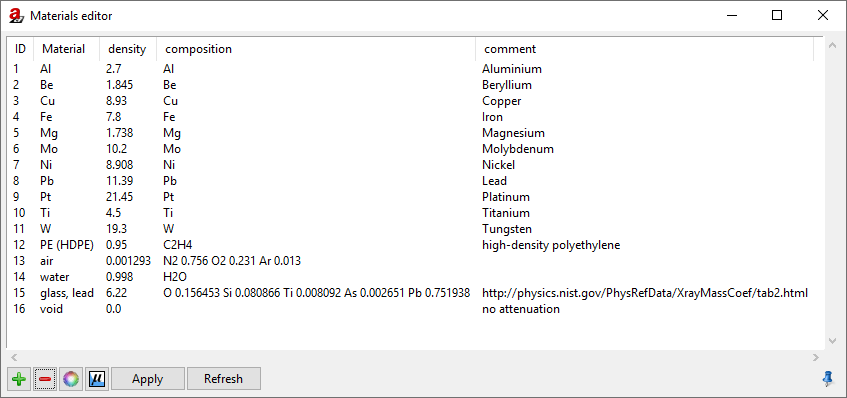
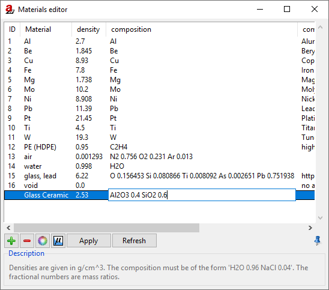
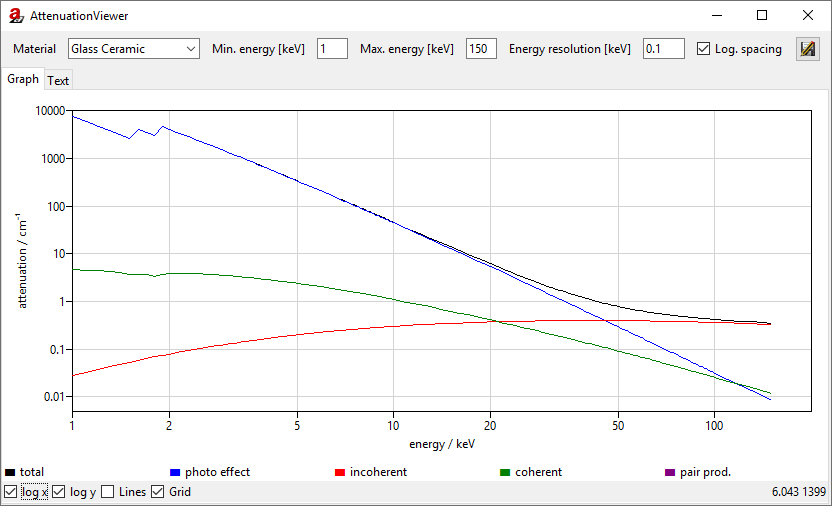
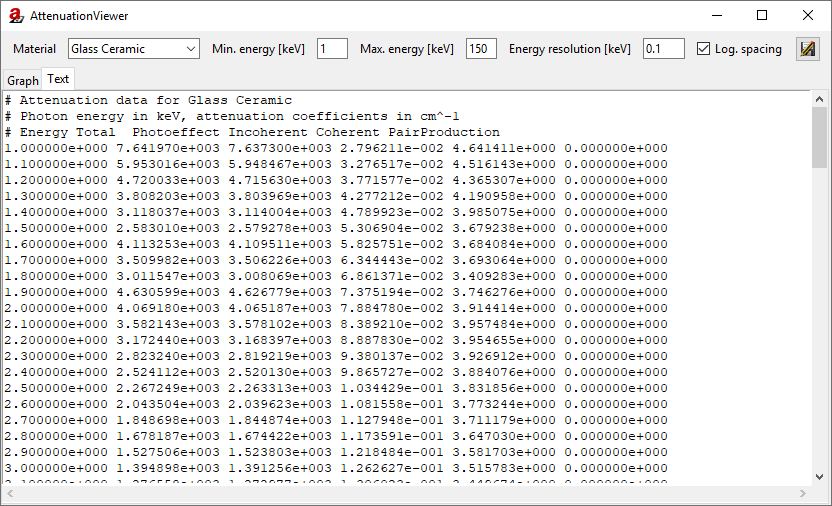
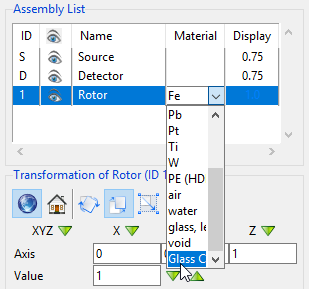

.. note:: We continue with the project from the last tutorial. You can download it here if you need the current state:

     :download:`tutorial_positioning.aRTist <files/tutorial_positioning.aRTist>` |nbsp| (4.6 MB)

Materials
==========

*aRT*\ ist approximates the X-ray attenuation coefficients of chemical compounds from the attenuation properties of their single chemical elements. It uses the elementary mass attenuation coefficients from the *Evaluated Nuclear Data File (ENDF)*. Higher-order structural effects such as the electron band structure of crystals or the orbital configurations of molecules are not taken into account. Any material is simulated as "the sum of its elementary parts."

Materials Editor
-----------------

*aRT*\ ist has a built-in materials editor (:numref:`materialsEditor`) that helps you manage your library of materials. You can change and add entries there, and inspect the attenuation coefficients that *aRT*\ ist has calculated.

.. note:: In the toolbar, click the button |icon-material-editor| :guilabel:`Edit material properties` or open it from the Menu bar: :guilabel:`Tools` → :guilabel:`Materials...`

.. _materialsEditor:

    Materials Editor

We will create a simple glass ceramic that has the following composition:

* Al\ :sub:`2`\ O\ :sub:`3` with a mass fraction of 40%
* SiO\ :sub:`2` with a mass fraction of 60%
* Overall density: ρ = 2.53 g/cm\ :sup:`3`

In the materials editor, this compound would be represented as :code:`Al2O3 0.4 SiO2 0.6`. Each of the two components is written in its empirical formula, using the chemical symbols from the periodic table of elements, followed by the number of atoms. After a compound, its *mass fraction* may follow (separated by a space from the empirical formula). The mass fractions will be automatically normalized to their total sum. For example, :code:`Al2O3 40 SiO2 60` would represent the same material as above.

.. note:: In the *Materials Editor,* click on |icon-add| :guilabel:`Add new material definition`. An empty row will appear where you can fill in the new material information (:numref:`materialsEditorAddNew`).

	1. Enter a material name, e.g. :code:`Glass Ceramic`.
	2. Enter the density: :code:`2.53`.
	3. Enter the composition: :code:`Al2O3 0.4 SiO2 0.6`.
	4. You may also add a comment, if you want.

	Click :guilabel:`Apply` to save the list.

.. |icon-add| image:: pictures/icons/16x16_list-add.png

.. _materialsEditorAddNew:

    We add the glass ceramic as a new material.

It is important to click :guilabel:`Apply` to save the changes you have made. The button :guilabel:`Refresh` will re-load the internal library, delete any unsaved changes you have made, and show changes that other *aRT*\ ist modules have made in the material library in the time since you have opened the *Materials Editor.*

Attenuation Data Viewer
------------------------

For each material, you can display the |icon-attenuation| **attenuation data** that *aRT*\ ist will use during the simulation.

.. |icon-attenuation| image:: pictures/icons/16x16_show-attenuation.png

.. note:: Make sure that our *Glass Ceramic* is selected in the *Materials Editor* and click on |icon-attenuation|.

The **Attenuation Viewer** (:numref:`attenuationViewerPlot`) will appear and show a plot of the attenuation coefficients.

.. _attenuationViewerPlot:

    The attenuation viewer shows a plot of the attenuation coefficients.

If you want to display a different photon energy range, you can enter it in the upper part of the window: **min. energy** and **max. energy**. The plot displays five curves that represent the following:

| |box-black| The **total** attenuation coefficients are plotted as a black line and consider all the modelled effects from particle physics.
| |box-blue| The contribution from the **photo effect** (photoelectric absorption) is plotted as a blue line.
| |box-red| The contribution from **incoherent scattering** (Compton scattering) is plotted as a red line.
| |box-green| The contribution from **coherent scattering** (Rayleigh/Thomson scattering) is plotted as a green line.
| |box-purple| The contribution from **pair production** (purple line) becomes relevant at photon energies above twice the electron rest mass: h⋅f > 2 m\ :sub:`e`\ c\ :sup:`2` |nbsp| (1.022 MeV).

.. note:: Switch to the :guilabel:`Text` tab to display the data as a text table. (:numref:`attenuationViewerText`)

.. _attenuationViewerText:

    The calculated data points for the attenuation coefficients are shown in a text table.

You can save the attenuation data as a text file with the |icon-saveas| :guilabel:`Save` button in the upper right corner of the *Attenuation Viewer*.

.. |icon-saveas| image:: pictures/icons/16x16_document-save-as.png

.. note:: Close the *Attenuation Viewer* and the *Materials Editor.*

Setting the Material of a Part
------------------------------

We now want to set the *Rotor's* material to the *Glass Ceramic* that we have created. You can do this in the *Material* column in the *Assembly List.*

.. note:: Click on the current *Material* of the *Rotor* (should be *Fe*). From the list, choose the *Glass Ceramic* that we have created. (:numref:`materialDropDown`)

.. _materialDropDown:

    We set the *Glass Ceramic* as the *Rotor's* material.

The attenuation behaviour of the *Rotor* should now change and represent the one of the *Glass Ceramic.* The grey values in the projection's preview image will become lighter as the *Glass Ceramic* absorbs less radiation than iron.

Summary
-------

In this brief tutorial you have learned how to manage your **materials library**, set the material of a part and how to access its **attenuation coefficients.**

| The scene that we created up to this point is available for download:
| :download:`tutorial_materials.aRTist <files/tutorial_materials.aRTist>` (4.6 MB)