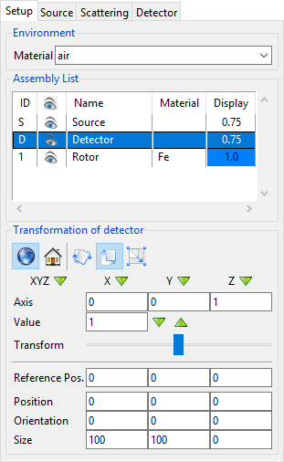
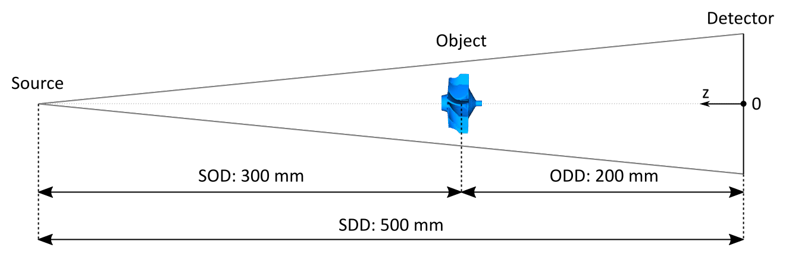
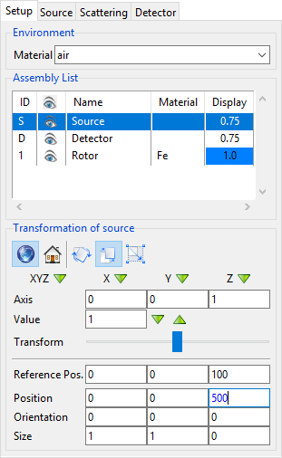
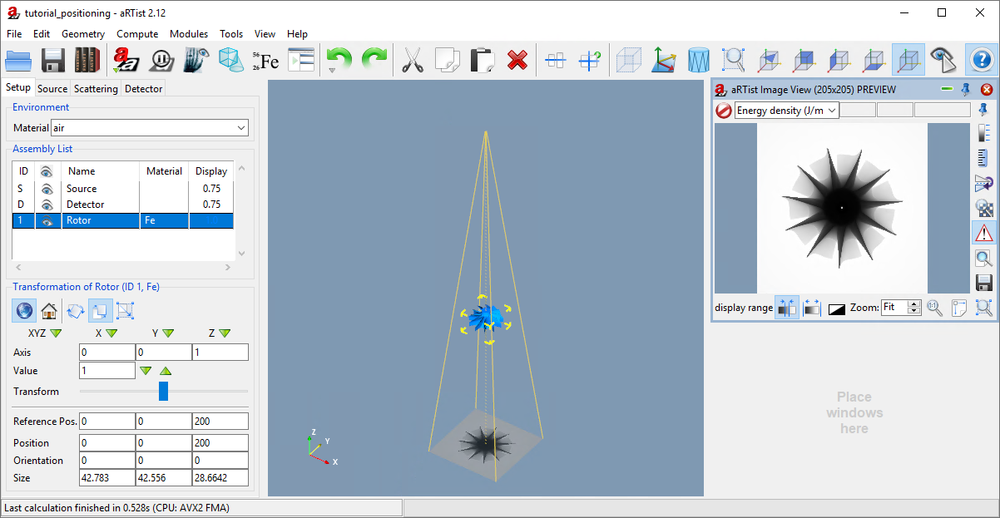
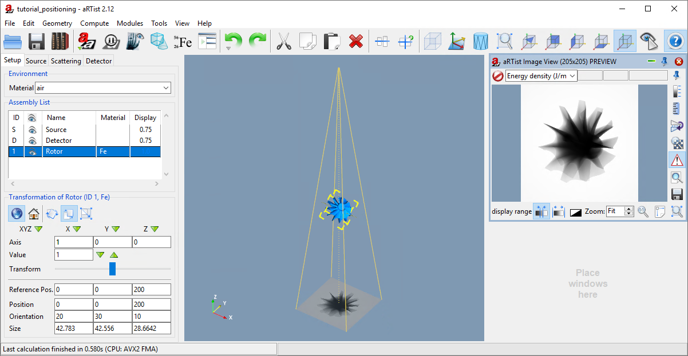
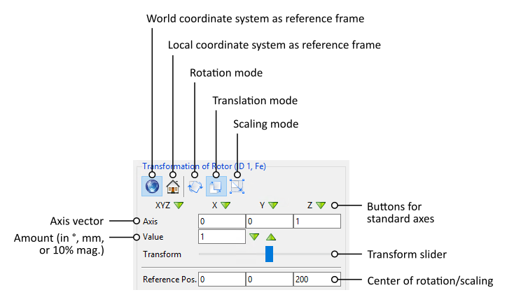

Position, Orientation & Size
============================

.. |nbsp| unicode:: 0xA0 
   :trim:

.. note:: We continue with the project from the last tutorial. You can download it here if you need the current state:

     :download:`tutorial_virtual_scene.aRTist <files/tutorial_virtual_scene.aRTist>` |nbsp| (4.6 MB)

Local and World Coordinate Systems
----------------------------------

In the previous tutorial, we have already seen that *aRT*\ ist puts the detector by default at the origin of the coordinate system and the source at some point in positive *z* direction. This main frame of reference is called the **world coordinate system**. You can imagine it as a fixed frame, or stage, that is *absolute* and will never change.

When placing objects into the scene, we can express their position and orientation in terms of the world coordinate system. In *aRT*\ ist, the position of an object is a tuple of three coordinates (x, |nbsp| y, |nbsp| z) that refer to the position of the object's centre (i.e. the centre of its bounding box) in the world coordinate system. This centre point is the origin of the object's **local coordinate system**. Each object comes with three intrinsic axes. For example, the coordinates of the triangles in the surface mesh of an STL or PLY file are expressed in terms of its own, specific coordinate system. The axes of this intrinsic coordinate system must not necessarily align with *aRT*\ ist's world coordinate system, as illustrated in the example of the tilted *Rotor* in :numref:`worldLocalCoordinateSystem`.

When an object rotates in space, the directions of the three axes of its **local coordinate** system change in relation to the world coordinate system. Mathematically, we can express the local axes as vectors within the world coordinate system to know an object's orientation.

In the example illustrated in :numref:`worldLocalCoordinateSystem`, the detector's local coordinate system {X\ :sub:`D`, Y\ :sub:`D`, Z\ :sub:`D`} has the same origin and alignment as the world coordinate system. The source's local coordinate system {X\ :sub:`S`, Y\ :sub:`S`, Z\ :sub:`S`} has the same alignment, but its origin is at a different point in the world coordinate system, somewhere along the positive *Z* axis. The *Rotor's* local coordinate system has also a different origin, and additionally a different alignment (orientation) relative to the world coordinate system.

.. _worldLocalCoordinateSystem:
.. figure:: pictures/coordinate-system-world-local.png
    :width: 80%

    The world coordinate system {X, Y, Z} and the local coordinate systems of the three objects in the scene.

Parameter Panel
---------------

If we take a look at the full scene again, we see that the source seems to be a little bit close to the detector.

.. note:: Deselect the rotor by clicking on the unoccupied white area in the *Assembly List* or on the brackground colour in the *Virtual Scene*. Now click on |icon-zoom-to-selection| :guilabel:`Zoom to Selection` to see the full scene again.

We already know that the detector is at the origin of the coordinate system: its centre lies at the point (0, |nbsp| 0, |nbsp| 0) in space. You can check this by selecting the *Detector* item from the *Assembly List* and inspecting its properties in the *Transformation* section of the *Parameter Panel* (:numref:`detectorTransformProperties`).

.. _detectorTransformProperties:

    The lower three rows of the *Parameter Panel* show the position, orientation and size of the selected *Detector*.

The panel also tells us that the detector has a **Size** of 100 |nbsp| mm in *X* direction and 100 |nbsp| mm in *Y* direction. It has no thickness (0 |nbsp| mm in *Z* direction). The size always refers to an object's **bounding box**, i.e. its local coordinate system. In the case of our specific detector, the axes of its local coordinate system and the world coordinate system point in the same direction. In general, this is not the case for any object.

We can also get the information about the position of the source.

.. note:: Select the *Source* from the *Assembly List* and check its *Z* position.

The source is located 100 |nbsp| mm away from the detector on the *Z* axis.

Position
--------

In the field of computed tomography, two very important parameters of a system's geometry are the **source-detector distance (SDD)** and the **source-object distance (SOD)**. We will now change our scene to get the  geometry shown in :numref:`goalSetup`, with an SDD of 500 |nbsp| mm and an SOD of 300 |nbsp| mm.

.. _goalSetup:

    Illustration of the geometry that we want to set up.

Setting up the :abbr:`SDD (source-detector distance)` is the easier part. We have to place the source at the position *Z* |nbsp| = |nbsp| 500 |nbsp| mm, because the detector is located at the origin of the coordinate system and we want to keep the convention to place the source in positive *Z* direction.

.. note:: Select the *Source* from the *Assembly List*. Set :code:`500` for the *Z* coordinate of the **Position** (:numref:`sourceTransformProperties`) and press :kbd:`Enter`.

The number in the input field will be displayed in blue until it is applied to the scene.

.. _sourceTransformProperties:

    Placing the source at 500 |nbsp| mm. The number remains blue until we press :kbd:`Enter` to apply the change.

The *Rotor* is still at the origin of the coordinate system, basically "inside" the detector. To move it to the correct :abbr:`SOD (source-object distance)` of 300 |nbsp| mm, we have to keep in mind that we need to set its position on the *Z* axis, which starts at the detector. This means that we have to calculate the **object-source distance (ODD)** first:

**ODD = SDD – SOD = 200 mm.**

We can now place the *Rotor* 200 |nbsp| mm away from the detector to get the required :abbr:`SOD (source-object distance)` of 300 |nbsp| mm.

.. note:: Select the *Rotor* from the *Assembly List* and set its *Z* position to :code:`200`. Press :kbd:`Enter`.

When you take a look at the full view of your scene, it should now look like in :numref:`SODandSDDsetup`.

.. _SODandSDDsetup:

    We have changed the geometry to an SOD of 300 |nbsp| mm and an SDD of 500 |nbsp| mm.

To set up horizontal and vertical shifts, you can change the *X* position and *Y* position of any object in the same way.

Orientation
-----------

One row below the *Position* settings in the *Parameter Panel* you can set the **Orientation**. This is a set of three angles (in degrees) that represent consecutive rotations around an object's coordinate axes.

Whenever you load a new object into the scene, the axes of its local coordinate system are aligned with the axes of the world coordinate system. To reach the orientation specified by the three angles, *aRT*\ ist will perform three rotations in the following order.

1. The object is rotated by the **third angle** around its **local Z axis**.
2. The object is rotated by the **first angle** around the **resulting local X axis**.
3. The object is rotated by the **second angle** around the **resulting local Y axis**.

.. note:: Select the *Rotor* and set its orientation angles to X: :code:`20`, Y: :code:`30` and Z: :code:`10`. Press :kbd:`Enter` to apply the orientation. 

You should now see a tilted *Rotor* in the virtual scene, just like in :numref:`rotorOrientation`. Starting with its local coordinate system aligned with the world coordinate system, it has first been rotated by 10° around its local *Z* axis, then by 20° around the resulting local *X* axis, and thirdly by 30° around the resulting local *Y* axis.

The order in which you enter the three *Orientation* angles does not matter for the final result. Whenever you change an orientation angle, *aRT*\ ist will internally reset the object to its original orientation, and then strictly rotate it in the given order Z→X→Y.

.. _rotorOrientation:

    We have changed the orientation of the *Rotor* in the scene.

Often, using the *Orientation* angles directly can be very inconvenient because of the strict order of rotations. An easier and more powerful way to transform an object's position and orientation are incremental transformations as explained in the next section.

Incremental Transformations
---------------------------

The upper part of the *Parameter Panel* provides a lot of options to transform an object. :numref:`transformPanel` gives an overview over the buttons and input fields.

.. _transformPanel:

    We have changed the orientation of the *Rotor* in the scene.

Rotations need an **axis of rotation,** and translations need a **translation vector** that points in the direction of the movement. Such an axis is provided as a three-component vector that you can enter under *Axis*. The buttons **X** |nbsp| |icon-arrow-down|, **Y** |nbsp| |icon-arrow-down| and **Z** |nbsp| |icon-arrow-down| provide easy ways to set the standard vectors for X, Y and Z direction. **XYZ** |nbsp| |icon-arrow-down| gives you a diagonal axis.

The important question is: does the vector describe a direction in the world coordinate system or in the local coordinate system of the object you selected? You can choose the one you prefer: in the upper part of the panel, either click the button for the |icon-world| |nbsp| **world coordinate system** or for the object's |icon-local| |nbsp| **local coordinate system.**

.. |icon-local| image:: pictures/icons/22x22/object-coordinate-system.png

Next to the two buttons for the coordinate systems you can choose which kind of transformation you want to perform. There are three buttons to choose |icon-rotate| |nbsp| **Rotation Mode**, |icon-move| |nbsp| **Translation Mode (move)** or |icon-scale| |nbsp| **Scale Mode (resize).**

.. |icon-rotate| image:: pictures/icons/22x22/transformation-rotate.png

For **Value**, you can set the amount by which you want to rotate, move or scale. For rotations, enter an **angle in degrees.** For translations, enter a **distance in mm.** For scaling, *aRT*\ ist expects a factor that expresses a **multiple of 10% magnification,** i.e. a factor of 1 will increase the object's size by 10% in the given direction.

To apply the transformation, you can use the **transform slider.** When you grab the handle and drag it across the slider, it might perform several consecutive transformations. If you want exactly one transformation step, you have much better control by clicking onto the horizontal slider bar to the left or to the right of the slider handle.

* A click on the **right side** of the slider handle leads to a positive transformation by the amount you entered. This means that rotations will happen in a mathematically *positive* direction around the axis vector and translations will move the object *in the direction* of the axis vector. Scalings will *multiply* the size of the object by the given 10%-magnification-factor.
* A click on the **left side** of the slider handle leads to a negative transformation by the amount you entered. This means that rotations will happen in a mathematically *negative* direction around the axis vector and translations will move the object in the *opposite* direction of the axis vector. Scalings will *divide* the size of the object by the given 10%-magnification-factor.

Normally, the **centre of rotation or scaling** is the centre of the object's bounding box. You can change this point by entering a different **Reference Position** underneath the transform slider.

.. note:: Let's put this in action. We will now reverse the *Rotor's* orientation using the transform slider. But first: **now is a good moment to save your project,** just in case you make a mistake.

    1. Make sure the *Rotor* is selected.
    2. Select the |icon-local| |nbsp| **Local Coordinate System** as the reference frame. (Remember that *aRT*\ ist assumes that the orientation angles refer to consecutive rotations around the three axes of the object's **local** coordinate system.)
    3. Switch to |icon-rotate| |nbsp| **Rotation Mode**.
    4. Click on **Y** |nbsp| |icon-arrow-down| to select the Y axis. (This has been the last of the three rotations. We need to go backwards in reverse order to get back to the start.)
    5. For **Value**, enter :code:`30`.
    6. Click to **left** of the transform slider handle to perform one transformation step in the opposite direction (a rotation of -30° degrees, if you will).
    7. Click on **X** |nbsp| |icon-arrow-down| to select the X axis.
    8. For **Value**, enter :code:`20`.
    9. Click to **left** of the transform slider handle.
    10. Click on **Z** |nbsp| |icon-arrow-down| to select the Z axis.
    11. For **Value**, enter :code:`10`.
    12. Click to **left** of the transform slider handle.

    You should now be back at an orientation of (0, 0, 0) and see the view from :numref:`SODandSDDsetup` again. If you would have changed the order of rotations, you would not be back at this point.

Summary
-------

In this tutorial, you have learned how to change the position and orientation of objects.

* You know that each object has its own **local coordinate system** in a fixed, unchanging reference frame that is called the **world coordinate system.**
* You can set the **position** and **orientation** of objects.
* You learned that the three **orientation angles** are always applied in the order Z→X→Y of the object's local coordinate axes.
* You are able to use the **transform slider** to apply rotations around any given vector, and translations in any directions.

| The scene that we created up to this point is available for download:
| :download:`tutorial_positioning.aRTist <files/tutorial_positioning.aRTist>` (4.6 MB)