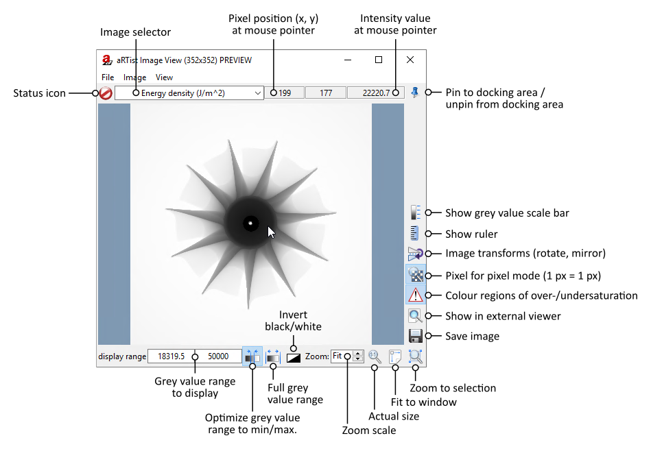
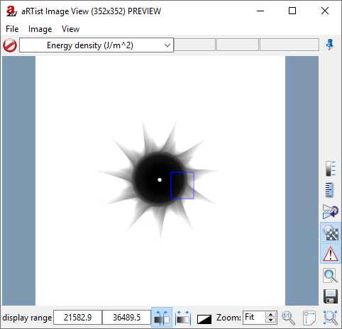
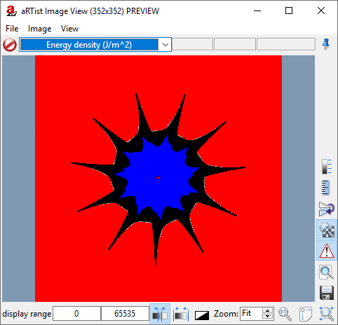
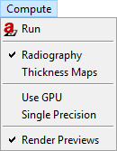

.. include:: _templates/icons.rst

Projection Images
=================

In the previous tutorials, we have already seen preview images of radiographic projections in the *Image Viewer.* In this tutorial, this module will be explained in more detail and you will learn how to run full simulations of projection images.

This tutorial will be mostly explanatory. Feel free to try everything and experiment with the features that are described. There will be no explicit instructions that you must follow.

.. note:: We continue with the project from the last tutorial. You can download it here if you need the current state:

     :download:`tutorial_materials.aRTist <files/tutorial_materials.aRTist>` |nbsp| (4.6 MB)

Image Viewer
------------

The *Image Viewer* is an |artist| module. Usually, you find it in the *Docking Area* on the right side of the window. If not, you can activate it with the button |32x32_image-viewer| :guilabel:`Show image viewer` in the *Toolbar* or find it in the menu: :guilabel:`Modules` → :guilabel:`ImageViewer`. You can use the |16x16_window-dock| **Pin** to put the *Image Viewer* in a separate window (:numref:`imageViewer`) or attach it to the *Docking Area.*

.. _imageViewer:

    The *Image Viewer* module in a separate window.

The Image Viewer is made to display 2D grey scale images. Typically, it will display a preview of the current detector image. This works only when the *live preview* is activated. You can activate or deactivate the live preview in the following ways:

* In the menu bar: :guilabel:`Compute` → :guilabel:`Render Previews`,
* with the toolbar button |32x32_preview-start| :guilabel:`Enable live rendering of preview images`, or
* with the toolbar button |32x32_preview-pause| :guilabel:`Disable live rendering of preview images` (the preview image will show the |artist| splash screen).

Status Icon
~~~~~~~~~~~

The **status icon** signals if you see a |22x22_image-preview| **preview image** or a |22x22_image-final| **full simulation image.** To calculate a full simulation image, you can use the |32x32_compute-radiography| :guilabel:`Run` button from the toolbar or in the menu bar, choose :guilabel:`Compute` → :guilabel:`Run`.

Saving Images
~~~~~~~~~~~~~

The *Image Viewer* lets you save the current image with the button |22x22_document-save| :guilabel:`Save to file`. It will warn you if you save a preview image instead of a fully simulated image.

In the *save dialog* that appears, it is important that you choose the **image type** that you need: do you want an 8-bit or 16-bit *unsigned integer* data type or a 32-bit *floating point* data type?

Unless you want a TIFF image, you need to enter the correct **file extension** (such as :code:`.raw`) that you prefer. Along with the actual image file, |artist| will save an additional text file that contains some important parameters from your simulation and about the image. If you save a RAW file, |artist| will add the data type, byte order and image size to the file name, using a pattern that allows *ImageJ* to automatically find the correct parameters to read the image.

Image Selector
~~~~~~~~~~~~~~

Often, there is more than one image to view. You can switch between images with the **image selector** right next to the status symbol. We will talk more about the different choices here in the following tutorials when this becomes more relevant.

Currently, you should have the choice between :guilabel:`Energy density (J/m^2)` and :guilabel:`primary intensities`. The **energy density image** is the output of your current detector: it is an ideal energy integrator (called the *1:1 detector*) whose grey values directly correspond to the energy that each pixel collects, normalized to their area (hence the unit J/m²). Its exposure time is automatically set up in such a way that the energy density at the maximum intensity directly corresponds to 50000 J/m² (to get a nice 16 bit grey value range). If you'd like to know more, we will learn about detector models in another tutorial.

The **primary intensity** is more universal: it is the pure intensity absorbed by the detector (in J/s/m²) and is not converted into grey values of any kind. It is a purely physical value. When you move your mouse pointer over an image of primary intensities, you can read the intensity at each pixel.

Intensity Value
~~~~~~~~~~~~~~~

Next to the image selector, you find the pixel coordinates and intensity value at the position of the mouse pointer. The intensity value and its unit depend on the kind of image you display and your detector model.

Display Range
~~~~~~~~~~~~~

The :guilabel:`display range` sets the minimum and maximum grey value displayed in the image. Normally, the minimum value is displayed as **black**, the maximum value as **white**, and all other values in between are interpolated linearly into corresponding grey values. You can use the |22x22_image-invert| :guilabel:`invert` button to turn around all grey values and make the minimum white and the maximum black.

To automatically set the grey value range to the grey value range featured in the image, click the button |22x22_optimize-contrast| :guilabel:`Optimize display`. On the other hand, you can display the maximum range that is possible with this image type: |22x22_reset-contrast| :guilabel:`Reset display to default range`.

Regions of Interest (ROI)
~~~~~~~~~~~~~~~~~~~~~~~~~

You can draw regions of interest with your mouse on the image in the *Image Viewer*. If |22x22_optimize-contrast| :guilabel:`Optimize display` is activated, the grey value range will be adjusted to match the minimum and maximum intensity inside your region of interest (:numref:`imageViewerROI`).

To remove the ROI, click anywhere in the image (but not on the ROI's border).

.. _imageViewerROI:

    We draw a region of interest (blue rectangle) and the grey value range adjusts.

Zoom, Image Size, Pixel-for-Pixel Mode
~~~~~~~~~~~~~~~~~~~~~~~~~~~~~~~~~~~~~~

In the bottom right corner of the *Image Viewer*, you find zoom options. You can enter a :guilabel:`Zoom` factor for the image (:code:`1` corresponds to its actual size). The button |22x22_zoom-original| :guilabel:`Show in actual size` will reset the zoom factor to :code:`1`, whereas |22x22_zoom-fit-best| :guilabel:`Zoom to fit window` will display the *full* image as big as it fits into the viewer. When you draw a region of interest on your image, you can use |22x22_zoom-select| :guilabel:`Zoom to selection` to enlarge this specific area of the picture.

By default, the **actual size** of an image is its size in the physical world, e.g. the projection's physical size on the detector. |artist| tries to get your monitor's resolution from the operating system and scales the image accordingly, such that at a zoom of :code:`1`, the image on your monitor should appear approximately in the physical size that it intends to have according to its proper pixel size.

You may regard the image as a pure pixel image and might want to ignore its physical size. In the *Image Viewer*, you can turn on |22x22_zoom-pixel-by-pixel| :guilabel:`Pixel for pixel mode`. In this mode, the image will not be interpreted by its *physical size*, but treated as a pure pixel image. A zoom factor of :code:`1` will display each pixel of the image with one pixel of your monitor, a zoom of :code:`2` will use 2×2 pixels of your monitor for one image pixel, and so on.

Mirror, Rotation and Advanced Image Processing
~~~~~~~~~~~~~~~~~~~~~~~~~~~~~~~~~~~~~~~~~~~~~~

You can flip (mirror) and rotate the image in the *Image Viewer*. Click the button |22x22_object-flip-turn| :guilabel:`Change image orientation` to open a menu with all the options.

When you display the *Image Viewer* in a separate window, you also have a **menu bar** where you can find more advanced options on image processing.

Exposure Latitude Warnings
~~~~~~~~~~~~~~~~~~~~~~~~~~

Sometimes, parts of your image can be overexposed or subject to complete photon extinction. These regions will be coloured in red and blue, respectively, if you turn on |22x22_latitude-warning| :guilabel:`Display exposure latitude warning` (:numref:`imageViewerSaturation`).

* **Over-exposition** occurs if there is too much radiation intensity. The maximum grey value of the detector is exceeded.

* **Full extinction** occurs if no radiation reaches the detector. This can happen if parts completely absorb any radiation, but it can also happen if you misconfigured the X-ray source (it might not emit any photons) or if you misconfigured the detector (it might not absorb any radiation).

In the example image in :numref:`imageViewerSaturation`, the *Rotor's* material was set to lead (Pb) and the X-ray source and detector were tuned to achieve full extinction and over-exposition in one image. We will not explain how to do this here, because it is beyond the scope of this tutorial.

.. _imageViewerSaturation:

    In some parts of the image, no radiation arrives at the detector (full extinction, blue area) whereas in other areas, the intensity exceeds the maximum grey value of the detector (over-exposition, red area).

Radiographies and Thickness Maps
--------------------------------

When you open |artist|'s :guilabel:`Compute` menu (:numref:`tutGuiComputeMenu`), you can choose between :guilabel:`Radiography` and :guilabel:`Thickness Maps`. (You can also long-press the |32x32_compute-radiography| :guilabel:`Run` button to get this menu.)

.. _tutGuiComputeMenu:

    *Compute* menu.

* **Radiographies** are your common detector images that show the intensities after X-ray attenuation.

* **Thickness Maps** are images that show the path length that a ray travelled in each material to reach the pixel. In this mode, you will get a thickness map for each material in your scene. You can switch between the thickness maps with the *image selector* in your *Image Viewer*. Each pixel in a *Thickness Map* will have a value that represents the penetration length in mm. Therefore, it is usually a good idea to save *Thickness Maps* as 32-bit float images to keep the precision.

  When you compute thickness maps instead of radiographies, the :guilabel:`Run` button will change its appearance to |32x32_compute-thickness|.

Computing Full Projection Images
--------------------------------

To calculate a full simulation image, you can use the |32x32_compute-radiography| :guilabel:`Run` button from the toolbar or in the menu bar, choose :guilabel:`Compute` → :guilabel:`Run`. Full simulation images have the true number of pixels of your detector. All activated effects are taken into account (e.g. source spot sampling, detector multisampling, scattering). Depending on your simulation parameters, a full simulation can take much longer than computing a simple preview image.

If :guilabel:`Use GPU` is activated in the :guilabel:`Compute` menu (:numref:`tutGuiComputeMenu`), |artist| will use some OpenGL techniques on your graphics card to speed up computations, but a big part is still performed on the CPU. If your graphics card does not support it, |artist| will automatically use the CPU for all computations.

:guilabel:`Single Precision` will use 32-bit floating point values for parts of the computations instead of 64-bit double precision values. In some cases, it might speed up computations.
