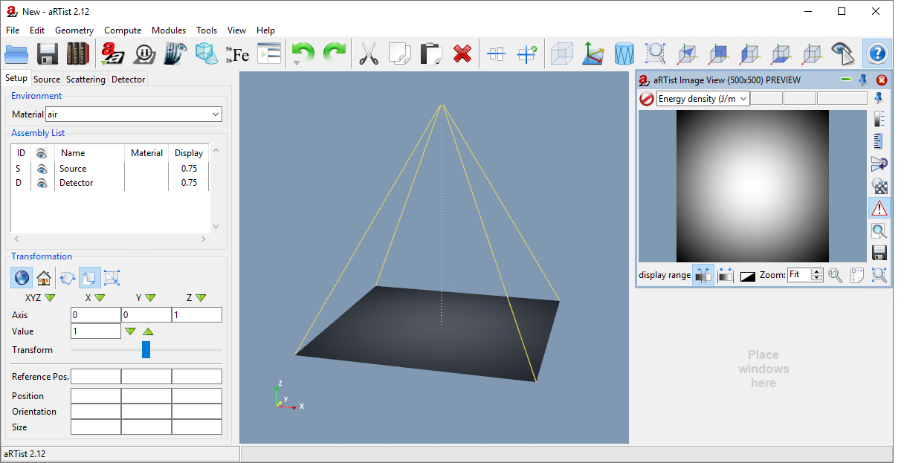
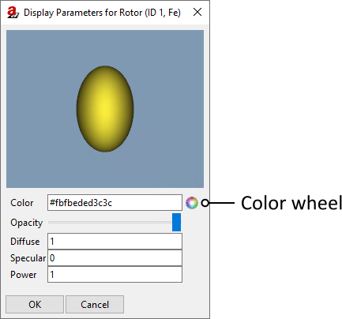
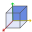
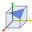
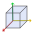
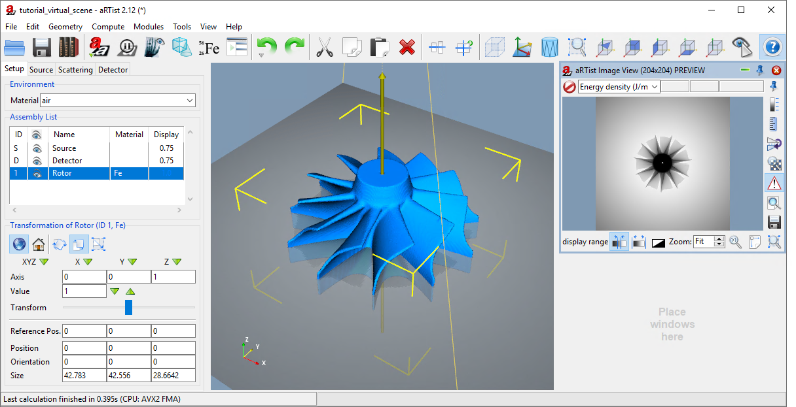
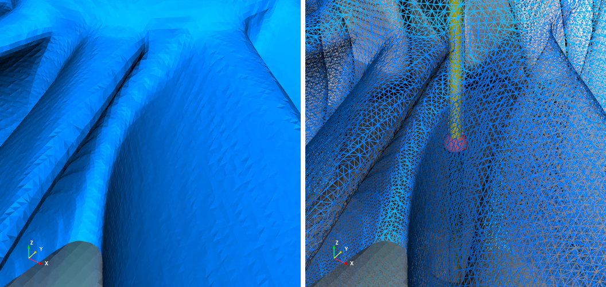
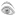

The Virtual Scene
=================

A Blank Scene
-------------

When you start *aRT*\ ist, it will show you an empty **scene** (:numref:`blankScene`). There is a **detector** and a **source**, and the rest is invisibly filled with **air**, the standard *environment material*.

.. _blankScene:

    The *aRT*\ ist window with a blank scene.

*aRT*\ ist's standard coordinate system is shown in :numref:`standardCoordinateSystem`. The detector is placed at the origin of the world coordinate system. The source is located at a positive point somewhere along the *Z* axis. For a standard CT set-up, the axis of rotation would point in the direction of the *Y* axis.

.. _standardCoordinateSystem:
.. figure:: pictures/coordinate-system.png
    :alt: aRTist standard coordinate system
    :width: 65%

    aRTist's standard coordinate system

You are free to change the position and orientation of any of the components in a scene, including the source and the detector. Some modules, like the *CtScan* module that we will use later, assume a certain coordinate system, for example that the *Y* axis is the axis of rotation. To stay on the safe side, it may be a good idea to stick with this convention.

.. note:: Use your mouse to change the view. **Left-click** and drag in the virtual scene to change the camera's view point. **Right-click** and move the mouse up and down to zoom. **Middle-click** (typically your mouse wheel) and move the mouse to shift the view on the screen.

Loading Objects
---------------

Any sample simulated in *aRT*\ ist is represented as a 3D surface model (triangular mesh) that encloses a volume. You are able to load STL, PLY, OBJ and VTK files as objects into the scene. To load objects, you can drag and drop a file into the *aRT*\ ist window, or use the |icon-open| :guilabel:`Open` button from the toolbar or use the menu: :guilabel:`File` → :guilabel:`Open...`

.. |icon-open| image:: pictures/icons/16x16_document-open-folder.png
    :width: 16

*aRT*\ ist comes with a sample library that contains some surface models that we can already use. Let's load the *Rotor*.

.. note:: Click the |icon-library| :guilabel:`Library` button in the toolbar or choose from the menu: :guilabel:`File` → :guilabel:`Open Library...`.

	Load the *Rotor* surface model from :file:`ExampleParts` → :file:`Rotor.ply`.

.. |icon-library| image:: pictures/icons/32x32_library.png
    :width: 32

The rotor is loaded and placed into the scene at the center of the detector, because that is the origin of the coordinate system (:numref:`rotorLoaded`). Additionally, the rotor appears on the left-hand side in the *Assembly list* of the *Parameter panel*. It gets a random colour and the default material is iron (Fe).

.. _rotorLoaded:
.. figure:: pictures/tutorial-virtualscene-rotor-loaded.png
    :width: 100%

    The rotor is loaded into the scene.

If you want to load a surface model at its native position (as defined in the file) instead of centred at the origin of the coordinate system, turn off the button |icon-centernew| :guilabel:`Center new parts` in the toolbar or turn it off in the menu: :guilabel:`Geometry` → :guilabel:`Center New Parts`.

.. |icon-centernew| image:: pictures/icons/32x32_center-new.png
    :width: 32

Colours of Objects
------------------

To change the colour of an object in your scene, find your object in the *Assembly list* and double-click on the colour in the list's :guilabel:`Display` column. The number shown in this column represents the object's opacity (transparency).

.. note:: Double-click on the rotor's colour.

The *Display Parameters* open (:numref:`displayParameters`). There, you can choose a new colour by clicking the |icon-colorwheel| **Colour Wheel.** You can also set up transparency with the **Opacity** slider. The parameters **Diffuse**, **Specular** and **Power** control the object's ability to cast shadows and its "shininess". For details, take a look at the `Phong reflection model <https://en.wikipedia.org/wiki/Phong_reflection_model>`_.

.. _displayParameters:

    The *Display Parameters* let you change the colour and appearance of an object.

.. |icon-colorwheel| image:: pictures/icons/16x16_colorwheel.png
    :width: 16

.. note:: Select a colour that you like for the rotor. I'll choose blue.

.. _colorChanged:
.. figure:: pictures/tutorial-virtualscene-color-changed.png
    :width: 100%

    We have changed the colour of the rotor.

Saving a Project
----------------

You can save your current work as an *aRT*\ ist project. These have the file extension :file:`.aRTist` and they contain everything from your scene in one file: all object definitions, their materials, the detector and source settings, etc. You will not need any additional files to open your complete project again at a later time.

.. note:: Click the |icon-save| :guilabel:`Save` button in the toolbar or choose from the menu: :guilabel:`File` → :guilabel:`Save`. Select a folder and name for your project and save it.

Save frequently! There will be no further reminders ;-)

View & Display Options
----------------------

Take a look at the buttons in the right section of the toolbar. They provide some functionality to change the view:

.. image:: pictures/tutorial-toolbar-view.png
    :width: 50%

Some of these only work once a part is selected.

.. note:: Select the rotor: either click on it in the *Assembly List* or click on it in the scene. It should now be highlighted in the *Assembly List* and a bounding box with yellow corners should appear that encloses the *Rotor* in the virtual scene (:numref:`rotorSelected`).

.. _rotorSelected:
.. figure:: pictures/tutorial-virtualscene-rotor-selected.png
    :width: 100%

    The *Rotor* is selected: it is highlighted with a blue background in the *Assembly List* and enclosed in a yellow-cornered bounding box in the virtual scene.

View Directions
^^^^^^^^^^^^^^^

The following buttons change the view such that the camera looks either from the top right direction or directly along one of the axes of the coordinate system. 

| |icon-view-topright| **View from top right**
| |icon-view-x| **View along X**
| |icon-view-y| **View along Y**
| |icon-view-z| **View along Z**

.. |icon-view-y| image:: pictures/icons/32x32_default-view-minus-y.png
    :width: 32
.. |icon-view-z| image:: pictures/icons/32x32_default-view-minus-z.png
    :width: 32

They can be clicked once or twice. Clicking them a second time will change the view to the opposite direction.

|icon-view-orthographic| **Orthographic/perspective projection**

With this button, you can switch between **orthographic** projection and **perspective** projection. In an orthographic projection, all parallel lines appear parallel and object size does not decrease with distance. In perspective view, parallel lines do not appear parallel on screen, but they meet in a common view point at infinity.

All of these commands can also be found in the :guilabel:`View` menu.

|icon-zoom-to-selection| Zoom to Selection
^^^^^^^^^^^^^^^^^^^^^^^^^^^^^^^^^^^^^^^^^^

.. |icon-zoom-to-selection| image:: pictures/icons/32x32_zoom-select.png
    :width: 32

This button zooms in or out to fit the selected part(s) into the view. If no part is selected, it will arrange the view such that everything can be seen at once.

You can also find this function in the menu bar: :guilabel:`View` → |icon-zoom-to-selection-small| :guilabel:`Zoom to Selection`

.. |icon-zoom-to-selection-small| image:: pictures/icons/16x16_zoom-select.png
    :width: 16

.. note:: Change the view to |icon-view-topright| **top right,** then |icon-zoom-to-selection| **zoom in** to the selected rotor (:numref:`zoomedIn`).

.. _zoomedIn:

    We have zoomed in to see the selected rotor and changed the view direction to *top right*.

|icon-bounding-box| Bounding Box
^^^^^^^^^^^^^^^^^^^^^^^^^^^^^^^^
.. |icon-bounding-box| image:: pictures/icons/32x32_bounding-box.png
    :width: 32

You can use this button to draw a permanent bounding box around the object. At the moment, it is only displayed by yellow corners as long as the rotor is selected. This functionality lets you always display the bounding box, no matter if the part is selected or not. A full frame will appear in the object's colour.

|icon-view-axes| Axes View
^^^^^^^^^^^^^^^^^^^^^^^^^^

Each part has its own, local coordinate system. With this button, you make the local axes visible. The *X* axis will be displayed as a red line, the *Y* axis as a yellow line, and the *Z* axis as a green line.

|icon-wireframe| Wireframe and Solid View
^^^^^^^^^^^^^^^^^^^^^^^^^^^^^^^^^^^^^^^^^

Instead of viewing a part as a solid surface, you can use this button to display a wireframe model of the triangular mesh. The *Rotor* has a lot of triangles, so you will need to zoom in to see the detailed wireframe mesh (:numref:`wireframe`). On less powerful computers, a reduced mesh will be displayed (possibly even instead of the solid model).

.. _wireframe:

    Solid surface (left) and wireframe view (right).

Object Visibility
-----------------

The visibility of an object can be turned *on* and *off* by clicking the |icon-eye| **eye symbol** in the *Assembly List*. Any sample other than the source or the detector that has been turned *off* will not be considered during the simulation of the X-ray projection.

.. |icon-eye| image:: pictures/icons/16x16_object-visible-on.png
    :width: 16

.. note:: Click the |icon-eye| **eye symbol** next to the *Rotor* in the *Assembly List*. In the *Virtual Scene*, it will be rendered in a highly transparent way, and it will disappear from the projection preview in the *Image Viewer* on the right side of the window. Turn it back on by clicking the |icon-eye-off| **eye symbol** (now grey) again.

If you feel that the scene looks too cluttered with the detector and the lines connecting its corners to the source, you can also turn off the visibility of the *Source* or the *Detector* in the *Assembly List*. Their visibility will not affect the simulation of the projection image in any way.

Summary
-------

In this tutorial, you have learned about *aRT*\ ist's virtual scene and how to arrange it.

* You know about the **standard coordinate** system and that, for the moment, we don't want to change the principal axes. 
* You have learned how to **load surface files** into the virtual scene and you have made use of *aRT*\ ist's library to import the *Rotor*.
* You assigned a **colour** to an object.
* You know that a **saved** *aRT*\ ist project contains everything you need to restore it at a later point (including all surface models).
* You have also learned how to **navigate** around the view, change the camera position, projection mode, and some rendering options.
* You know how to turn the **visibility** of objects *on* and *off* and that only visible objects are considered during a simulation (with the exception of *Source* and *Detector*).

| The scene that we created up to this point is available for download:
| :download:`tutorial_virtual_scene.aRTist <files/tutorial_virtual_scene.aRTist>` (4.6 MB)