.. include:: _templates/icons.rst

.. _sourceTutorialChapter:

X-ray Source
============

This tutorial explains |artist|'s spectrum calculator and how the source intensity and spot size are set up. We will build a pinhole camera to investigate the modelling of the focal spot.

.. note:: We continue with the project from the last tutorial. You can download it here if you need the current state:

     :download:`tutorial_ctscan.aRTist <files/tutorial_ctscan.aRTist>` |nbsp| (4.6 MB)

Source Parameter Panel
----------------------

.. note:: Open the :guilabel:`Source` tab in the *Parameter Panel*.

The *Source* section of the *Parameter Panel* (:numref:`xraySourceParameterPanel`) displays the current configuration of the X-ray source and provides configuration tools.

.. _xraySourceParameterPanel:
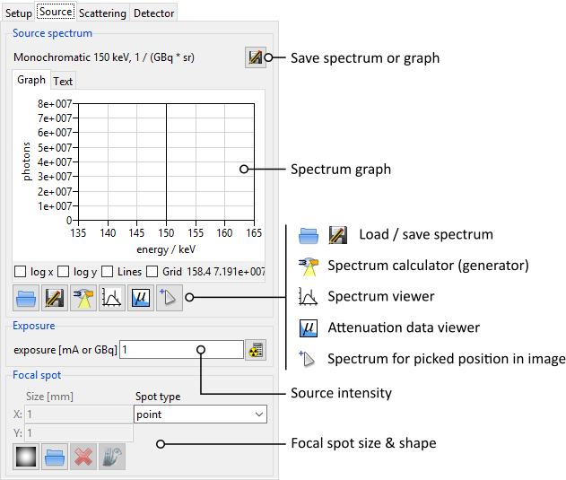

    The *Parameter Panel* for the X-ray source.

In the upper part of the panel, the current spectrum of the X-ray source is plotted. At the moment, a monochromatic photon energy of 150 |nbsp| keV is simulated.

Spectrum Calculator
-------------------

The *Spectrum Calculator* can be used to generate a spectrum for a given X-ray source configuration. It uses a model by Andreas Deresch *et al.*: :cite:p:`Deresch2016`

.. note:: Click the button |22x22_xray-tube| :guilabel:`Calculate X-ray tube spectrum` to open the *Spectrum Calculator* (:numref:`spectrumCalculatorMono`).

.. _spectrumCalculatorMono:
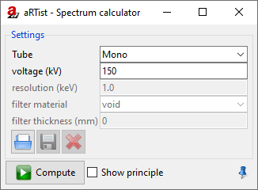

    The *Spectrum Calculator* in its mode for monochromatic radiation.

Let's generate a spectrum for a common X-ray tube that accelerates electrons onto a target. We will have to switch the *Spectrum Calculator* window from the current monochromatic mode to a general X-ray tube and enter some parameters (:numref:`spectrumCalculatorGeneral`).

.. note:: 1. For :guilabel:`Tube` select :code:`General`. You will get more options to specify the tube (:numref:`spectrumCalculatorGeneral`).
    2. Select :guilabel:`Show principle` in the bottom of the window to display a schematic drawing that illustrates the geometrical parameters.
    3. For :guilabel:`voltage (kV)` enter :code:`130`.
    4. For :guilabel:`resolution (keV)` enter :code:`1.0`.
    5. For :guilabel:`filter material` select a :code:`Cu` filter.
    6. For :guilabel:`filter thickness` enter :code:`0.2` |nbsp| mm.
    7. Make sure :guilabel:`Transmission` is not checked. We will simulate a reflection target.
    8. For :guilabel:`target material` select :code:`W`.
    9. The :guilabel:`target thickness` does not matter for a reflection target: you can leave it at :code:`1` |nbsp| mm.
    10. For both :guilabel:`angles`, enter :code:`45` degrees.
    11. For :guilabel:`window material` select :code:`Al`.
    12. For :guilabel:`window thickness` enter :code:`2` |nbsp| mm.

.. _spectrumCalculatorGeneral:
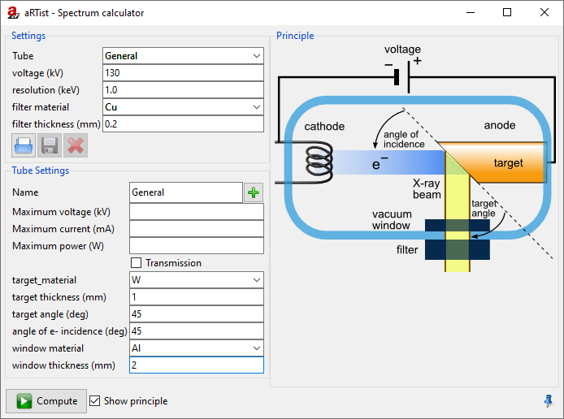

    The *Spectrum Calculator* in its mode for a general X-ray tube.

If you want, you can save your tube parameters as a template for future projects. To do this, you can enter a :guilabel:`name`, and limits for a :guilabel:`maximum voltage`, :guilabel:`current` and :guilabel:`power`. Using the button |16x16_list-add| :guilabel:`Add tube definition to database` you can save this tube and later select it from the :guilabel:`Tube` drop-down menu, as another entry among :code:`Mono` and :code:`General`.

The target thickness does not affect tubes with a reflection target, like the one we have modelled now. However, it is an important parameter for tubes with a transmission target. When you select :guilabel:`Transmission`, the image of the tube schematics will change and illustrate the parameters for a transmission tube.

.. note:: Click the button |16x16_compute-run| :guilabel:`Compute` to calculate the spectrum. This might take a few moments.

Once the computation is done, the new spectrum will appear in the spectrum viewer (:numref:`spectrum130kV`).

.. _spectrum130kV:
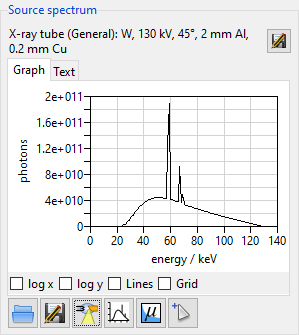

    We have calculated a spectrum for a specific tube with an acceleration voltage of 130 |nbsp| kV.

.. note:: Close the *Spectrum Calculator* window. We will not need it anymore.

Each bin of the spectrum will have a width of 1 |nbsp| keV, because that is the resolution that we chose before calculating the spectrum. To keep the simulation time at a bearable level, it is recommended not to exceed 128 |nbsp| spectrum bins. The *Spectrum Calculator* will ask if you want to reduce the spectrum when you go to higher voltages. The reduction process will remove bins in areas of the spectrum that are mostly flat (i.e. have the smallest slope). This method keeps distinct features like the peaks of characteristic radiation, and only removes information in areas where it shouldn't hurt.

Flux Units
----------

Spectra generated with the *Spectrum Calculator* represent the number of photons per energy bin that pass through an area of 1 |nbsp| m² at a distance of 1 |nbsp| m away from the X-ray source (:numref:`isotropicSourceSphere`).

.. _isotropicSourceSphere:
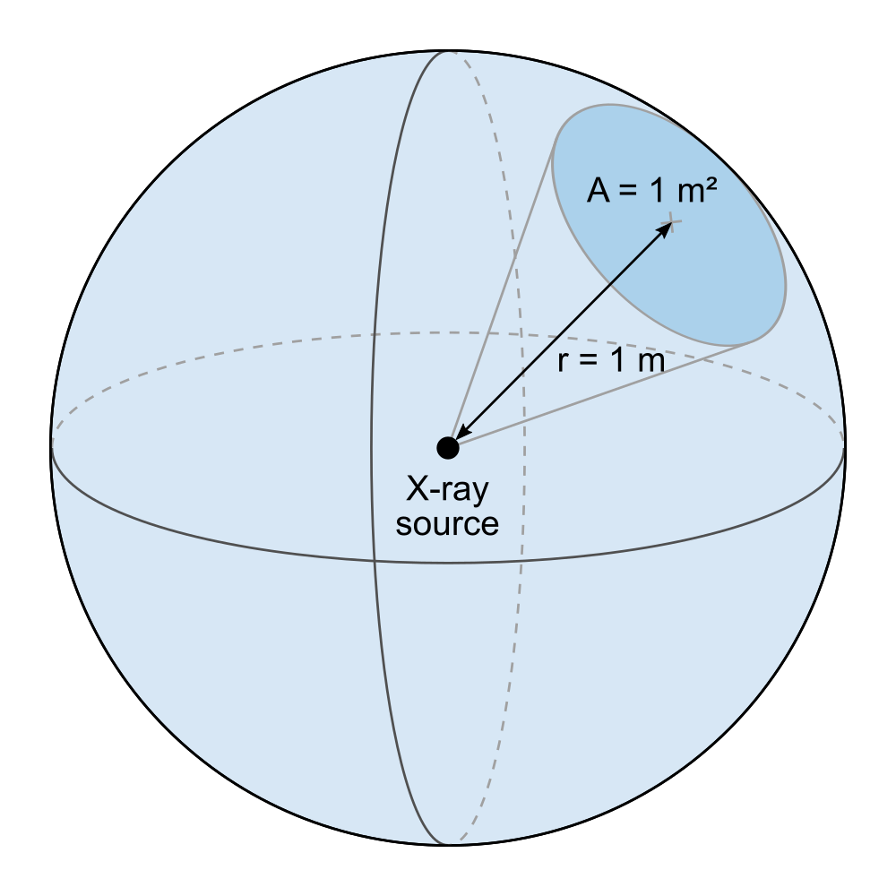

    The flux is calculated as the number of photons that pass through an area *A* of 1 |nbsp| m², located at a distance *r* of 1 |nbsp| m away from the X-ray source.

|artist| simulates an isotropic source that emits photons uniformly in all directions, but the flux per energy bin that the *Spectrum Calculator* generates is expressed as the number of photons through a solid angle Ω of 1 |nbsp| sr.

.. math::
    \Omega = \frac{A}{r^2} = 1\,\textsf{sr}

Additionally, the number of photons is given for a certain time interval (1 |nbsp| s) and a certain source current (1 |nbsp| mA). For X-ray tubes that accelerate electrons onto a target, the unit of the spectrum is therefore:

.. math::
    \textsf{count unit per energy bin} = \frac{\textsf{number of photons}}{\textsf{s} \cdot \textsf{mA} \cdot \textsf{sr}}

Exposure & Primary Intensities
------------------------------

The intensity of the X-ray source can be tuned with the :guilabel:`Exposure` parameter (:numref:`xrayExposure`). For an acceleration tube like the one we just defined, you can enter a value for the electron current in mA.

.. _xrayExposure:
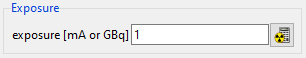

    The intensity of the X-ray source can be set in the *Exposure* box.

Currently, changing this value does not affect the projection image because the current detector automatically adjusts its exposure time to reach 50000 grey values at the intensity maximum (:numref:`xrayExposure_50000auto`). The detector settings will be treated in a later tutorial.

.. _xrayExposure_50000auto:
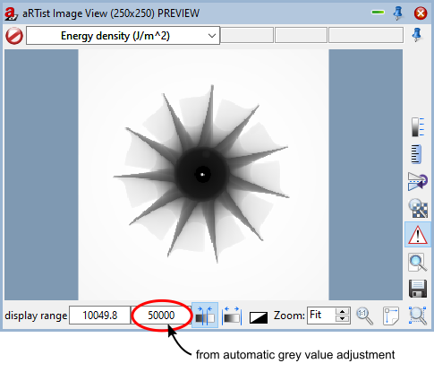

    The detector's integration time is adjusted automatically to reach a maximum of 50000 grey values.

However, you will already see an effect on the *primary intensities* at the detector.

.. note:: In the upper left corner of the preview window, select :guilabel:`primary intensities` from the drop-down menu to switch the display mode (:numref:`xrayExposure_primaryIntensities_menu`).

.. _xrayExposure_primaryIntensities_menu:
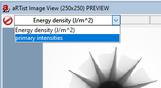

    We switch the preview window mode to display the primary intensities.

The image of **primary intensities** gives the intensity of the incident radiation at the detector (:numref:`xrayExposure_primaryIntensities_imageViewer`).  It is measured in units of

.. math::
    \left[ \textsf{primary intensity} \right] = \frac{\textsf{J}}{\textsf{m}^2 \cdot \textsf{s}} = \frac{\textsf{W}}{\textsf{m}^2}

The primary intensity is not affected by the detector's integration time, but it depends on the source intensity (i.e. its current in mA). The primary intensities at the pixels are later converted into grey values through the underlying detector model, which can also take the spectral sensitivity (e.g. of a scintillator screen) into account. We will learn how to set up the detector characteristics in a later tutorial.

.. _xrayExposure_primaryIntensities_imageViewer:
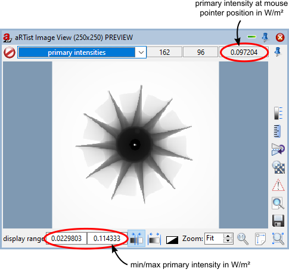

    The *Image Viewer* displays a map of primary intensities in W/m².

.. warning:: When saving a primary intensity image, make sure to select :guilabel:`Float Image` for the data type because the primary intensities are floating point numbers.

Spectrum Files
--------------

Spectra can be imported into |artist| from an external file and they can also be saved. They are stored in :code:`.xrs` files. Those are ASCII-coded and can be opened in a text editor. Their structure is relatively simple: they feature two columns separated by tab characters. The first column contains the energy (in kV) of the energy bins, the second column contains the number of photons for each bin. Further information can be added to such files in the form of comments. Commented lines start with a :code:`#` character. Certain comments can be understood by |artist| to display further information about the spectrum in the GUI, but it is not necessary to include them.

If you want to know more about spectrum files, start exploring them on your own: save the current spectrum with the |22x22_document-save-as| :guilabel:`Save` button and open it in a text editor. Consequently, you can load a spectrum file with the |22x22_document-open-folder| :guilabel:`Load` button.

In the file for the spectrum that we have generated, you will find three blocks that list information from the spectrum generator. The first block lists the properties of the radiation right after its generation at the source target, the second block for the radiation after the tube window, and the third block after the X-ray filter. The :code:`Avg` states the average photon energy (in keV) after the current filter step, the :code:`Flux` gives the total number of photons, i.e. the sum over all energy bins. Note that the flux information for the fully filtered spectrum is usually found at the very end of the file.

Spectrum Picker
---------------

Objects in the path of the beam attenuate radiation: the result is an attenuation image on the detector. Apart from the material properties and their thickness, the absorption probability for a photon also depends on its energy. Usually, photons of lower energies have higher absorption probabilities than photons of higher energies. This means that the spectrum measured at the detector is usually shifted towards higher energies, because lower energies tend to be absorbed more often. This effect is called *beam hardening*.

You can get the spectrum (and therefore the photon flux) at a certain point of the projection image with the *Spectrum Picker*.

.. note:: Below the diagram of the spectrum, click on the button |22x22_edit-pickposition| :guilabel:`Show attenuated spectrum for picked position` to open the *Spectrum Picker* (:numref:`spectrumPicker01`).

The **incident** spectrum (i.e. the free beam when it leaves the source after the last filter step) and the **attenuated** spectrum are currently the same because we have not yet picked a reference point on the projection image.

.. _spectrumPicker01:
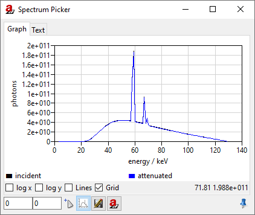

    We have opened the *Spectrum Picker*: it displays the current spectrum because we have not yet selected a reference point.

.. note:: In the *Spectrum Picker* window, click on the button |16x16_edit-pickposition| :guilabel:`Pick image position to calculate attenuation for`.

The *Image Viewer* will now display a message in red: :guilabel:`Picking spectrum reference position` (:numref:`spectrumPickerPreviewWindow`).

.. _spectrumPickerPreviewWindow:
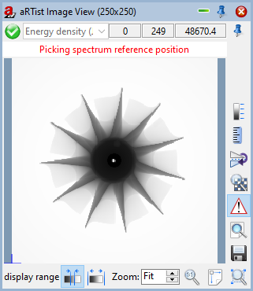

    The *Image Viewer* is ready to select a reference position for the attenuated spectrum.

.. note:: Click on a point in the image for which you want to get the attenuated spectrum.

The attenuated spectrum will be displayed in blue, next to the incident (original) spectrum in black (:numref:`spectrumPicker02attenuatedSpectrum`).

.. _spectrumPicker02attenuatedSpectrum:
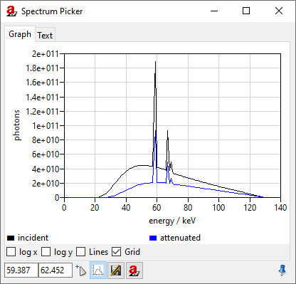

    The *Spectrum Picker* displays the attenuated spectrum (blue) alongside the original incident spectrum (black).

When you switch to the :guilabel:`Text` view, you can get further information, for example the path lengths that the ray travelled through each material to reach the chosen point on the detector (:numref:`spectrumPicker03text`). The spectral information is now arranged in three tab-separated columns: the energy of the bin (keV), and the photon counts for the incident (original) and attenuated spectrum.

.. _spectrumPicker03text:
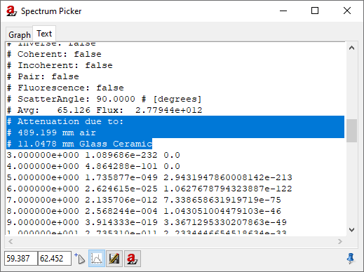

    The *Spectrum Picker* in text view displays further information.

Of course, you can also save the current data using the |16x16_document-save-as| :guilabel:`Save` button in the *Spectrum Picker*.

.. note:: Close the *Spectrum Picker*.

Focal Spot
----------

Until this point, we have simulated an ideal point source. |artist| also offers an approach to simulate a spatially extended focal spot profile. To understand what is happening, we will build a simple pinhole camera to project an image of the focal spot onto the detector. Then, we will start exploring the settings that |artist| has to offer.

Pinhole Camera
^^^^^^^^^^^^^^

.. note:: Turn off the visibility of the *Support Cylinder*, the *Rotor* and the *Air Pocket* (:numref:`objectVisibility`).

.. _objectVisibility:
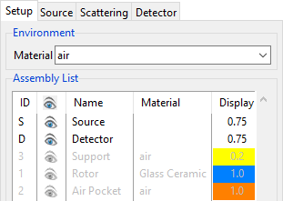

    We turned off the visibility of the objects in the scene to make room for the pinhole camera.

Using the *Solids* generator, we will now set up a plate of a highly absorbing material and poke a small hole at its centre.

.. note::
    1. Open the |32x32_icon-solid| *Solid* module.
    2. Create a :guilabel:`cuboid` with the following dimensions (:numref:`solidsPlate`)
        * :guilabel:`X` = 100 mm
        * :guilabel:`Y` = 100 mm
        * :guilabel:`Z` = 0.1 mm
    3. Press the :guilabel:`Create` button.

.. _solidsPlate:
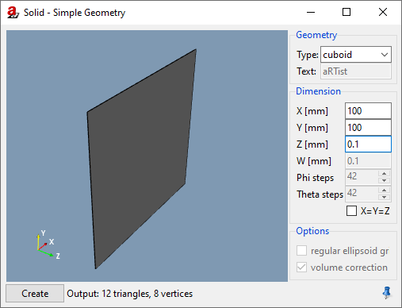

    We use the *Solids* generator to create a cover plate.

.. note::
    4. Create a :guilabel:`cylinder` with the following dimensions (:numref:`solidsCylinder`)
        * :guilabel:`X` = 0.05 mm
        * :guilabel:`Y` = 0.20 mm
        * :guilabel:`Z` = 0.05 mm
    5. Press the :guilabel:`Create` button.
    6. Close the *Solids* module window.

.. _solidsCylinder:
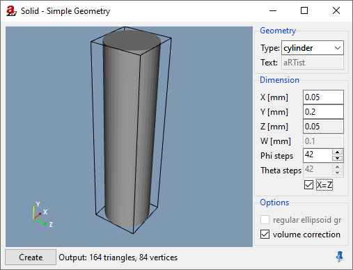

    We use the *Solids* generator to create a cylinder for the pinhole.

We'll rename the two generated parts to make it nicer, and set the cover's material to a highly absorbing platinum, whereas the hole needs to be filled with air, our environment material. Also, the pinhole cylinder does not have the correct orientation yet: we need to rotate it to point in the direction of the beam. We will then position our pinhole very close in front of the source to reach a high magnification of the focal spot.

.. note:: * Rename the :code:`cuboid` to :code:`Cover`.
    * Rename the :code:`cylinder` to :code:`Pinhole`.
    * Rotate the *Pinhole* by 90 degrees around the world's X axis: enter :code:`90` for its :guilabel:`X Orientation`.
    * Set the *Cover's* material to :guilabel:`Pt` and its :guilabel:`Z Position` to :code:`485`.
    * Set the *Pinhole's* material to :guilabel:`air` and its :guilabel:`Z Position` to :code:`485`.

You should now have a setup as displayed in :numref:`pinholeArtistWindow`.

.. _pinholeArtistWindow:
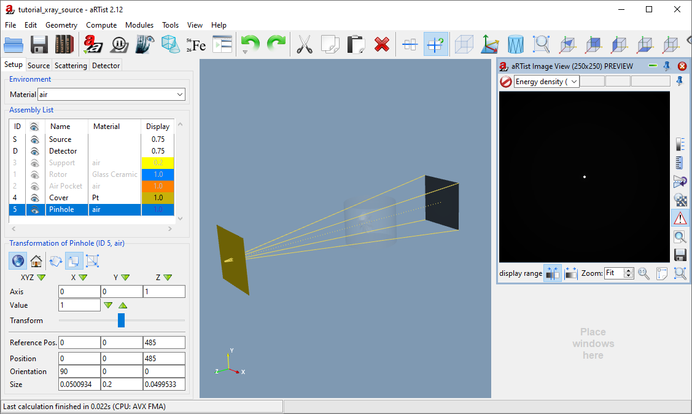

    We created a pinhole camera.

.. _sourceTutorialSpotChapter:

Spot Size & Spot Type
^^^^^^^^^^^^^^^^^^^^^

To simulate X-ray spots, |artist|'s approach is to place several point sources in the rectangular 2D source region. In the *Focal spot* settings group of the *Source*, you can set the :guilabel:`Size [mm]` of this rectangular region. The number of point sources can be set under :guilabel:`Spot type`. If you set a single integer, the point sources will be distributed in a random pattern, but optimized such that points are not too close to each other (`Poisson Disc Sampling <https://en.wikipedia.org/wiki/Supersampling#Poisson_disk>`__). You can also choose a regular grid by entering two integers separated by an :code:`x`.

You can either choose pre-defined spot types from the drop-down menu, or enter your own numbers and grid sizes.

The simulation will be closer to reality with more point sources, but the simulation time will increase proportionally.

.. note:: 1. Go to the :guilabel:`Source` parameter panel.
    2. Enter a spot size of :code:`1.5` mm in :guilabel:`X` and :guilabel:`Y` direction.
    3. For :guilabel:`Spot type`, enter :code:`4x4` (:numref:`spot4x4`).
    4. Run a full simulation by pressing the |32x32_compute-radiography| :guilabel:`Run` button.

.. _spot4x4:
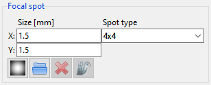

    Settings for 4×4 point sources arranged in a regular grid on the source region.

Once the full simulation is complete, you should see an image of the magnified focal spot in the *Image Viewer*: a regular grid pattern of 16 individual point sources (:numref:`spot4x4imageViewer`).

.. _spot4x4imageViewer:

    Image of the magnified focal spot, simulated as 16 individual point sources arranged in a regular grid.

.. note:: For the :guilabel:`Spot type`, enter :code:`20` (:numref:`spot20`) and press the |32x32_compute-radiography| :guilabel:`Run` button again.

.. _spot20:

    Settings for 20 point sources arranged in a quasi-random way on the source region.

You will now see a Poisson Disc pattern of 20 individual point sources in the *Image Viewer* (:numref:`spot20imageViewer`).

.. _spot20imageViewer:
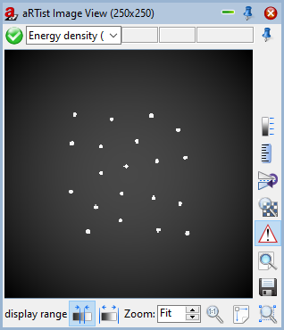

    Image of the magnified focal spot, simulated as 20 individual point sources.

Each of these point sources has the same intensity: the total photon flux given by the current and spectrum is divided up evenly among each of the points. In the next section, we will learn how to set up intensity profiles for the focal spot.

Spot Intensity Profile
^^^^^^^^^^^^^^^^^^^^^^
.. _TutorialXraySourceSpotIntensityProfile:

|artist| offers a simple way to generate two-dimensional Gaussian or Lorentzian intensity profiles for the focal spot. In the following example, we will create a purely Gaussian spot which has a circular symmetry: its width and height will be equal. Feel free to experiment with different parameters.

.. note::
    Click the button |22x22_smooth| :guilabel:`Create a spot profile image`. A window will appear that lets you enter the profile parameters (:numref:`spotGenerator`).

        * :guilabel:`Width`: :code:`1.5`
        * :guilabel:`Height`: :code:`1.5`
        * :guilabel:`Fraction`: :code:`0.0`
        * :guilabel:`Resolution`: :code:`301`

    Click the :guilabel:`Set` button (the following calculation may take a few seconds).

.. _spotGenerator:
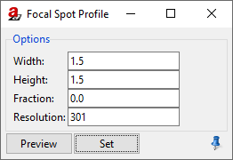

    Profile generator for the focal spot.

The parameters that you can enter here are for a *Pseudo-Voigt* profile, V(r), a linear combination of a Gaussian distribution G(r) and a Lorentzian distribution L(r), weighted by the Lorentz :guilabel:`fraction` η.

.. math::
    V(r) = \eta \cdot L(r) + (1-\eta) \cdot G(r)

The normalized Gaussian distribution is given by

.. math::
    G(r) = \frac{1}{\sqrt{2\pi\sigma^2}} \exp\left( -\frac{r^2}{2\sigma^2} \right) = \frac{\sqrt{\ln 2}}{w\sqrt{\pi}} \exp\left( -\frac{r^2 \ln 2}{w^2} \right)

with the :guilabel:`width` *w*, which is the parameter that you entered for the width (or height). For a Gaussian distribution, this is the half width at half maximum, or:

.. math::
    \textsf{FWHM} = 2w = 2\sigma\sqrt{2 \ln 2}.

The Lorentzian distribution is given by

.. math::
    L(r) = \left[ w \pi \left( 1 + \frac{r^2}{w^2} \right) \right]^{-1}.

|artist| generates a square image for a symmetric intensity profile. If the :guilabel:`width` and :guilabel:`height` (in mm) are not equal, the spot profile image will be stretched to cover the rectangular source region.

In general, |artist| will set up the size of the source rectangle such that its physical width and height are a factor of three higher than the ones you entered. This means that it covers 1.5 times the FWHM; the rest of the distribution is cut off. If you need a different source spot alignment, you can rotate the source object with the *Transform* tools in the :guilabel:`Setup` tab.

.. note:: Close the *Focal Spot Profile Generator* window. Press the button |22x22_image-viewer| :guilabel:`Show spot profile image`. The profile we just generated will appear in the *Image Viewer* (:numref:`spotProfileView`).

.. _spotProfileView:
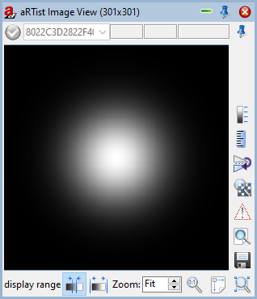

    The *Image Viewer* shows the spot profile we just generated.

The spot profile image has a size of 301×301 pixels: this is the :guilabel:`resolution` we requested. It is an odd number such that the central pixel contains the intensity maximum.

.. note:: Press the |32x32_compute-radiography| :guilabel:`Run` button to calculate another projection image.

The *Image Viewer* now shows how the 20 single point sources are distributed on the intensity profile (higher intensities are more likely) and how their individual intensity is weighted (:numref:`spot20intensityProfile`).

.. _spot20intensityProfile:
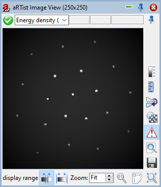

    The *Image Viewer* shows the projection of the 20 point sources spread across the intensity profile we just generated.

You can also load spot profiles from external grey value images using the button |22x22_document-open-folder| :guilabel:`Load spot profile image from file`. Externally loaded spot image files will be placed onto the source in the same way as our generated profile image: it will be stretched to completely fill the source rectangle. The aspect ratio can be adjusted with the physical size (in mm) that you set for the source/focal spot in |artist|.

Summary
-------

In this tutorial, you have learned how to set up |artist|'s virtual X-ray tube.

* You learned how to generate a spectrum using the *Spectrum Calculator*.
* You saw how :code:`.xrs` spectrum files are structured and how to import your own spectra.
* You have used the *Spectrum Picker* to get the spectrum after attenuation.
* You learned how |artist| simulates spatially extended spots using multiple point sources arranged in grids or smart patterns.
* You know how to apply an intensity profile for the focal spot and how |artist| uses it to distribute the point sources and their intensities according to the given intensity map.

| The scene that we created up to this point is available for download:
| :download:`tutorial_xray_source.aRTist <files/tutorial_xray_source.aRTist>` (4.7 MB)
